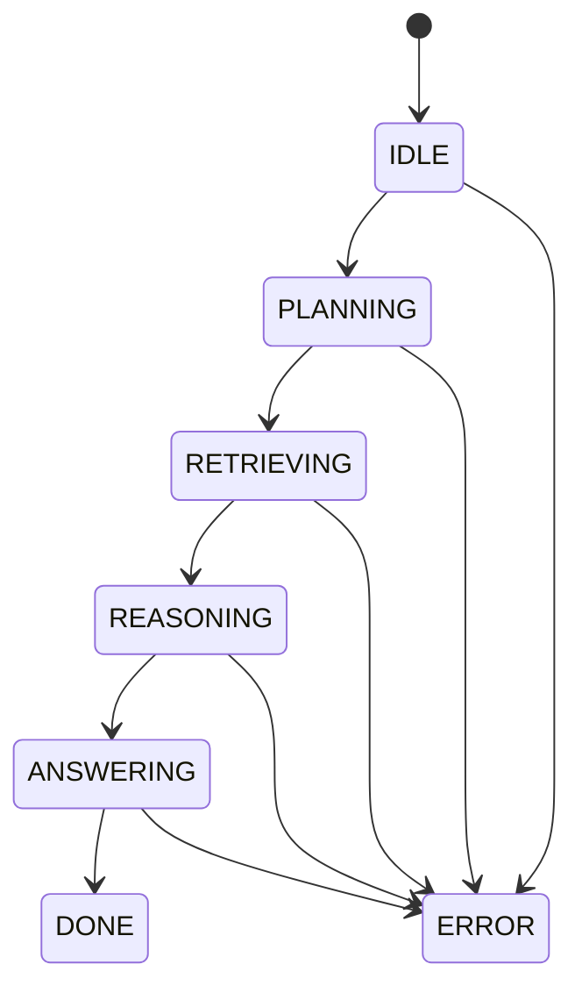

# Architecture

## Agent State Machine



Each transition is persisted to SQLite before the next side effect. The event log stores `timestamp`, `agent_id`, `run_id`, source state, target state, and JSON payload.

## Retrieval Pipeline

```mermaid
flowchart LR
  query[Research Query] --> hyde[HyDE Expansion]
  hyde --> dense[Dense Cosine]
  hyde --> sparse[BM25 Sparse]
  dense --> rrf[RRF Fusion]
  sparse --> rrf
  rrf --> mmr[MMR Diversify optional]
  mmr --> graph[Entity Graph Expansion]
  graph --> multihop[MultiHop Depth 3]
  multihop --> rerank[CrossEncoder Rerank]
  rerank --> chunks[Grounding Chunks]
```

## Data Flow

1. Ingestion normalizes PDF, arXiv, and Semantic Scholar records into documents and chunks.
2. Dense and sparse indexes are built from chunks.
3. spaCy NER is used when available; a deterministic scientific-term fallback keeps tests and demos offline.
4. The planner decomposes a query into retrieval tasks and logs rationale as JSON.
5. The executor retrieves, re-ranks, generates, validates, grounds, and returns an answer with chunk citations.

## Model Providers

`ModelRouter` selects an adapter (`openai`, `anthropic`, `gemini`, `kimi`, or
the offline `fake`) per `TaskType`. Each adapter normalizes a provider-specific
JSON payload into the shared `LLMResponse`.

Provider response content is a *list* (OpenAI `choices`, Anthropic/Gemini
`content` parts), so an adapter must reconstruct the full text rather than
reading only the first element: it concatenates every text segment in order and
skips non-text parts (for example a Gemini `functionCall` part). Reading a
single element silently truncates multi-part answers and can drop cited
evidence before grounding.
