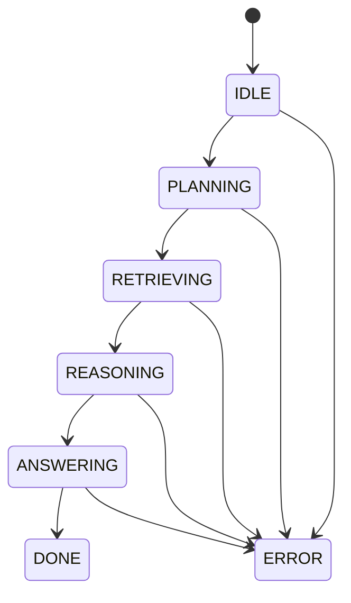

# Architecture

Scholar RAG Agent is a local-first FastAPI service and Python toolkit built with
Pydantic schemas/settings, HTTPX provider adapters, and SQLite stores. Its
Observe -> Decide -> Act orchestration is a hand-written state machine, not a
LangGraph integration. The default wiring lives in
[`AppContainer`](src/api/dependencies.py).

[`api.application.create_app(settings)`](src/api/application.py) constructs an
isolated app on demand; importing the factory or routers does not initialize a
database. `api.main:app` remains the environment-configured deployment entrypoint.
Offline demos use explicit validated defaults and ignore ambient environment,
dotenv, and secret-file settings rather than initializing that deployment app.

## Agent State Machine

```mermaid
stateDiagram-v2
  [*] --> IDLE
  IDLE --> PLANNING
  PLANNING --> RETRIEVING
  RETRIEVING --> REASONING
  REASONING --> ANSWERING
  ANSWERING --> DONE
  IDLE --> ERROR
  PLANNING --> ERROR
  RETRIEVING --> ERROR
  REASONING --> ERROR
  ANSWERING --> ERROR
```

Each transition is persisted to SQLite before the next phase. The event log
stores `timestamp`, `agent_id`, `run_id`, event type, and a JSON payload; state
transition payloads contain the source and target states. The plan includes
operational rationale, not a model's hidden reasoning.

## Retrieval Pipeline

This is the integrated `/query` path. Hybrid and graph retrieval are separate
lookups for each planned task, not a graph stage that consumes fused hits:

```mermaid
flowchart LR
  query[Research query] --> plan[Keyword intent and task plan]
  plan --> hyde[Deterministic HyDE template]
  plan --> graph[Entity co-mention traversal]
  hyde --> dense[Lexical hash-vector cosine]
  hyde --> sparse[BM25 Sparse]
  dense --> rrf[RRF Fusion]
  sparse --> rrf
  rrf --> merge[Merge by chunk ID and bound results]
  graph --> merge
  merge --> rerank[Lexical overlap reranking]
  rerank --> quota[Optional per-document passage quota]
  quota --> snapshot[Persist exact context snapshot]
  snapshot --> model[Routed provider or fake adapter]
  model --> ground[Token-overlap citation mapping]
  ground --> done[Persist answer and completed run]
```

`DenseRetriever` defaults to deterministic `HashEmbeddingModel` vectors, not
learned semantic embeddings. `HyDEExpander` has no LLM in the API wiring: it adds
a fixed hypothetical-abstract template. `AdaptiveReranker()` uses lexical
overlap by default. Enabling its optional cross-encoder requires explicit Python
wiring and suitable model dependencies; installing the `all` extra alone does
not enable it.

MMR, multi-HyDE, synonym rewriting, contextual compression, screening gates,
and most other retrieval helpers are opt-in library components. Their names or
presence in the [guide catalog](docs/README.md) do not imply execution in `/query`.

Optional `/query` `document_ids` selects eligible ingested papers for **all**
planned tasks. A shared validator snapshots bounded, deduplicated IDs as an
immutable tuple before awaits. Dense and BM25 filter before scoring/top-k/RRF;
BM25 statistics remain global. Graph SQL filters chunks and both directions of
edge ownership before `LIMIT`, so excluded documents cannot bridge selected
ones. No shared index stores per-request scope. Unscoped calls preserve old
signatures; unsupported scoped components fail rather than retrying globally.
See [Document scope](docs/guides/DOCUMENT_SCOPE_GUIDE.md) for the exact contract.

Optional `max_chunks_per_document` on `/query` and `/retrieve` freezes a strict
1-50 integer in `QueryObservation.evidence_policy` before awaits.
`Executor.prepare_context` applies the existing `DiversityCapGate` after normal
reranking, before capture, within the already bounded candidate pool. It preserves
scores, order, and chunk ownership while appending the prior reranker to gate
provenance. There is no extra retrieval, oversampling, or shared index mutation;
fewer passages may remain. The policy is recorded in the initial event and plan,
validated in previews/exports, and compared even when saved contexts match.
`RunConfiguration` keeps its four version-one fields; old records default to no
policy. Unsupported opt-in executor overrides fail rather than discard the quota.
See [Per-paper evidence limits](docs/guides/PER_PAPER_EVIDENCE_LIMITS_GUIDE.md).

## Generation-Free Retrieval Preview

`POST /retrieve`, in the separate `api.retrieval` router, calls
`AgentRunner.preview`. It uses the same analyzer, planner, task clamping,
bounded executor retrieval, and `Executor.prepare_context` as `/query`.
The latter method performs reranking, scope/quota enforcement, and detached
`EvidenceSnapshot.capture`; `Executor.answer` then adds generation and grounding
only for real queries.

Preview returns an inspection-only plan (without a run ID), full ordered sources,
scores, ranks, paths, exact context/digest, and copied scope/limits. It does not
enter the state machine, call any live/fake generator, ground claims, or append
agent events. Its context-preparation budget uses the existing reasoning timeout
without running a reasoning model. LLM-backed HyDE is rejected rather than
silently replaced by a different retrieval algorithm.

Unknown document IDs produce empty evidence, not a widened search. Invalid HTTP
scope is 422; generative retrieval is 409; operational failures are sanitized
500 responses and timeouts are 504. No failed stage returns partial success.
Existing `/query` response/event contracts and legacy executor override binding
are unchanged. A preview does not freeze concurrent or subsequent corpus changes
and is not a saved evidence export. See the
[retrieval preview guide](docs/guides/RETRIEVAL_PREVIEW_GUIDE.md).

## Model-Free Research Worksheets

`ResearchWorksheetService`, wired through `AppContainer.worksheets` and
`POST /research/worksheet`, composes `AgentRunner.preview` for each question
and selected paper. The existing collection store validates explicit IDs or
resolves a saved collection once before asynchronous work. Each cell receives
an immutable one-paper scope; no shared runner configuration is changed.

Requests are capped at five questions, ten papers, fifty cells, and three
returned passages per cell. The service validates preview ownership, ordering,
context and full-text digests, then exposes bounded excerpts with explicit
truncation flags. Both JSON and literal Markdown must fit 256 KiB. A cooperative
30-second overall deadline complements the existing preview phase timeouts.
Any failed cell rejects the whole worksheet; cancellation propagates.

Construction does not invoke generation or append agent events, and introduces
no schema or new retrieval algorithm. Membership is frozen, not corpus contents;
inspection links read current chunks. Existence is rechecked before completion.
See the [worksheet guide](docs/guides/RESEARCH_WORKSHEET_GUIDE.md) for schemas,
errors, privacy, limitations, and the measured offline demonstration.

## Data Flow

1. `POST /ingest/text` accepts a title, text, and source. `TextChunker` normalizes
   whitespace and produces overlapping character windows (800 characters with
   120 overlap by default). PDF and scholarly-service connectors are separate
   Python ingestion paths, not upload endpoints or automatic web searches.
2. SQLite persists normalized documents and chunks. Hash-vector and BM25 indexes
   are in memory and are rebuilt from stored chunks when `AppContainer` starts.
   The graph store persists entity mentions and within-chunk co-mention edges.
3. Graph construction uses spaCy when its package and requested model can load;
   otherwise it uses a deterministic term extractor. Query entities come from
   the analyzer's capitalized-term heuristic. Graph paths connect co-mentions,
   not proven scientific relationships.
4. The keyword analyzer selects factual, synthesis, comparison, or hypothesis
   intent. The planner creates fixed task templates and logs their rationale.
   Supporting/counter-evidence task results are merged before generation; there
   is no automatic evidence adjudication.
5. The executor retrieves and reranks chunks, saves its bounded context, calls a
   model, and maps claims to chunks. If no parsed claims are provided, the whole
   response becomes one claim. Current live adapters return the context's chunk
   IDs; the default path does not parse prose citation markers or verify that a
   source entails a claim. The fake adapter echoes the query with IDs.
6. `/query` returns `{"result": ...}` with a `DONE` or `ERROR` run state; callers
   must inspect that state and `error`, not just the HTTP status. Read the saved
   event stream or export a completed run to inspect its exact evidence.

The API also exposes `/retrieve`, `/health`, `/runs`, `/runs/{run_id}/events`, and the export route
below, plus FastAPI's schema/docs. It has no built-in authentication, tenant
controls, PDF-upload UI, or public multi-turn chat endpoint. See
[API examples](docs/EXAMPLES.md) and [Safety](SAFETY.md).

### SQLite connection lifecycle

The core event, document, and graph stores open a connection per operation.
Their existing transaction context exits before the connection is explicitly
closed, including after SQL, serialization, or commit failures. Reads materialize
their rows before closing; connections do not depend on garbage collection for
release. This does not add connection pooling, make multi-store ingestion atomic,
or synchronize in-memory retrieval indexes across workers.

## Persistent Corpus Discovery

`SQLiteDocumentCatalog` projects `GET /documents` directly from existing
`documents` and `chunks`, opening the database read-only. Source equality and
literal title-substring filters precede an exclusive ascending document-ID
cursor and a maximum 100-row page plus one-row lookahead. Bounded byte prefixes
preserve Unicode and embedded NUL characters without hydrating bodies or metadata.
IDs are never truncated; malformed/unselectable records fail explicitly.

An index on `chunks(document_id)` supports per-document stored chunk counts.
Browsing does not rebuild indexes, invoke models, or append agent events, though
normal application startup still reconstructs its retrieval indexes. Each page
is consistent within its SELECT; independent pages do not freeze corpus edits.
Recovered IDs can be passed to document-scoped `/query`. See the
[document catalog guide](docs/guides/DOCUMENT_CATALOG_GUIDE.md).

## Persistent Paper Collections

`SQLitePaperCollections` stores only a stable collection ID, unique trimmed
name, revision, and normalized JSON document IDs in one additive SQLite table.
`/collections` supplies bounded discovery and metadata CRUD; full replacement
and deletion require the expected revision. Document existence, name uniqueness,
revision checks, and writes share a `BEGIN IMMEDIATE` transaction. No corpus,
graph, or run data is copied, deleted, or backfilled.

Both `/query` and `/retrieve` accept either `collection_id` or `document_ids`,
never both. The API resolves collection membership and checks document existence
in one read transaction **before awaiting the runner**, then passes an immutable
ID tuple through the existing scope pipeline. Invalid, unknown, corrupt, or
broken selections fail explicitly; no failure means unscoped. Python callers
use `store.resolve(...)` and the existing runner `document_ids` argument.

Concurrent edits affect new requests, not an already resolved scope. This
freezes IDs, not source contents or multi-process indexes. Evidence exports
continue to use their saved actual IDs and chunks, independent of subsequent
collection replacement/deletion. No evidence schema or runner signature changes
are needed. See [Paper collections](docs/guides/PAPER_COLLECTIONS_GUIDE.md) for
schema, paging, conditional writes, errors, privacy, and the offline demo.

## Persistent Run Discovery

`SQLiteRunHistory` projects `GET /runs` summaries directly from `agent_events`,
without a duplicate run table, event backfill, or evidence deserialization.
Pages contain at most 100 summaries (20 by default), ordered by immutable first
event ID. An exclusive integer keyset cursor and latest-recorded-state filter
are applied before the one-row pagination lookahead.

One SELECT reads a consistent page; separate pages do not freeze changing states.
Query prefixes and identifiers are bounded, but grouping and transition checks
still scale with stored events. Legacy event-only runs have a null recorded state,
and missing planning queries stay null. Nonterminal states do not claim liveness
or resumability. Export links are navigation, not proof of export availability.
See [Run history](docs/guides/RUN_HISTORY_GUIDE.md) for errors, privacy, restart
behavior, and the reproducible synthetic demo.

## Persistent Evidence Exports

Completed exports also feed a pure, typed saved-run comparison through
`GET /runs/{baseline_run_id}/compare/{candidate_run_id}`. The dedicated
`SavedRunComparator` depends only on `EvidenceExporter`; either side's export
failure rejects the operation. Owner-aware chunk identities, exact field changes,
bounded previews, and digests expose differences without copying full passages
or arbitrary diagnostics. There is no new retrieval, generation, event write,
corpus hydration, migration, or quality scoring. See the
[comparison contract and synthetic demo](docs/guides/RUN_COMPARISON_GUIDE.md).

`Executor.answer` calls the shared `Executor.prepare_context` to rerank and make
a detached, bounded `EvidenceSnapshot`.
Its ordered passages construct the exact `LLMRequest.context`; full chunk text,
source metadata, rank, final score, retrieval path, and UTF-8 digests are retained.
A run-local callback appends `evidence_snapshot` to the existing `SQLiteEventLog`
**before** calling the LLM. A second `generation_record` event captures only
returned provider/model identity and proposed claim citation IDs. Grounding uses
the same detached passages, not mutable index objects.

Each run copies its effective source/hop limits and retrieval/reasoning timeouts
before asynchronous work, persists only those allowlisted configuration fields
in the initial `PLANNING` payload, and uses the copy throughout execution.
Legacy executor overrides that cannot accept capture callbacks still run once
without them; their completed answers remain non-exportable rather than being
given a guessed snapshot.

Document selection is frozen separately in `plan.observation.document_ids` and
the initial event, leaving the four-field version-one configuration unchanged.
Exports cross-check saved scope and source/citation ownership. Old evidence
records without scope remain readable as unscoped; no corpus lookup or migration
is needed.

`EvidenceExporter` depends only on the event log. It validates a completed run,
resolves references against the saved snapshot, preserves the original answer
and warnings, and freezes the trace at the first terminal event.
`GET /runs/{run_id}/export?format=json|markdown` derives both downloads from this
versioned model, without document-store reads, retrieval, or generation.
Unknown event payloads are omitted explicitly rather than exporting arbitrary
diagnostic content. Snapshot/provenance trace entries reference the top-level
bundle fields to avoid duplicating those event payloads.

No new database or event table is introduced. Existing `/query` responses are
unchanged; `/events` gains the two additive event types and therefore includes
full sensitive evidence text. Legacy runs without capture, failed runs,
incomplete runs, and invalid saved records are rejected rather than backfilled
from a changing corpus. See the [evidence export guide](docs/guides/EVIDENCE_EXPORT_GUIDE.md)
for schema, bounds, privacy, and error contracts.

## Model Providers

`ModelRouter` selects an adapter (`openai`, `anthropic`, `gemini`, `kimi`, or
the offline `fake`) per `TaskType`. Each adapter normalizes a provider-specific
JSON payload into the shared `LLMResponse`. `/query` requests `REASONING`, which
prefers configured Anthropic before the configured default family, OpenAI, and
fake fallbacks. This is selection before a call, not failover after an HTTP error.

Adapters preserve ordered answer-text parts and skip non-answer blocks. OpenAI
and Kimi use the first choice's content, Gemini the first candidate's answer
parts, and Anthropic its text blocks; they do not concatenate separate alternate
answers. Provenance records the requested model ID when known, not an immutable
resolved backend version.

Current defaults, overrides, payload constraints, and dated official sources
live in the [provider model guide](docs/guides/PROVIDER_MODELS_GUIDE.md).
