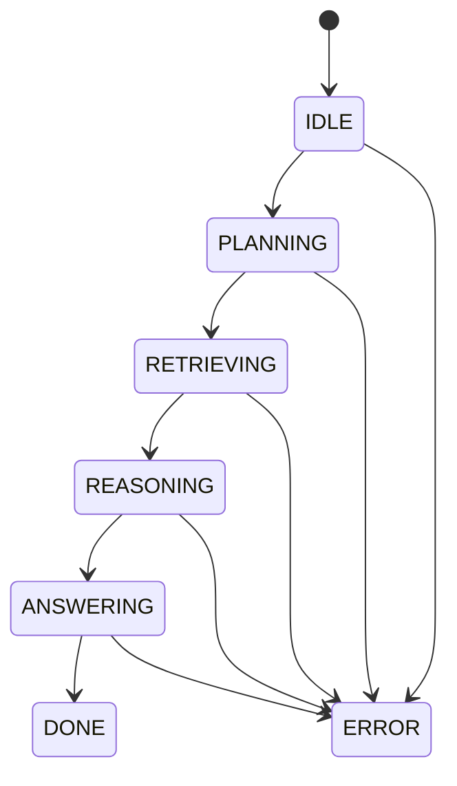

# Architecture

## Agent State Machine

```mermaid
stateDiagram-v2
  [*] --> IDLE
  IDLE --> PLANNING
  PLANNING --> RETRIEVING
  RETRIEVING --> REASONING
  REASONING --> ANSWERING
  ANSWERING --> DONE
  IDLE --> ERROR
  PLANNING --> ERROR
  RETRIEVING --> ERROR
  REASONING --> ERROR
  ANSWERING --> ERROR
```

Each transition is persisted to SQLite before the next side effect. The event log stores `timestamp`, `agent_id`, `run_id`, source state, target state, and JSON payload.

## Retrieval Pipeline

```mermaid
flowchart LR
  query[Research Query] --> hyde[HyDE Expansion]
  hyde --> dense[Dense Cosine]
  hyde --> sparse[BM25 Sparse]
  dense --> rrf[RRF Fusion]
  sparse --> rrf
  rrf --> mmr[MMR Diversify optional]
  mmr --> graph[Entity Graph Expansion]
  graph --> multihop[MultiHop Depth 3]
  multihop --> rerank[CrossEncoder Rerank]
  rerank --> chunks[Grounding Chunks]
```

## Data Flow

1. Ingestion normalizes PDF, arXiv, and Semantic Scholar records into documents and chunks.
2. Dense and sparse indexes are built from chunks.
3. spaCy NER is used when available; a deterministic scientific-term fallback keeps tests and demos offline.
4. The planner decomposes a query into retrieval tasks and logs rationale as JSON.
5. The executor retrieves, re-ranks, generates, validates, grounds, and returns an answer with chunk citations.

## Persistent Evidence Exports

After reranking, `Executor.answer` makes a detached, bounded `EvidenceSnapshot`.
Its ordered passages construct the exact `LLMRequest.context`; full chunk text,
source metadata, rank, final score, retrieval path, and UTF-8 digests are retained.
A run-local callback appends `evidence_snapshot` to the existing `SQLiteEventLog`
**before** calling the LLM. A second `generation_record` event captures only
returned provider/model identity and proposed claim citation IDs. Grounding uses
the same detached passages, not mutable index objects.

Each run copies its effective source/hop limits and retrieval/reasoning timeouts
before asynchronous work, persists only those allowlisted configuration fields
in the initial `PLANNING` payload, and uses the copy throughout execution.
Legacy executor overrides that cannot accept capture callbacks still run once
without them; their completed answers remain non-exportable rather than being
given a guessed snapshot.

`EvidenceExporter` depends only on the event log. It validates a completed run,
resolves references against the saved snapshot, preserves the original answer
and warnings, and freezes the trace at the first terminal event.
`GET /runs/{run_id}/export?format=json|markdown` derives both downloads from this
versioned model, without document-store reads, retrieval, or generation.
Unknown event payloads are omitted explicitly rather than exporting arbitrary
diagnostic content. Snapshot/provenance trace entries reference the top-level
bundle fields to avoid duplicating those event payloads.

No new database or event table is introduced. Existing `/query` responses are
unchanged; `/events` gains the two additive event types and therefore includes
full sensitive evidence text. Legacy runs without capture, failed runs,
incomplete runs, and invalid saved records are rejected rather than backfilled
from a changing corpus. See the [evidence export guide](docs/guides/EVIDENCE_EXPORT_GUIDE.md)
for schema, bounds, privacy, and error contracts.

## Model Providers

`ModelRouter` selects an adapter (`openai`, `anthropic`, `gemini`, `kimi`, or
the offline `fake`) per `TaskType`. Each adapter normalizes a provider-specific
JSON payload into the shared `LLMResponse`.

Provider response content is a *list* (OpenAI `choices`, Anthropic/Gemini
`content` parts), so an adapter must reconstruct the full text rather than
reading only the first element: it concatenates every text segment in order and
skips non-text parts (for example a Gemini `functionCall` part). Reading a
single element silently truncates multi-part answers and can drop cited
evidence before grounding.
