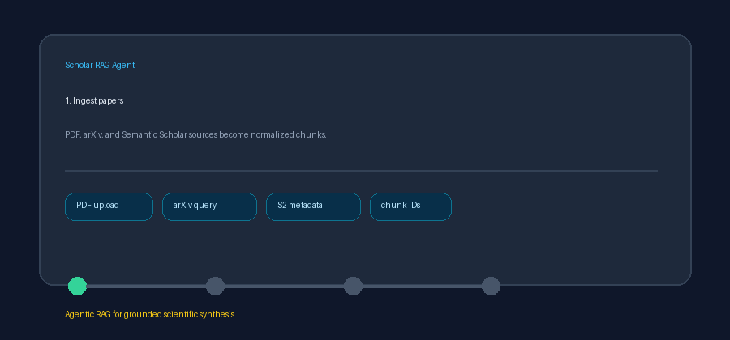
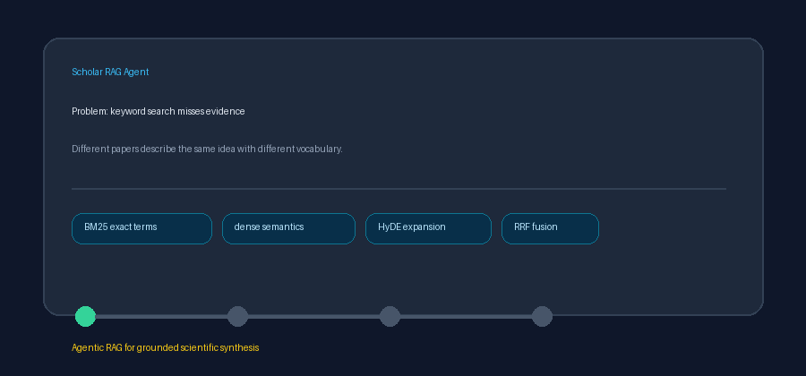
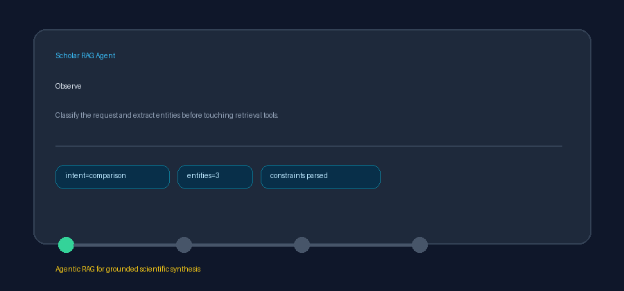
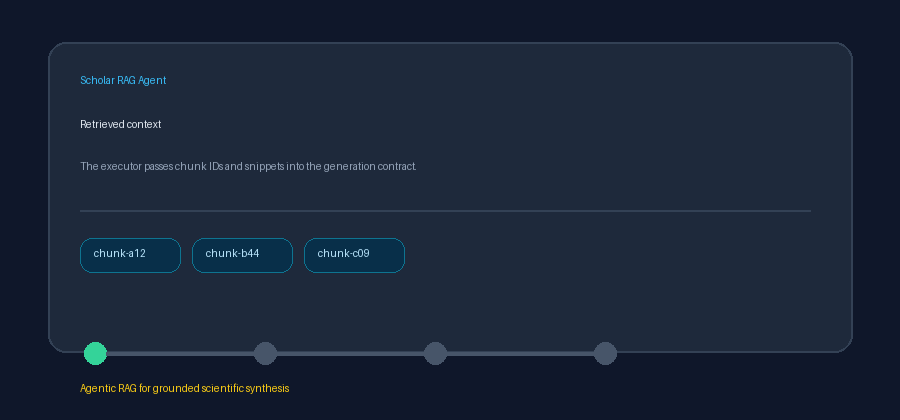

# Scholar RAG Agent

[](https://github.com/Francis1998/scholar-rag-agent/actions/workflows/ci.yml)
[](tests)
[](pyproject.toml)
[](LICENSE)

Scholar RAG Agent is a production-grade, local-first Agentic RAG system for scientific literature. It ingests papers from PDFs, arXiv, Semantic Scholar, OpenAlex, PubMed, Crossref, Europe PMC, DOAJ, DBLP, HAL, OpenAIRE, Zenodo, Figshare, CORE, bioRxiv/medRxiv, NASA ADS, DataCite, and OpenCitations; builds hybrid dense, sparse, and entity-relationship retrieval indexes; and answers research questions with multi-hop reasoning and citation-backed evidence.
Scholar RAG Agent is a production-grade, local-first Agentic RAG system for scientific literature. It ingests papers from PDFs, arXiv, Semantic Scholar, OpenAlex, PubMed, Crossref, Europe PMC, DOAJ, DBLP, HAL, OpenAIRE, Zenodo, Figshare, CORE, bioRxiv/medRxiv, NASA ADS, DataCite, and ORCID; builds hybrid dense, sparse, and entity-relationship retrieval indexes; and answers research questions with multi-hop reasoning and citation-backed evidence.

The project is designed for the scientific knowledge synthesis narrative behind NIW-style research impact: researchers can accelerate literature review, hypothesis validation, and grounded comparison across large corpora without losing provenance.

## Why Researchers Need This

Most literature workflows break down when the corpus grows beyond a few papers:

- Issue: keyword search misses papers that use different terminology.
  Scholar RAG Agent combines dense semantic retrieval, BM25 sparse search, HyDE expansion, and RRF fusion so a query can match both exact terms and related scientific phrasing.

- Issue: fused results are dominated by near-duplicate passages that waste the context window.
  An optional Maximal Marginal Relevance (MMR) re-ranker balances relevance against novelty, dropping redundant chunks so the model sees complementary evidence.

- Issue: single-hop RAG retrieves isolated snippets but misses evidence chains.
  The GraphRAG layer extracts entities and relationships, then follows bounded multi-hop paths to connect methods, datasets, findings, and limitations across papers.

- Issue: generated summaries sound plausible but are hard to audit.
  Every answer is mapped back to retrieved chunk IDs, and unsupported claims are flagged with `[UNGROUNDED]` instead of being silently trusted.

- Issue: research questions often need a plan, not just one search call.
  The Observe -> Decide -> Act runtime classifies intent, decomposes the query into retrieval sub-tasks, and persists a JSON rationale trace for every decision.

- Issue: teams need reproducible evidence trails for reviews, grants, and publications.
  The SQLite event log records state transitions, timestamps, agent IDs, run IDs, plans, retrieval payloads, and final answer provenance.

## Actual Use Cases

- Systematic literature review: ingest a folder of PDFs plus arXiv IDs, ask for the strongest themes, and receive cited claims grouped by supporting chunks.

- Grant or NIW evidence synthesis: collect papers around a research contribution, validate novelty claims, and export citation-backed reasoning traces that show why each claim is supported.

- Hypothesis validation: ask whether the literature supports or refutes a hypothesis, then inspect supporting and counter-evidence retrieval tasks separately.

- Method comparison: compare approaches such as GraphRAG, dense retrieval, and BM25 across papers while preserving the source chunks behind each contrast.

- Research onboarding: give a new lab member a paper corpus and let them ask grounded factual, synthesis, comparison, and hypothesis questions without manually reading every PDF first.

- Prior-art triage: search Semantic Scholar and arXiv records, ingest abstracts, then identify overlapping methods, datasets, and claims before deeper manual review.

- Citation QA for drafts: paste draft claims as questions and flag statements that are not supported by the ingested source chunks.

- Multi-provider LLM evaluation: route reasoning, speed, cost, and default tasks to different adapters while keeping output validation and citation grounding consistent.

## Demo Gallery









```text
                 +---------------------------+
                 | Observe: Query Analyzer   |
                 +-------------+-------------+
                               |
                               v
+---------+      +-------------+-------------+      +-------------------+
| Papers  +----->| Decide: Planner           +----->| Act: Executor     |
+---------+      +-------------+-------------+      +---------+---------+
 PDF/arXiv/S2                  |                              |
                               v                              v
                   +-----------+-----------+       +----------+----------+
                   | SQLite Durable Events |       | Hybrid Retrieval    |
                   +-----------------------+       | Dense + BM25 + RRF  |
                                                   +----------+----------+
                                                              |
                                                              v
                                                   +----------+----------+
                                                   | GraphRAG Multi-hop  |
                                                   +----------+----------+
                                                              |
                                                              v
                                                   +----------+----------+
                                                   | LLM Router + Guard  |
                                                   +----------+----------+
                                                              |
                                                              v
                                                   Citation-backed answer
```

## Install In 3 Commands

```bash
git clone https://github.com/Francis1998/scholar-rag-agent.git
cd scholar-rag-agent && uv sync --extra dev
uv run pytest tests/ -v
```

## Local Demo

```bash
uv run python scripts/demo_local.py
uv run uvicorn api.main:app --reload
```

The deterministic demo ingests a small fixture paper, executes an Observe -> Decide -> Act run, prints the planner trace, and returns a cited answer. A generated demo asset is available at `docs/assets/demo.gif`.

Additional GIFs in `docs/assets/` show the problem-to-solution flow, planner trace, and citation grounding guard.

## Documentation

| Document | Description |
| --- | --- |
| [Quickstart](QUICKSTART.md) | Install, demo, and API in three steps. |
| [Architecture](ARCHITECTURE.md) | Agent state machine, retrieval pipeline, and data flow. |
| [Configuration](CONFIGURATION.md) | Environment variables and provider keys. |
| [Configuration (extended)](docs/CONFIGURATION.md) | Full configuration reference with examples. |
| [Safety](SAFETY.md) | Timeout policy, scope bounds, cancellation, and hallucination guard design. |
| [Demo](docs/DEMO.md) | Demo GIFs and reproducible local demo commands. |
| [Examples](docs/EXAMPLES.md) | Usage examples for ingestion, querying, and retrieval evaluation. |
| [Performance](docs/PERFORMANCE.md) | Performance tuning notes. |
| [Troubleshooting](docs/TROUBLESHOOTING.md) | Common setup and runtime fixes. |
| [Contributing](CONTRIBUTING.md) | Development and PR workflow. |
| [Security](SECURITY.md) | Vulnerability reporting policy. |
| [Changelog](CHANGELOG.md) | Version history. |
| [bioRxiv / medRxiv source guide](docs/guides/BIORXIV_SOURCE_GUIDE.md) | bioRxiv and medRxiv preprint connector. |
| [NASA ADS source guide](docs/guides/ADS_SOURCE_GUIDE.md) | NASA ADS astronomy/physics connector. |
| [DataCite source guide](docs/guides/DATACITE_SOURCE_GUIDE.md) | DataCite DOI registry connector. |
| [OpenCitations source guide](docs/guides/OPENCITATIONS_SOURCE_GUIDE.md) | OpenCitations DOI metadata and citation-count connector. |
| [ORCID source guide](docs/guides/ORCID_SOURCE_GUIDE.md) | ORCID public record works connector. |
| [CORE source guide](docs/guides/CORE_SOURCE_GUIDE.md) | CORE open-access works connector. |
| [Figshare source guide](docs/guides/FIGSHARE_SOURCE_GUIDE.md) | Figshare research-output connector. |

## Provider Keys

All live providers are optional. Without keys the system uses deterministic fakes for tests and demos. Configure keys in `.env` or your shell:

```bash
export OPENAI_API_KEY=...
export ANTHROPIC_API_KEY=...
export GEMINI_API_KEY=...
export MOONSHOT_API_KEY=...
```

## Quality Gates

```bash
uv run ruff check . && uv run ruff format --check .
uv run mypy src/
uv run pytest tests/ -v --cov=src --cov-fail-under=70
```

## License

Apache-2.0. See `LICENSE`.
