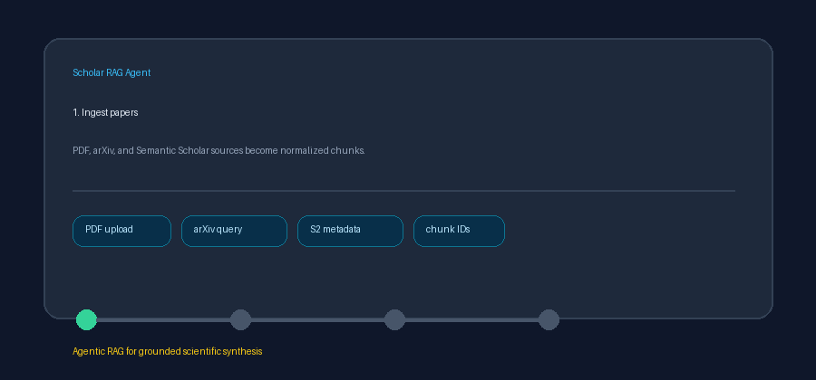
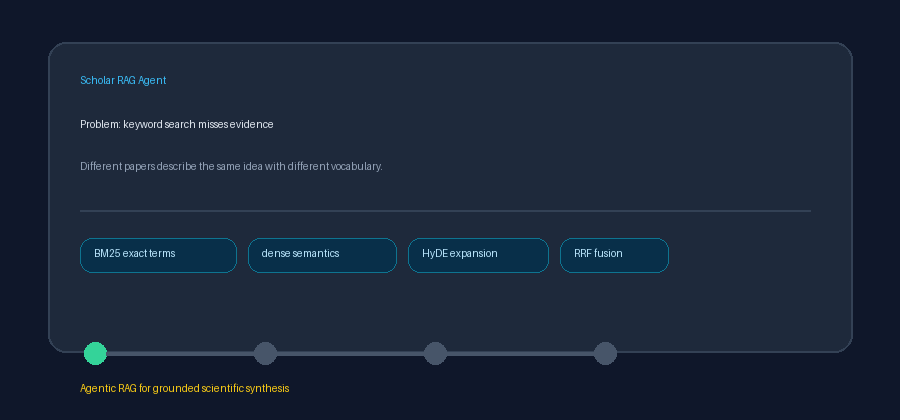
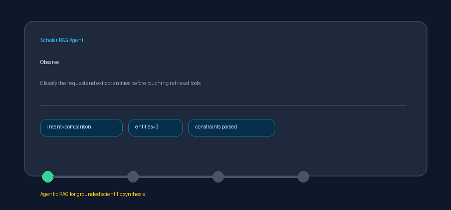
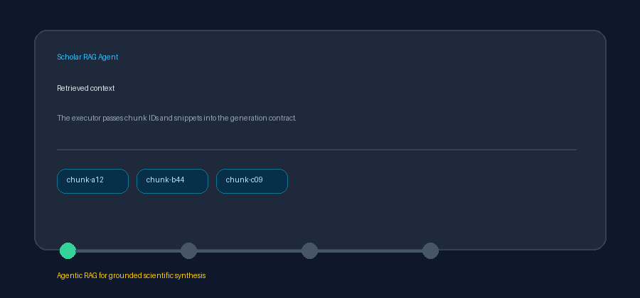

# Scholar RAG Agent

[](https://github.com/Francis1998/scholar-rag-agent/actions/workflows/ci.yml)
[](tests)
[](pyproject.toml)
[](LICENSE)

Scholar RAG Agent is a production-grade, local-first Agentic RAG system for scientific literature. It ingests papers from PDFs, arXiv, arXiv HTML abs abstracts, Semantic Scholar search and recommendations, OpenAlex, OpenAlex authors, OpenAlex author works, OpenAlex concepts, OpenAlex institutions, OpenAlex sources/venues, PubMed MeSH, OpenAlex topics hierarchy, Semantic Scholar bulk, OpenAlex publishers, OpenAlex funders, OpenAlex keywords, OpenAlex topics, PubMed, PubMed Central (PMC), PMC OA packages, Crossref, Crossref types filter, Crossref members, Crossref relations, Crossref Funder Registry, Crossref works-by-funder, Crossref works-by-license, Crossref Event Data, Crossref journals, Europe PMC, Europe PMC grants, DOAJ, DBLP, HAL, OpenAIRE, OpenAIRE projects, Zenodo, Figshare, CORE, bioRxiv/medRxiv, bioRxiv/medRxiv collections, NASA ADS, DataCite, DataCite related identifiers, DataCite reports, DataCite Event Data, OpenCitations, OSF, ORCID, ORCID works filter, Unpaywall, Dryad, Wikidata scholarly entities, SSRN preprints, OpenAlex retraction alerts, and ClinicalTrials.gov; builds hybrid dense, sparse, and entity-relationship retrieval indexes; and answers research questions with multi-hop reasoning and citation-backed evidence.

Scholar RAG Agent supports reproducible scientific knowledge synthesis, helping researchers accelerate literature review, hypothesis validation, and grounded comparison across large corpora while preserving source provenance.

## Why Researchers Need This

Most literature workflows break down when the corpus grows beyond a few papers:

- Issue: keyword search misses papers that use different terminology.
  Scholar RAG Agent combines dense semantic retrieval, BM25 sparse search, HyDE expansion, and RRF fusion so a query can match both exact terms and related scientific phrasing.

- Issue: fused results are dominated by near-duplicate passages that waste the context window.
  An optional Maximal Marginal Relevance (MMR) re-ranker balances relevance against novelty, dropping redundant chunks so the model sees complementary evidence.

- Issue: single-hop RAG retrieves isolated snippets but misses evidence chains.
  The GraphRAG layer extracts entities and relationships, then follows bounded multi-hop paths to connect methods, datasets, findings, and limitations across papers.

- Issue: generated summaries sound plausible but are hard to audit.
  Every answer is mapped back to retrieved chunk IDs, and unsupported claims are flagged with `[UNGROUNDED]` instead of being silently trusted.

- Issue: research questions often need a plan, not just one search call.
  The Observe -> Decide -> Act runtime classifies intent, decomposes the query into retrieval sub-tasks, and persists a JSON rationale trace for every decision.

- Issue: teams need reproducible evidence trails for reviews, grants, and publications.
  The SQLite event log records state transitions, timestamps, agent IDs, run IDs, plans, retrieval payloads, and final answer provenance.

## Example Use Cases

- Systematic literature review: ingest a folder of PDFs plus arXiv IDs, ask for the strongest themes, and receive cited claims grouped by supporting chunks.

- Research and grant evidence synthesis: collect papers around a research question or contribution, assess novelty claims, and export citation-backed reasoning traces showing the evidence for each claim.

- Hypothesis validation: ask whether the literature supports or refutes a hypothesis, then inspect supporting and counter-evidence retrieval tasks separately.

- Method comparison: compare approaches such as GraphRAG, dense retrieval, and BM25 across papers while preserving the source chunks behind each contrast.

- Research onboarding: give a new lab member a paper corpus and let them ask grounded factual, synthesis, comparison, and hypothesis questions without manually reading every PDF first.

- Prior-art triage: search Semantic Scholar and arXiv records, expand a trusted seed through Semantic Scholar recommendations, ingest abstracts, then identify overlapping methods, datasets, and claims before deeper manual review.

- Citation QA for drafts: paste draft claims as questions and flag statements that are not supported by the ingested source chunks.

- Multi-provider LLM evaluation: route reasoning, speed, cost, and default tasks to different adapters while keeping output validation and citation grounding consistent.

## Demo Gallery









```text
                 +---------------------------+
                 | Observe: Query Analyzer   |
                 +-------------+-------------+
                               |
                               v
+---------+      +-------------+-------------+      +-------------------+
| Papers  +----->| Decide: Planner           +----->| Act: Executor     |
+---------+      +-------------+-------------+      +---------+---------+
 PDF/arXiv/S2                  |                              |
                               v                              v
                   +-----------+-----------+       +----------+----------+
                   | SQLite Durable Events |       | Hybrid Retrieval    |
                   +-----------------------+       | Dense + BM25 + RRF  |
                                                   +----------+----------+
                                                              |
                                                              v
                                                   +----------+----------+
                                                   | GraphRAG Multi-hop  |
                                                   +----------+----------+
                                                              |
                                                              v
                                                   +----------+----------+
                                                   | LLM Router + Guard  |
                                                   +----------+----------+
                                                              |
                                                              v
                                                   Citation-backed answer
```

## Install In 3 Commands

```bash
git clone https://github.com/Francis1998/scholar-rag-agent.git
cd scholar-rag-agent && uv sync --extra dev
uv run pytest tests/ -v
```

## Local Demo

```bash
uv run python scripts/demo_local.py
uv run uvicorn api.main:app --reload
```

The deterministic demo ingests a small fixture paper, executes an Observe -> Decide -> Act run, prints the planner trace, and returns a cited answer. A generated demo asset is available at `docs/assets/demo.gif`.

Additional GIFs in `docs/assets/` show the problem-to-solution flow, planner trace, and citation grounding guard.

## Documentation

| Document | Description |
| --- | --- |
| [Quickstart](QUICKSTART.md) | Install, demo, and API in three steps. |
| [Architecture](ARCHITECTURE.md) | Agent state machine, retrieval pipeline, and data flow. |
| [Configuration](CONFIGURATION.md) | Environment variables and provider keys. |
| [Configuration (extended)](docs/CONFIGURATION.md) | Full configuration reference with examples. |
| [Safety](SAFETY.md) | Timeout policy, scope bounds, cancellation, and hallucination guard design. |
| [Demo](docs/DEMO.md) | Demo GIFs and reproducible local demo commands. |
| [arXiv HTML abstract source guide](docs/guides/ARXIV_HTML_ABSTRACT_SOURCE_GUIDE.md) | arXiv abs HTML abstract enrichment connector. |
| [Examples](docs/EXAMPLES.md) | Usage examples for ingestion, querying, and retrieval evaluation. |
| [Performance](docs/PERFORMANCE.md) | Performance tuning notes. |
| [Troubleshooting](docs/TROUBLESHOOTING.md) | Common setup and runtime fixes. |
| [Contributing](CONTRIBUTING.md) | Development and PR workflow. |
| [Security](SECURITY.md) | Vulnerability reporting policy. |
| [Changelog](CHANGELOG.md) | Version history. |
| [bioRxiv / medRxiv source guide](docs/guides/BIORXIV_SOURCE_GUIDE.md) | bioRxiv and medRxiv preprint connector. |
| [bioRxiv / medRxiv collections guide](docs/guides/BIORXIV_COLLECTIONS_SOURCE_GUIDE.md) | bioRxiv and medRxiv subject-category collection connector. |
| [NASA ADS source guide](docs/guides/ADS_SOURCE_GUIDE.md) | NASA ADS astronomy/physics connector. |
| [PMC source guide](docs/guides/PMC_SOURCE_GUIDE.md) | PubMed Central full-text connector. |
| [PMC OA package guide](docs/guides/PMC_OA_PACKAGE_GUIDE.md) | NCBI PMC Open Access package/PDF link discovery connector. |
| [DataCite source guide](docs/guides/DATACITE_SOURCE_GUIDE.md) | DataCite DOI registry connector. |
| [DataCite related identifiers source guide](docs/guides/DATACITE_RELATED_SOURCE_GUIDE.md) | DataCite related-identifier enrichment connector. |
| [DataCite Event Data source guide](docs/guides/DATACITE_EVENTS_SOURCE_GUIDE.md) | DataCite DOI citation, usage, and relationship events connector. |
| [OpenCitations source guide](docs/guides/OPENCITATIONS_SOURCE_GUIDE.md) | OpenCitations DOI metadata and citation-count connector. |
| [Semantic Scholar recommendations guide](docs/guides/SEMANTIC_SCHOLAR_RECOMMENDATIONS_GUIDE.md) | Related-paper expansion from a seed Semantic Scholar id or DOI. |
| [OSF source guide](docs/guides/OSF_SOURCE_GUIDE.md) | Open Science Framework preprint and registration connector. |
| [OpenAIRE projects source guide](docs/guides/OPENAIRE_PROJECTS_SOURCE_GUIDE.md) | OpenAIRE funded-projects registry connector. |
| [ORCID works filter source guide](docs/guides/ORCID_WORKS_FILTER_SOURCE_GUIDE.md) | ORCID works year/type deep-filter connector. |
| [ORCID source guide](docs/guides/ORCID_SOURCE_GUIDE.md) | ORCID public record works connector. |
| [Unpaywall source guide](docs/guides/UNPAYWALL_SOURCE_GUIDE.md) | Unpaywall DOI open-access landing/PDF lookup connector. |
| [OpenAlex topics source guide](docs/guides/OPENALEX_TOPICS_SOURCE_GUIDE.md) | OpenAlex research-topic taxonomy connector. |
| [OpenAlex concepts source guide](docs/guides/OPENALEX_CONCEPTS_SOURCE_GUIDE.md) | OpenAlex legacy concepts taxonomy connector. |
| [OpenAlex institutions source guide](docs/guides/OPENALEX_INSTITUTIONS_SOURCE_GUIDE.md) | OpenAlex research-institution connector. |
| [OpenAlex sources source guide](docs/guides/OPENALEX_SOURCES_SOURCE_GUIDE.md) | OpenAlex journal/venue sources connector. |
| [PubMed MeSH source guide](docs/guides/PUBMED_MESH_SOURCE_GUIDE.md) | NCBI MeSH vocabulary descriptor connector. |
| [OpenAlex topics hierarchy source guide](docs/guides/OPENALEX_TOPICS_HIERARCHY_SOURCE_GUIDE.md) | OpenAlex topics with domain/field/subfield ancestry. |
| [Semantic Scholar bulk source guide](docs/guides/SEMANTIC_SCHOLAR_BULK_SOURCE_GUIDE.md) | Semantic Scholar paper/batch bulk connector. |
| [OpenAlex publishers source guide](docs/guides/OPENALEX_PUBLISHERS_SOURCE_GUIDE.md) | OpenAlex publisher-organization connector. |
| [OpenAlex funders source guide](docs/guides/OPENALEX_FUNDERS_SOURCE_GUIDE.md) | OpenAlex funding-organization connector. |
| [OpenAlex keywords source guide](docs/guides/OPENALEX_KEYWORDS_SOURCE_GUIDE.md) | OpenAlex research-keyword taxonomy connector. |
| [Europe PMC grants source guide](docs/guides/EUROPEPMC_GRANTS_SOURCE_GUIDE.md) | Europe PMC GRIST grants connector. |
| [Crossref relations source guide](docs/guides/CROSSREF_RELATIONS_SOURCE_GUIDE.md) | Crossref works relation-types connector. |
| [OpenAlex authors source guide](docs/guides/OPENALEX_AUTHORS_SOURCE_GUIDE.md) | OpenAlex researcher-profile connector. |
| [Retraction check guide](docs/guides/RETRACTION_CHECK_GUIDE.md) | OpenAlex retracted-works alert connector. |
| [Crossref Event Data source guide](docs/guides/CROSSREF_EVENTS_SOURCE_GUIDE.md) | Crossref Event Data altmetrics/events connector. |
| [Crossref journals source guide](docs/guides/CROSSREF_JOURNALS_SOURCE_GUIDE.md) | Crossref journal metadata / ISSN connector. |
| [Crossref members source guide](docs/guides/CROSSREF_MEMBERS_SOURCE_GUIDE.md) | Crossref publisher/registrant member connector. |
| [Crossref Funder Registry source guide](docs/guides/CROSSREF_FUNDER_SOURCE_GUIDE.md) | Crossref Open Funder Registry connector. |
| [CORE source guide](docs/guides/CORE_SOURCE_GUIDE.md) | CORE open-access works connector. |
| [Figshare source guide](docs/guides/FIGSHARE_SOURCE_GUIDE.md) | Figshare research-output connector. |
| [Dryad source guide](docs/guides/DRYAD_SOURCE_GUIDE.md) | Dryad research-data repository connector. |
| [ClinicalTrials.gov source guide](docs/guides/CLINICALTRIALS_SOURCE_GUIDE.md) | ClinicalTrials.gov clinical-study registry connector. |
| [Wikidata scholarly source guide](docs/guides/WIKIDATA_SCHOLARLY_SOURCE_GUIDE.md) | Wikidata scholarly-entity search connector. |
| [SSRN source guide](docs/guides/SSRN_SOURCE_GUIDE.md) | SSRN preprint DOI bridge via Crossref connector. |
| [ORCID employments source guide](docs/guides/ORCID_EMPLOYMENTS_SOURCE_GUIDE.md) | ORCID public employment affiliations connector. |
| [Crossref works-by-funder source guide](docs/guides/CROSSREF_WORKS_FUNDER_SOURCE_GUIDE.md) | Crossref funded-works / funder-filter connector. |
| [Crossref works-by-license source guide](docs/guides/CROSSREF_WORKS_LICENSE_SOURCE_GUIDE.md) | Crossref licensed-works / license-URL filter connector. |
| [OpenAlex author works source guide](docs/guides/OPENALEX_AUTHOR_WORKS_SOURCE_GUIDE.md) | OpenAlex author→works citations blend connector. |
| [DataCite reports source guide](docs/guides/DATACITE_REPORTS_SOURCE_GUIDE.md) | DataCite research-report DOI connector. |
| [Europe PMC preprints source guide](docs/guides/EUROPEPMC_PREPRINTS_SOURCE_GUIDE.md) | Europe PMC PPR-filtered preprint connector. |

## Provider Keys

All live providers are optional. Without keys the system uses deterministic fakes for tests and demos. Configure keys in `.env` or your shell:

```bash
export OPENAI_API_KEY=...
export ANTHROPIC_API_KEY=...
export GEMINI_API_KEY=...
export MOONSHOT_API_KEY=...
export UNPAYWALL_EMAIL=dev@example.org
```

When enabled, downstream synthesis can route through GPT-5.5, Claude Sonnet 4.6,
Gemini 3.x, and Kimi K2 while deterministic connectors such as Unpaywall keep
source lookup reproducible.
For downstream synthesis and evaluation, the preferred frontier model families are GPT-5.5, Claude Sonnet 4.6, Gemini 3.x, and Kimi K2.
Gemini 3.x, and Kimi K2 while deterministic connectors such as Unpaywall and
retraction checks keep source lookup reproducible.

## Quality Gates

```bash
uv run ruff check . && uv run ruff format --check .
uv run mypy src/
uv run pytest tests/ -v --cov=src --cov-fail-under=70
```

## License

Apache-2.0. See `LICENSE`.
