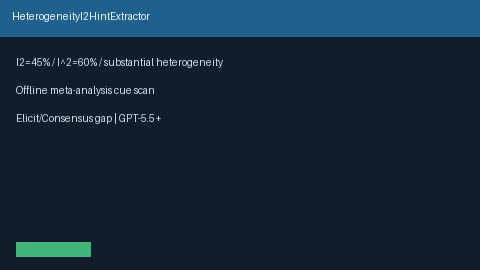

- **BlindingStatusCueExtractor**: offline evidence cue extractor — see `docs/guides/BLINDING_STATUS_CUE_EXTRACTOR_GUIDE.md`
- **PrimaryEndpointCueExtractor**: offline evidence cue extractor — see `docs/guides/PRIMARY_ENDPOINT_CUE_EXTRACTOR_GUIDE.md`
- **IntentionToTreatCueExtractor**: offline evidence cue extractor — see `docs/guides/INTENTION_TO_TREAT_CUE_EXTRACTOR_GUIDE.md`
- **NumberNeededToTreatHintExtractor**: offline evidence cue extractor — see `docs/guides/NNT_HINT_EXTRACTOR_GUIDE.md`
- **RiskOfBiasCueExtractor**: offline Cochrane-style RoB cues — see `docs/guides/RISK_OF_BIAS_CUE_EXTRACTOR_GUIDE.md`

# Scholar RAG Agent

[](https://github.com/Francis1998/scholar-rag-agent/actions/workflows/ci.yml)
[](pyproject.toml)
[](LICENSE)

Load a small paper corpus, ask comparison or hypothesis questions, and inspect
the passages and run history behind the response. Scholar RAG Agent is a
**local-first Python toolkit and FastAPI service** for building inspectable
literature workflows, with SQLite persistence and optional model-provider adapters.

The default setup works without model credentials. Its fake adapter demonstrates
the workflow; it does **not** produce a scientific summary or validate a hypothesis.

## Start offline

With Python 3.11+ and [uv](https://docs.astral.sh/uv/) installed:

```bash
git clone https://github.com/Francis1998/scholar-rag-agent.git
cd scholar-rag-agent
uv sync --extra dev
uv run python scripts/demo_local.py
```

The demo explicitly uses the fake model, ingests a synthetic fixture into a
temporary database, and prints a run ID, `DONE` state, planner trace, and cited
placeholder answer. Its temporary database is removed on exit.

Next, use the [Quickstart](QUICKSTART.md) to start the API with an isolated
database and empty provider keys. The interactive API documentation is at
`http://127.0.0.1:8000/docs`; this is not a paper-chat or PDF-upload UI.

## Choose a workflow

| What you can do | Integrated path | Next guide |
| --- | --- | --- |
| Explore a corpus you own or may process | Ingest text, ask a question, inspect source IDs and snippets | [Quickstart](QUICKSTART.md) |
| Restrict a query to selected ingested papers | Pass `document_ids` through hybrid and graph retrieval; preserve scope in the saved evidence | [Document scope](docs/guides/DOCUMENT_SCOPE_GUIDE.md) |
| Compare methods or explore a hypothesis | Inspect comparison or supporting/counter-evidence retrieval tasks, then review the merged evidence | [Research workflow](docs/guides/RESEARCH_WORKFLOW_GUIDE.md) |
| Preserve a reviewable answer and its context | Export a completed run as JSON or Markdown with its exact recorded source chunks | [Evidence export](docs/guides/EVIDENCE_EXPORT_GUIDE.md) |
| Find a previous run after restart | Page through saved query previews and recorded states, then follow events/export links | [Run history](docs/guides/RUN_HISTORY_GUIDE.md) |
| Demonstrate your engineering work | Use synthetic notes, review warnings, save artifacts, and explain limitations | [Portfolio walkthrough](docs/guides/RESEARCH_WORKFLOW_GUIDE.md#6-present-a-portfolio-demonstration) |
| Extend ingestion or retrieval | Explicitly wire Python connectors, ranking helpers, or screening utilities | [Categorized catalog](docs/README.md) |

## Inspect a recorded run


This generated animation illustrates the synthetic offline evidence-export demo,
not a live research UI or a real model's scientific findings. Follow the
[demo reproduction instructions](docs/DEMO.md) to inspect the actual output.

Forgot the run ID? `GET /runs?limit=20` discovers persisted runs with bounded
query previews and creation-ordered pagination. Its recorded state is not a
liveness claim; see [run history and restart recovery](docs/guides/RUN_HISTORY_GUIDE.md).

`GET /runs/{run_id}/export?format=json|markdown` reconstructs a completed run from
stored evidence, without another retrieval or generation call. Keep the query,
plan, answer, claims, exact source chunks, trace, and nonsecret model provenance
together for review. The saved context survives corpus changes and restart; this
is not a guarantee of identical output from a new LLM run or a signed audit record.

## What actually runs

The API uses a hand-written **Observe -> Decide -> Act** state machine, not
LangGraph. Pydantic validates settings and schemas; HTTPX connects optional live
providers; SQLite stores documents, graph data, and durable run events.

| Stage | Default behavior |
| --- | --- |
| Ingest | `/ingest/text` normalizes text into fixed-size overlapping chunks and indexes entity co-mentions |
| Plan | Keyword-based intent analysis creates bounded retrieval tasks and a rationale trace |
| Retrieve | Deterministic HyDE template expansion, hash-vector cosine retrieval, BM25, and reciprocal rank fusion |
| Expand | Bounded traversal of an entity co-mention graph; paths are retrieval aids, not reasoning proofs |
| Rerank | Lexical overlap via `AdaptiveReranker`, not a learned cross-encoder |
| Generate and check | A routed provider or the fake adapter; claim/source-ID mapping with token-overlap checks |
| Record | SQLite events and frozen evidence for completed-run exports |

`DenseRetriever` uses `HashEmbeddingModel`: deterministic lexical hash vectors,
**not learned semantic embeddings**. Installing optional ML dependencies does not
switch the API to semantic embeddings or cross-encoder reranking. MMR, multi-HyDE,
query rewriting, screening checklists, metadata boosts, paper chat memory, and
most other cataloged helpers require explicit library integration.

For the exact wiring and storage lifecycle, see [Architecture](ARCHITECTURE.md).
For current model IDs, per-provider overrides, routing, and dated official
sources, use the [provider model guide](docs/guides/PROVIDER_MODELS_GUIDE.md).
`/query` requests the reasoning route; the default-provider setting is not a
universal override. Provider availability depends on your account and credentials.

## Boundaries to understand

- **A citation is not verification.** `CitationGrounder` checks token overlap and
  source IDs, not factual correctness or entailment. Review original passages,
  opposing evidence, and warnings even when `grounded` is true.
- **This is not a complete review platform.** Supporting/counter-evidence tasks
  do not constitute a systematic review, novelty proof, or medical decision.
  The offline demo is a plumbing demonstration, not a quality evaluation.
- **Local-first is not production-hardened.** There is no built-in authentication,
  tenant isolation, or PDF-upload endpoint/UI. Keep the API on loopback.
- **Evidence exports contain source text.** Queries, documents, answers, and
  local metadata may be sensitive. Live providers receive retrieved context;
  review permissions and content before transmitting or sharing anything.

Read [Safety](SAFETY.md) before using non-synthetic material.

## Offline evidence extractors



Library helpers can surface meta-analysis and statistics cues from local paper
text without a network call. `HeterogeneityI2HintExtractor` pulls I2 / I^2 /
heterogeneity phrases from abstracts (Elicit/Consensus gap; distinct from
`EffectSizeHintExtractor` and `PValueHintExtractor`). See the
[heterogeneity I2 guide](docs/guides/HETEROGENEITY_I2_HINT_EXTRACTOR_GUIDE.md).

## Documentation

| Guide | Purpose |
| --- | --- |
| [Quickstart](QUICKSTART.md) | Working offline setup and first API request |
| [Research workflow and portfolio](docs/guides/RESEARCH_WORKFLOW_GUIDE.md) | Corpus, questions, evidence review, export, and acceptance checklist |
| [API and library examples](docs/EXAMPLES.md) | Copyable requests and clearly separated network adapters |
| [Configuration](CONFIGURATION.md) | Runtime settings and provider setup |
| [Architecture](ARCHITECTURE.md) | Integrated pipeline and persistence |
| [Documentation catalog](docs/README.md) | All existing extension/source guides, operations, and historical records |
| [Contributing](CONTRIBUTING.md) / [Security](SECURITY.md) | Contribution workflow and vulnerability reporting |

## Quality gates

```bash
uv run ruff check . && uv run ruff format --check .
uv run mypy src/
uv run pytest tests/ -v --cov=src --cov-fail-under=70
```

[CI](.github/workflows/ci.yml) runs on Python 3.11 and 3.12.
[Security Scan](.github/workflows/security.yml) also audits dependencies and runs
Bandit. Passing these checks is not a scientific-accuracy benchmark.

## License

[Apache-2.0](LICENSE). Source papers and third-party service content retain their
own licenses and access terms.
