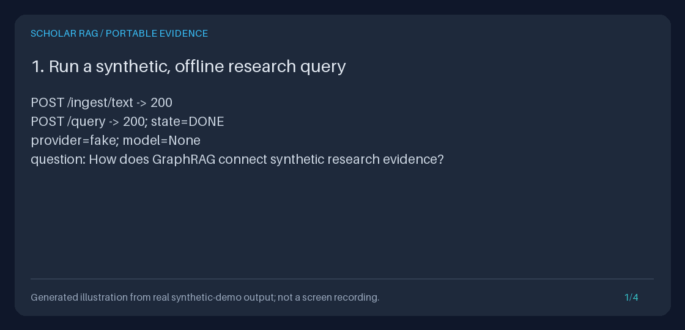
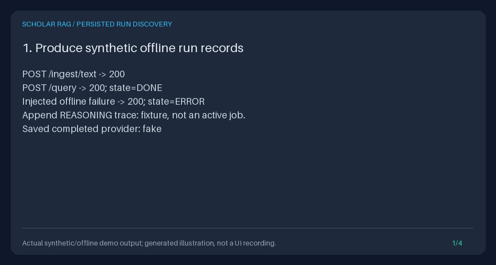

# Demo

## Evidence-export walkthrough



The four-frame animation is a generated illustration based on the synthetic
demo's actual transcript, not a recording of a research UI or live model
inference. It shows the inspectable engineering path: ingest text, query, record
evidence, and export an artifact.

After `uv sync --extra dev`, run from the repository root:

```bash
DEMO_DIR="$(mktemp -d)/evidence-demo"
uv run python -m scripts.demo_evidence_export --output-dir "$DEMO_DIR"
printf 'Demo artifacts: %s\n' "$DEMO_DIR"
uv run python -m json.tool "$DEMO_DIR/bundle.json"
```

Choose a fresh output directory: the demo refuses to overwrite its named output
files. It uses only synthetic text and explicitly selects the fake adapter
without provider credentials; inherited model keys do not turn this
demonstration into live inference.

| File | What to inspect |
| --- | --- |
| `bundle.json` | Versioned machine-readable evidence bundle |
| `bundle.md` | Human-readable rendering of the same recorded run |
| `demo.sqlite3` | Saved run events and evidence; the demo deliberately removes its synthetic corpus to demonstrate persistence |
| `transcript.txt` | Actual demo output used by the generated illustration |

Use the [evidence export guide](guides/EVIDENCE_EXPORT_GUIDE.md) for the schema,
error behavior, and animation reproduction instructions. Use the
[research workflow](guides/RESEARCH_WORKFLOW_GUIDE.md) to run your own API-based
comparison, hypothesis, evidence-review, and portfolio walkthrough.

## Run-history discovery after restart



This generated illustration uses actual offline demo output, not a UI recording
or real-model science. It shows completed and failed API queries, a labeled
partial-trace fixture, container recreation, paginated discovery, and export
through a recovered ID.

```bash
HISTORY_DIR="$(mktemp -d)/run-history-demo"
uv run python -m scripts.demo_run_history --output-dir "$HISTORY_DIR"
uv run python -m scripts.create_run_history_gif \
  --transcript "$HISTORY_DIR/transcript.txt" \
  --output "$HISTORY_DIR/run-history.gif"
```

Inspect `page-1.json`, `page-2.json`, `done.json`, `events.json`, `bundle.json`,
`bundle.md`, `history.sqlite3`, and `transcript.txt` in that directory. Neither
script overwrites an existing named artifact. The
[run-history guide](guides/RUN_HISTORY_GUIDE.md) explains the API/Python contracts
and why a recorded state is not a claim of active or resumable work.

## Small local smoke demo

```bash
uv run python scripts/demo_local.py
```

This explicitly uses `FakeLLMAdapter` and a temporary SQLite database. It prints
the plan and a cited placeholder answer; it does not synthesize scientific
findings, and its database is removed on exit. The
[Quickstart](../QUICKSTART.md) starts a separate, persistent API workspace.

## Historical illustrations

Earlier assets remain available at their original paths:
[local flow](assets/demo.gif), [use cases](assets/use_cases.gif),
[planning trace](assets/planning_trace.gif), and
[grounding](assets/grounded_answer.gif).

These are scripted storyboards from `scripts/create_demo_gif.py`, not captured
application output. They contain historical shorthand such as "PDF upload" and
"dense semantics"; neither describes the current default API. They also do not
establish scientific quality or deterministic replay from old event-only runs.
Use [Architecture](../ARCHITECTURE.md),
[the provider model guide](guides/PROVIDER_MODELS_GUIDE.md), and the evidence demo
above as the current references rather than treating old animations as UI or
capability specifications.
