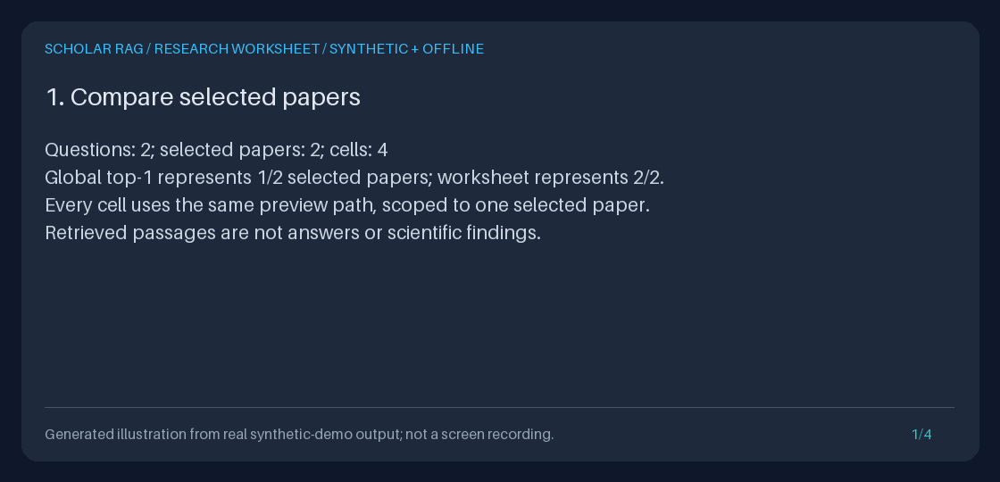
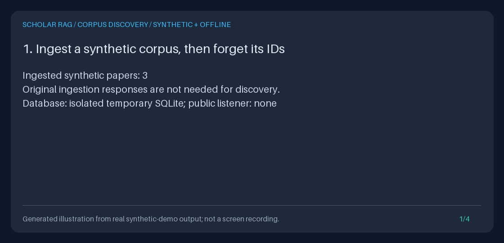
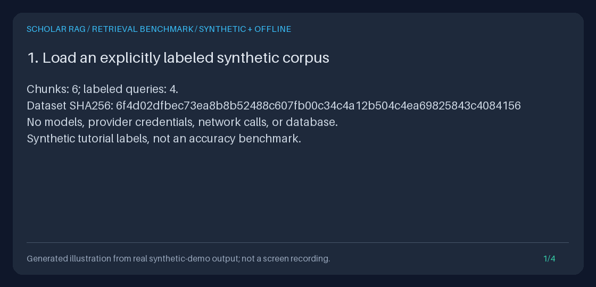

# Demo

## Per-paper research evidence worksheets



This generated illustration uses executed API/Python output: two questions,
two selected papers, four cells, no model calls or agent events, and portable
JSON/Markdown downloads. It is not a UI recording or a scientific finding.

```bash
WORKSHEET_DIR="$(mktemp -d)/worksheet-demo"
uv run python -m scripts.demo_research_worksheet --output-dir "$WORKSHEET_DIR"
uv run python -m scripts.create_research_worksheet_gif \
  --transcript "$WORKSHEET_DIR/transcript.txt" \
  --output "$WORKSHEET_DIR/research-worksheet.gif"
```

Read `checks.json`, both worksheet formats, and `transcript.txt` in the chosen
directory. The temporary database is removed and existing named artifacts are
not overwritten. The [worksheet guide](guides/RESEARCH_WORKSHEET_GUIDE.md)
explains API/Python use, bounds, failure behavior, and honest portfolio use.

## Generation-free retrieval preview


This original illustration is rendered from executed API/Python output, not a
screen recording or a model's scientific findings. It demonstrates shared context
preparation, scoped hybrid/graph evidence, unknown versus invalid IDs, zero
live/fake generation calls and agent events, and unchanged-corpus restart parity.

```bash
PREVIEW_DIR="$(mktemp -d)/retrieval-preview"
uv run python -m scripts.demo_retrieval_preview --output-dir "$PREVIEW_DIR"
uv run python -m scripts.create_retrieval_preview_gif \
  --transcript "$PREVIEW_DIR/transcript.txt" \
  --output "$PREVIEW_DIR/retrieval-preview.gif"
```

The temporary database is removed; the measured JSON previews and transcript
remain in the chosen directory. Explicit validated settings ignore ambient
provider keys and `.env`, and tests deny HTTP with all four dummy model keys
present. See the [complete guide](guides/RETRIEVAL_PREVIEW_GUIDE.md) for API,
Python, privacy, limits, and portfolio use.

## Evidence-export walkthrough


The four-frame animation is a generated illustration based on the synthetic
demo's actual transcript, not a recording of a research UI or live model
inference. It shows the inspectable engineering path: ingest text, query, record
evidence, and export an artifact.

After `uv sync --extra dev`, run from the repository root:

```bash
DEMO_DIR="$(mktemp -d)/evidence-demo"
uv run python -m scripts.demo_evidence_export --output-dir "$DEMO_DIR"
printf 'Demo artifacts: %s\n' "$DEMO_DIR"
uv run python -m json.tool "$DEMO_DIR/bundle.json"
```

Choose a fresh output directory: the demo refuses to overwrite its named output
files. It uses only synthetic text and explicitly selects the fake adapter
without provider credentials; inherited model keys do not turn this
demonstration into live inference.

| File | What to inspect |
| --- | --- |
| `bundle.json` | Versioned machine-readable evidence bundle |
| `bundle.md` | Human-readable rendering of the same recorded run |
| `demo.sqlite3` | Saved run events and evidence; the demo deliberately removes its synthetic corpus to demonstrate persistence |
| `transcript.txt` | Actual demo output used by the generated illustration |

Use the [evidence export guide](guides/EVIDENCE_EXPORT_GUIDE.md) for the schema,
error behavior, and animation reproduction instructions. Use the
[research workflow](guides/RESEARCH_WORKFLOW_GUIDE.md) to run your own API-based
comparison, hypothesis, evidence-review, and portfolio walkthrough.

## Run-history discovery after restart


This generated illustration uses actual offline demo output, not a UI recording
or real-model science. It shows completed and failed API queries, a labeled
partial-trace fixture, container recreation, paginated discovery, and export
through a recovered ID.

```bash
HISTORY_DIR="$(mktemp -d)/run-history-demo"
uv run python -m scripts.demo_run_history --output-dir "$HISTORY_DIR"
uv run python -m scripts.create_run_history_gif \
  --transcript "$HISTORY_DIR/transcript.txt" \
  --output "$HISTORY_DIR/run-history.gif"
```

Inspect `page-1.json`, `page-2.json`, `done.json`, `events.json`, `bundle.json`,
`bundle.md`, `history.sqlite3`, and `transcript.txt` in that directory. Neither
script overwrites an existing named artifact. The
[run-history guide](guides/RUN_HISTORY_GUIDE.md) explains the API/Python contracts
and why a recorded state is not a claim of active or resumable work.

## Document discovery after restart



This generated illustration uses actual offline responses: ingest three notes,
page through saved IDs without generation, restart, filter the corpus, and query
one selected paper with the fake provider. It is not a UI recording.

```bash
CATALOG_DIR="$(mktemp -d)/catalog-demo"
uv run python -m scripts.demo_document_catalog --output-dir "$CATALOG_DIR"
uv run python -m scripts.create_document_catalog_gif \
  --transcript "$CATALOG_DIR/transcript.txt" \
  --output "$CATALOG_DIR/document-catalog.gif"
```

The [document catalog guide](guides/DOCUMENT_CATALOG_GUIDE.md) describes every
saved artifact, the executable Python/API workflows, and pagination/privacy limits.

## Retrieval benchmark quality gates



This generated illustration shows measured BM25/hybrid scores and both a failing
and passing gate on the same synthetic corpus, not a quality claim or live UI.

```bash
BENCHMARK_DIR="$(mktemp -d)/retrieval-benchmark"
uv run python -m scripts.demo_retrieval_benchmark --output-dir "$BENCHMARK_DIR"
uv run python -m scripts.create_retrieval_benchmark_gif \
  --transcript "$BENCHMARK_DIR/transcript.txt" \
  --output "$BENCHMARK_DIR/retrieval-benchmark.gif"
```

Read the [benchmark guide](guides/RETRIEVAL_BENCHMARK_GUIDE.md) for the dataset
schema, installed CLI, strict validation, per-case JSON reports, threshold exit
codes, Python API, and honest portfolio workflow.

## Small local smoke demo

```bash
uv run python scripts/demo_local.py
```

This explicitly uses `FakeLLMAdapter` and a temporary SQLite database. It prints
the plan and a cited placeholder answer; it does not synthesize scientific
findings, and its database is removed on exit. The
[Quickstart](../QUICKSTART.md) starts a separate, persistent API workspace.

## Historical illustrations

Earlier assets remain available at their original paths:
[local flow](assets/demo.gif), [use cases](assets/use_cases.gif),
[planning trace](assets/planning_trace.gif), and
[grounding](assets/grounded_answer.gif).

These are scripted storyboards from `scripts/create_demo_gif.py`, not captured
application output. They contain historical shorthand such as "PDF upload" and
"dense semantics"; neither describes the current default API. They also do not
establish scientific quality or deterministic replay from old event-only runs.
Use [Architecture](../ARCHITECTURE.md),
[the provider model guide](guides/PROVIDER_MODELS_GUIDE.md), and the evidence demo
above as the current references rather than treating old animations as UI or
capability specifications.
