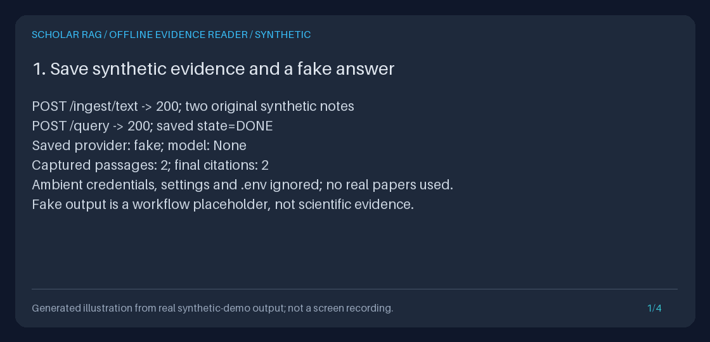
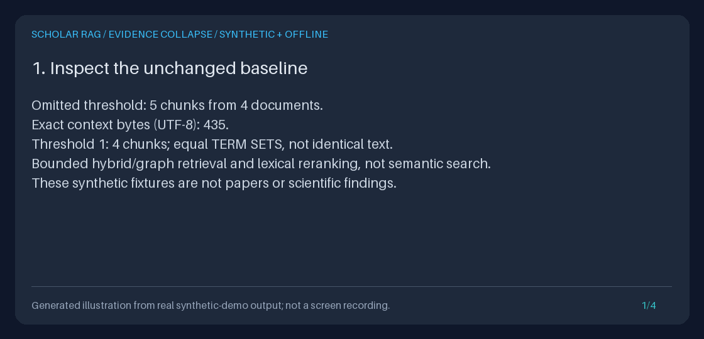
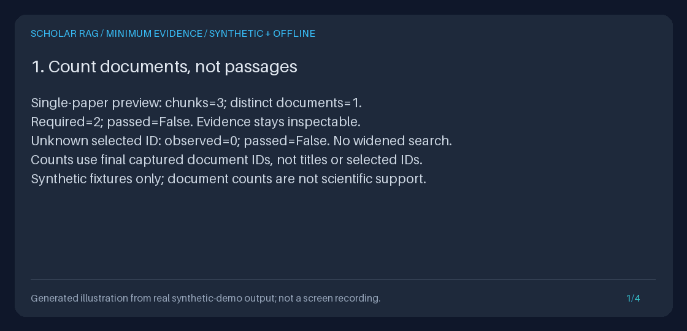
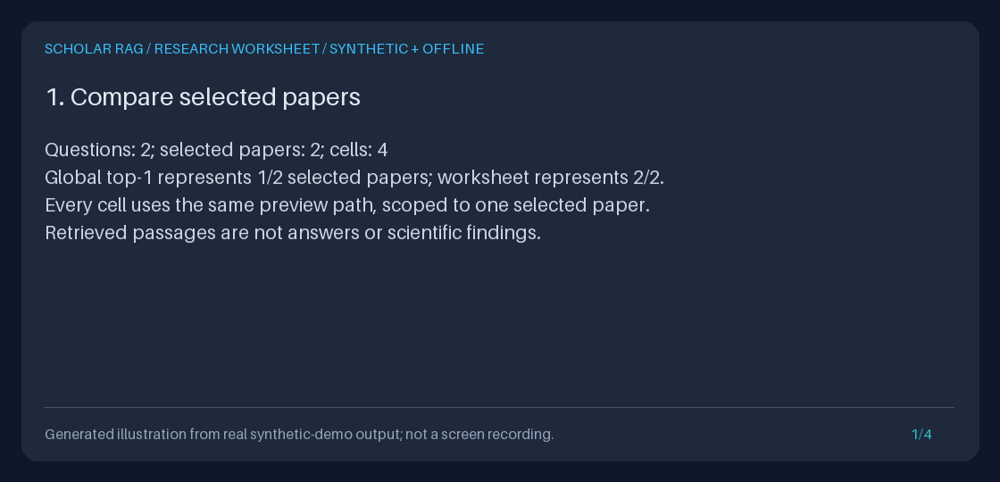
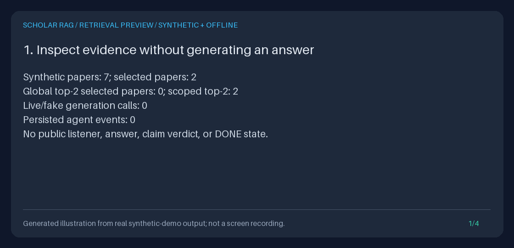
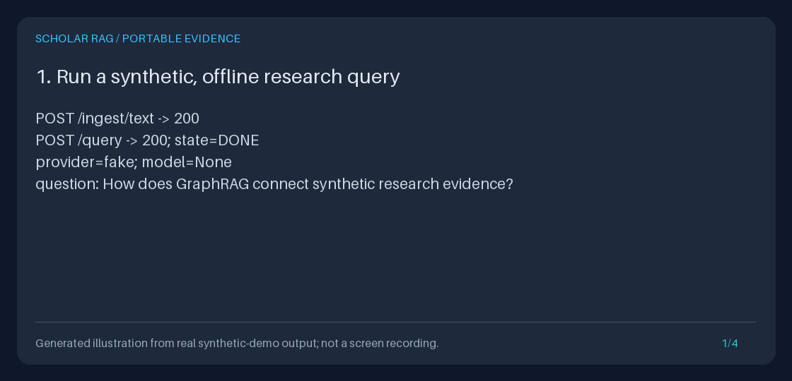
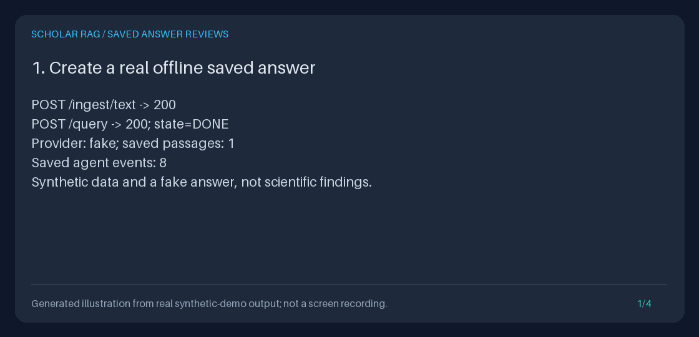
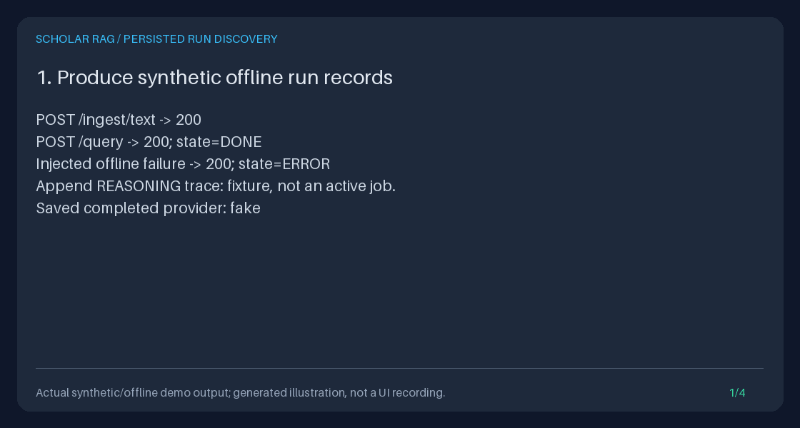
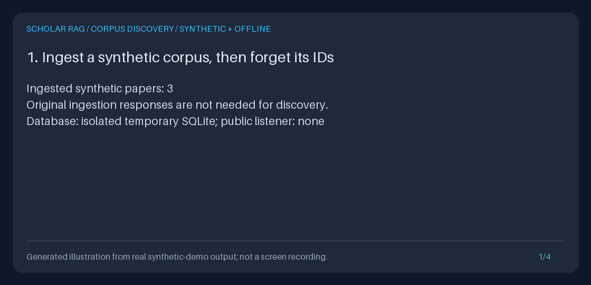
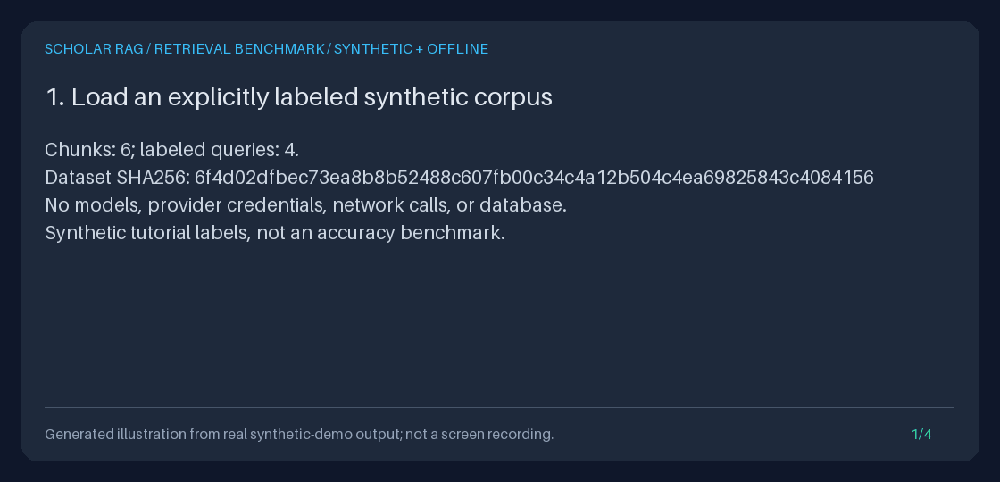

# Demo

## Offline HTML evidence reader



This generated illustration comes from actual API execution, not a screen
recording: two synthetic notes, a saved fake answer, six local source links,
and byte-identical HTML/JSON/Markdown after corpus deletion and restart.
Export performs no generation, retrieval, event writes or network calls.

```bash
READER_DIR="$(mktemp -d)/offline-evidence-reader"
uv run --no-sync python -m scripts.demo_evidence_html --output-dir "$READER_DIR"
uv run --no-sync python -m scripts.create_evidence_html_gif \
  --transcript "$READER_DIR/transcript.txt" \
  --output "$READER_DIR/offline-evidence-reader.gif"
```

Open the saved HTML without the API and inspect the companion JSON, measured
checks and transcript. The scripts ignore ambient settings/provider keys and
refuse overwrites; the new temporary database is removed. The
[complete guide](guides/OFFLINE_EVIDENCE_READER_GUIDE.md) covers API/Python use,
literal text and CSP, limits, attribution, privacy and portfolio boundaries.

## Near-duplicate evidence collapse



This actual-output illustration shows five passages becoming three, 435 context
bytes becoming 264, and a minimum-document query stopping without generation.
All measurements use synthetic fixtures, explicit isolated settings, a temporary
database, and zero live/fake model calls or external HTTP attempts.

```bash
COLLAPSE_DIR="$(mktemp -d)/near-duplicate-evidence"
uv run python -m scripts.demo_near_duplicate_evidence --output-dir "$COLLAPSE_DIR"
uv run python -m scripts.create_near_duplicate_evidence_gif \
  --transcript "$COLLAPSE_DIR/transcript.txt" \
  --output "$COLLAPSE_DIR/near-duplicate-evidence.gif"
```

Inspect the preview JSON, failed-run events, checks, and transcript. Files are
not overwritten. Equal term sets are not identical text or scientific equivalence;
see the [complete guide](guides/NEAR_DUPLICATE_COLLAPSE_GUIDE.md) before opting in.

## Minimum evidence documents



This generated illustration uses actual offline results: three chunks from one
document fail a minimum of two without generation, while a two-paper collection
passes after cap 1. Failed evidence, exports, and policy-only comparisons remain
byte-identical after restart. Counts are not scientific support.

```bash
MINIMUM_DIR="$(mktemp -d)/minimum-evidence"
uv run python -m scripts.demo_minimum_evidence_documents --output-dir "$MINIMUM_DIR"
uv run python -m scripts.create_minimum_evidence_documents_gif \
  --transcript "$MINIMUM_DIR/transcript.txt" \
  --output "$MINIMUM_DIR/minimum-evidence-documents.gif"
```

Read `checks.json`, `failed-events.json`, the previews, both bundle formats,
and `comparison.json`. External HTTP is denied, ambient credentials/settings
are ignored, and the temporary database is removed. See the
[complete guide](guides/MINIMUM_EVIDENCE_DOCUMENTS_GUIDE.md) for API/Python
examples, provenance, errors, privacy, and limitations.

## Per-paper research evidence worksheets



This generated illustration uses executed API/Python output: two questions,
two selected papers, four cells, no model calls or agent events, and portable
JSON/Markdown downloads. It is not a UI recording or a scientific finding.

```bash
WORKSHEET_DIR="$(mktemp -d)/worksheet-demo"
uv run python -m scripts.demo_research_worksheet --output-dir "$WORKSHEET_DIR"
uv run python -m scripts.create_research_worksheet_gif \
  --transcript "$WORKSHEET_DIR/transcript.txt" \
  --output "$WORKSHEET_DIR/research-worksheet.gif"
```

Read `checks.json`, both worksheet formats, and `transcript.txt` in the chosen
directory. The temporary database is removed and existing named artifacts are
not overwritten. The [worksheet guide](guides/RESEARCH_WORKSHEET_GUIDE.md)
explains API/Python use, bounds, failure behavior, and honest portfolio use.

## Generation-free retrieval preview



This original illustration is rendered from executed API/Python output, not a
screen recording or a model's scientific findings. It demonstrates shared context
preparation, scoped hybrid/graph evidence, unknown versus invalid IDs, zero
live/fake generation calls and agent events, and unchanged-corpus restart parity.

```bash
PREVIEW_DIR="$(mktemp -d)/retrieval-preview"
uv run python -m scripts.demo_retrieval_preview --output-dir "$PREVIEW_DIR"
uv run python -m scripts.create_retrieval_preview_gif \
  --transcript "$PREVIEW_DIR/transcript.txt" \
  --output "$PREVIEW_DIR/retrieval-preview.gif"
```

The temporary database is removed; the measured JSON previews and transcript
remain in the chosen directory. Explicit validated settings ignore ambient
provider keys and `.env`, and tests deny HTTP with all four dummy model keys
present. See the [complete guide](guides/RETRIEVAL_PREVIEW_GUIDE.md) for API,
Python, privacy, limits, and portfolio use.

## Evidence-export walkthrough



The four-frame animation is a generated illustration based on the synthetic
demo's actual transcript, not a recording of a research UI or live model
inference. It shows the inspectable engineering path: ingest text, query, record
evidence, and export an artifact.

After `uv sync --extra dev`, run from the repository root:

```bash
DEMO_DIR="$(mktemp -d)/evidence-demo"
uv run python -m scripts.demo_evidence_export --output-dir "$DEMO_DIR"
printf 'Demo artifacts: %s\n' "$DEMO_DIR"
uv run python -m json.tool "$DEMO_DIR/bundle.json"
```

Choose a fresh output directory: the demo refuses to overwrite its named output
files. It uses only synthetic text and explicitly selects the fake adapter
without provider credentials; inherited model keys do not turn this
demonstration into live inference.

| File | What to inspect |
| --- | --- |
| `bundle.json` | Versioned machine-readable evidence bundle |
| `bundle.md` | Human-readable rendering of the same recorded run |
| `demo.sqlite3` | Saved run events and evidence; the demo deliberately removes its synthetic corpus to demonstrate persistence |
| `transcript.txt` | Actual demo output used by the generated illustration |

Use the [evidence export guide](guides/EVIDENCE_EXPORT_GUIDE.md) for the schema,
error behavior, and animation reproduction instructions. Use the
[research workflow](guides/RESEARCH_WORKFLOW_GUIDE.md) to run your own API-based
comparison, hypothesis, evidence-review, and portfolio walkthrough.

## Persistent saved-answer reviews



This generated illustration uses executed API output, not a UI recording or
fabricated results. It shows a real fake-adapter saved answer, human comments,
UUID retries and conflicts, frozen chunk validation after corpus deletion, and
ordered history after restart. A human judgment is not factual verification.

```bash
REVIEWS_DIR="$(mktemp -d)/answer-reviews"
uv run python -m scripts.demo_answer_reviews --output-dir "$REVIEWS_DIR"
uv run python -m scripts.create_answer_reviews_gif \
  --transcript "$REVIEWS_DIR/transcript.txt" \
  --output "$REVIEWS_DIR/answer-reviews.gif"
```

The temporary database is cleaned on success and failure. Real response JSON,
evidence Markdown, and the transcript remain in the output directory; existing
named artifacts are not overwritten. See the
[complete review guide](guides/ANSWER_REVIEWS_GUIDE.md) for contracts, errors,
privacy boundaries, artifact descriptions, and source-linked motivation.

## Run-history discovery after restart



This generated illustration uses actual offline demo output, not a UI recording
or real-model science. It shows completed and failed API queries, a labeled
partial-trace fixture, container recreation, paginated discovery, and export
through a recovered ID.

```bash
HISTORY_DIR="$(mktemp -d)/run-history-demo"
uv run python -m scripts.demo_run_history --output-dir "$HISTORY_DIR"
uv run python -m scripts.create_run_history_gif \
  --transcript "$HISTORY_DIR/transcript.txt" \
  --output "$HISTORY_DIR/run-history.gif"
```

Inspect `page-1.json`, `page-2.json`, `done.json`, `events.json`, `bundle.json`,
`bundle.md`, `history.sqlite3`, and `transcript.txt` in that directory. Neither
script overwrites an existing named artifact. The
[run-history guide](guides/RUN_HISTORY_GUIDE.md) explains the API/Python contracts
and why a recorded state is not a claim of active or resumable work.

## Document discovery after restart



This generated illustration uses actual offline responses: ingest three notes,
page through saved IDs without generation, restart, filter the corpus, and query
one selected paper with the fake provider. It is not a UI recording.

```bash
CATALOG_DIR="$(mktemp -d)/catalog-demo"
uv run python -m scripts.demo_document_catalog --output-dir "$CATALOG_DIR"
uv run python -m scripts.create_document_catalog_gif \
  --transcript "$CATALOG_DIR/transcript.txt" \
  --output "$CATALOG_DIR/document-catalog.gif"
```

The [document catalog guide](guides/DOCUMENT_CATALOG_GUIDE.md) describes every
saved artifact, the executable Python/API workflows, and pagination/privacy limits.

## Retrieval benchmark quality gates



This generated illustration shows measured BM25/hybrid scores and both a failing
and passing gate on the same synthetic corpus, not a quality claim or live UI.

```bash
BENCHMARK_DIR="$(mktemp -d)/retrieval-benchmark"
uv run python -m scripts.demo_retrieval_benchmark --output-dir "$BENCHMARK_DIR"
uv run python -m scripts.create_retrieval_benchmark_gif \
  --transcript "$BENCHMARK_DIR/transcript.txt" \
  --output "$BENCHMARK_DIR/retrieval-benchmark.gif"
```

Read the [benchmark guide](guides/RETRIEVAL_BENCHMARK_GUIDE.md) for the dataset
schema, installed CLI, strict validation, per-case JSON reports, threshold exit
codes, Python API, and honest portfolio workflow.

## Small local smoke demo

```bash
uv run python scripts/demo_local.py
```

This explicitly uses `FakeLLMAdapter` and a temporary SQLite database. It prints
the plan and a cited placeholder answer; it does not synthesize scientific
findings, and its database is removed on exit. The
[Quickstart](../QUICKSTART.md) starts a separate, persistent API workspace.

## Historical illustrations

Earlier assets remain available at their original paths:
[local flow](assets/demo.gif), [use cases](assets/use_cases.gif),
[planning trace](assets/planning_trace.gif), and
[grounding](assets/grounded_answer.gif).

These are scripted storyboards from `scripts/create_demo_gif.py`, not captured
application output. They contain historical shorthand such as "PDF upload" and
"dense semantics"; neither describes the current default API. They also do not
establish scientific quality or deterministic replay from old event-only runs.
Use [Architecture](../ARCHITECTURE.md),
[the provider model guide](guides/PROVIDER_MODELS_GUIDE.md), and the evidence demo
above as the current references rather than treating old animations as UI or
capability specifications.
