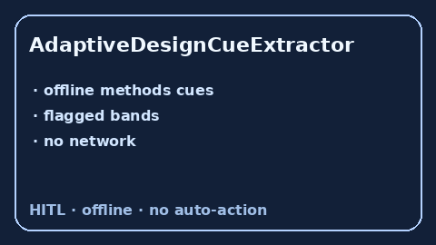

# AdaptiveDesignCueExtractor Guide



Offline cue extractor. Never network. Closes Elicit / Consensus / FDA adaptive-design gaps.

Optional polish via **GPT-5.5 / Claude Sonnet 4.6 / Gemini 3.x / Kimi K2**.

Distinct from `InterimAnalysisCueExtractor / MultiplicityAdjustmentCueExtractor`.

## Usage

```python
from retrieval.adaptive_design_cues import AdaptiveDesignCueExtractor

rows = AdaptiveDesignCueExtractor().extract(
    [{"paper_id": "p1", "methods": "An interim sample-size re-estimation was planned."}]
)
print(rows[0].flagged, rows[0].cues)
```
