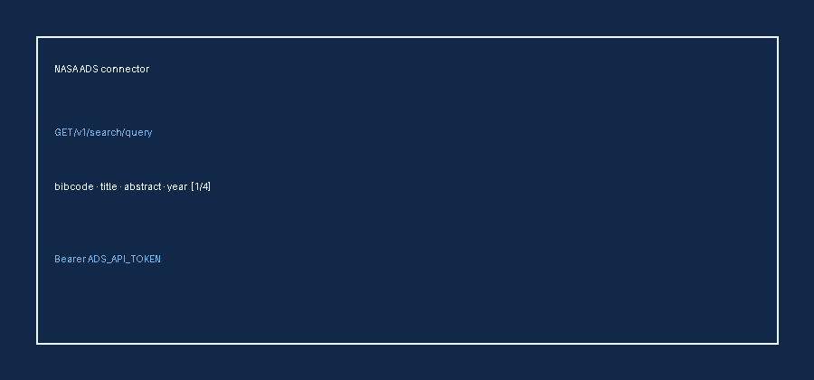

# NASA ADS Source Guide



Use this guide when wiring NASA ADS into **scholar-rag-agent**. The agent can
route enrichment through GPT-5.5 / Claude Sonnet 4.6 / Gemini 2.5 / Kimi K2 when
enabled, but the ADS connector itself is deterministic JSON — no LLM required to
list matching bibliographic records.

## Why NASA ADS

NASA ADS (Astrophysics Data System) indexes astronomy, astrophysics, and related
physics literature with bibcodes, citation links, and deep observatory coverage.
Alongside arXiv and Semantic Scholar it surfaces astronomy papers that
general-purpose indexes under-represent.

Public keyword search (token required):

```
GET https://api.adsabs.harvard.edu/v1/search/query?q=exoplanet+transit&fl=bibcode,title,abstract,author,year,doi,pub&rows=5
Authorization: Bearer $ADS_API_TOKEN
```

`rows` is capped at **100**. The response is a JSON object with
`response.docs`. Without an API token the connector returns an empty list and
issues no HTTP call.

## What you get

| Field | Source |
|---|---|
| `title` | First entry of `title` |
| `text` | Collapsed `abstract`, or a `By authors in pub (year)` descriptor when absent |
| `source` | `https://ui.adsabs.harvard.edu/abs/{bibcode}`, else `https://doi.org/{doi}`, else title |
| `metadata.doi` | First entry of `doi` |
| `metadata.year` | `year` |
| `metadata.authors` | Comma-joined `author` |
| `metadata.bibcode` | `bibcode` |
| `metadata.pub` | `pub` |
| `metadata.source_type` | `"ads"` |

## Example

```python
import asyncio
import os

from ingestion.ads import AdsConnector

os.environ["ADS_API_TOKEN"] = "your-token"
documents = asyncio.run(AdsConnector().search("exoplanet atmosphere", max_results=5))
for document in documents:
    print(document.metadata["bibcode"], document.title)
```

## Safety notes

- Blank queries, non-positive `max_results`, and a missing API token short-circuit
  with no HTTP call.
- Records without a title are skipped rather than raising.
- Configure `ADS_API_TOKEN` (or pass `api_key=`) before expecting live results;
  ADS rejects unauthenticated search.
