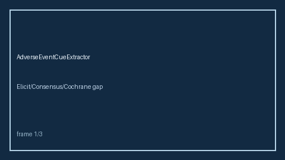

# AdverseEventCueExtractor Guide



Offline adverse-event reporting cue extraction. Never network. Optional polish via **GPT-5.5 / Claude Sonnet 4.6 / Gemini 3.x / Kimi K2**.

## Usage

```python
from retrieval.adverse_event_cues import AdverseEventCueExtractor

print(AdverseEventCueExtractor().extract([{"paper_id": "p1", "abstract": "..."}]))
```
