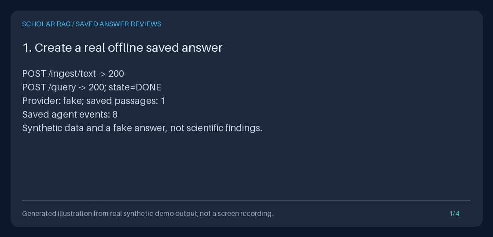

# Persistent human reviews of saved answers

A researcher can inspect a [saved evidence export](EVIDENCE_EXPORT_GUIDE.md),
record a judgment with a comment, and recover the ordered review history after
restart. This is an integrated local API feature, not an opt-in ranking helper.

**A human judgment is an opinion, not factual verification.** `accepted` does not
prove a claim, remove grounding warnings, approve clinical use, or establish the
identity of a reviewer. All three decisions leave the original answer, evidence,
agent events, and recorded run state unchanged.



This four-frame GIF is generated from executed demo output. It is not a UI
recording, a fabricated product screen, or evidence of scientific accuracy.

## API workflow

Start the API using the isolated, empty-key setup in the
[Quickstart](../../QUICKSTART.md). Recover a run with `GET /runs`, then:

1. Download `GET /runs/{run_id}/export` and inspect its answer, warnings, and full
   `snapshot.sources` passages.
2. Generate a client UUID, retain it with the exact intended content, and
   `POST /runs/{run_id}/reviews`.
3. Read `GET /runs/{run_id}/reviews?limit=20`. Use the returned `next_cursor`
   unchanged to continue toward older reviews.

Both review endpoints require an existing, exportable `DONE` run, checked by the
existing `EvidenceExporter`. A legacy or damaged run is never reconstructed from
the current corpus. An exportable ungrounded answer or empty source context can
still receive a review; an empty context permits no cited IDs.

### Append a review

The following request omits optional source IDs. Replace `RUN_ID` with an actual
exportable saved run ID. Keep the same UUID and body when retrying a request whose
response was lost; generate a new UUID for a new opinion.

```bash
RUN_ID="replace-with-your-saved-run-id"
REVIEW_ID="$(uv run python -c 'import uuid; print(uuid.uuid4())')"
curl -fsS "http://127.0.0.1:8000/runs/$RUN_ID/export" > saved-bundle.json
curl -i "http://127.0.0.1:8000/runs/$RUN_ID/reviews" \
  -H 'Content-Type: application/json' \
  --data "{\"review_id\":\"$REVIEW_ID\",\"decision\":\"needs_revision\",\"comment\":\"Explain the limits of these sources before using the answer.\"}"
curl -fsS "http://127.0.0.1:8000/runs/$RUN_ID/reviews?limit=20"
```

| Request field | Contract |
| --- | --- |
| `review_id` | Required UUID supplied by the client; normalized to its canonical UUID string and unique **within one run** |
| `decision` | Required, case-sensitive enum: `accepted`, `needs_revision`, or `rejected` |
| `comment` | Required nonblank string, at most 4,000 Unicode characters; exact whitespace, newlines, and Unicode are preserved |
| `cited_chunk_ids` | Optional array, default `[]`; at most 100 distinct string IDs, each 1-256 characters |

IDs cannot be blank, have outer whitespace, or contain control characters.
Comments cannot contain NUL or invalid Unicode. Explicit `null`, duplicate cited
IDs, wrong types, and unknown fields are rejected. There is deliberately no
reviewer name, authentication claim, arbitrary score, or client timestamp field.
OpenAPI at `/docs` exposes the request enum and size bounds.

Every cited ID must occur in **that saved export's `snapshot.sources`**, including
for a document-scoped run. An ID merely present in the current corpus, a different
run, a proposed citation, or an unresolved answer reference is not sufficient.
Source replacement or deletion does not invalidate a saved chunk reference.
The 100-ID request ceiling is not a retrieval quota: a frozen bundle can contain
fewer sources, and only its actual IDs are valid.

A new record returns **201**. An identical retry returns **200** with the original
record, including its original sequence and creation time. Reusing the same
run/UUID with different decision, comment, or ordered cited IDs returns **409**
`review_id_conflict`; no row is changed. Omitted and empty cited-ID arrays are
equivalent. Comment whitespace and cited-ID order are otherwise significant.
The same UUID on a different run is independent.

The returned record contains the four request fields plus `schema_version`
(`"1.0"`), `run_id`, `sequence`, and a server-generated UTC `created_at`. These
fields do not appear in the original export.

### Read ordered history

`GET /runs/{run_id}/reviews` returns `{"reviews": [...], "next_cursor": ...}`.
Reviews are **newest first**, ordered by their immutable SQLite sequence rather
than their timestamps or client UUIDs.

| Query field | Contract |
| --- | --- |
| `limit` | Default 20; minimum 1; maximum 100 |
| `cursor` | Optional integer from 1 through 9,223,372,036,854,775,807; exclusive upper sequence boundary |

The store fetches `limit + 1` rows in one SQLite read. It validates the lookahead
row as well, and returns the last delivered sequence as `next_cursor` only when
another row exists. An exact-size final page, a valid empty history, and a cursor
beyond the oldest row all return `next_cursor: null`.

Use a cursor with the same run. Each query remains scoped to that run even if a
caller supplies a sequence from elsewhere. Sequence numbers are global and can
have gaps; they are not counts, authorization tokens, or resumable job handles.
Reviews added between requests are above the current cursor, so they do not
repeat or displace older results. Start a fresh first page to see new reviews.
Pagination is not a frozen snapshot spanning multiple requests.

### Explicit errors

Failures use a sanitized `detail` object with `code` and `message`. Review
responses include `Cache-Control: no-store` and `X-Content-Type-Options: nosniff`.
Validation errors do not echo private comments or corrupt persisted payloads.

| HTTP | Code | Meaning |
| --- | --- | --- |
| 404 | `run_not_found` | No saved events for this run |
| 409 | `run_incomplete` | No terminal `DONE` event |
| 409 | `run_failed` | A failed run is not exportable |
| 409 | `snapshot_unavailable` | Legacy record or missing saved snapshot |
| 409 | `invalid_run_record` | Corrupt, inconsistent, or unsupported saved evidence |
| 409 | `review_id_conflict` | UUID already used for different content in this run |
| 409 | `invalid_review_record` | Malformed stored review, including references outside the saved bundle |
| 422 | `invalid_review_request` | Invalid body, run ID, limit, or cursor |
| 422 | `invalid_review_references` | New review cites a chunk absent from the frozen bundle |
| 503 | `review_storage_unavailable` | SQLite evidence/review read or write failure, including a busy database |

An unavailable or corrupt store does not become a successful empty page.
History reads and retries also revalidate saved evidence: later database damage
is reported, not hidden by previously stored opinions. No update or delete
endpoint exists. Append a new review instead of editing an earlier judgment.

## Storage and isolation

`create_app(settings)` builds an isolated `AppContainer`. Its
`AnswerReviewService` depends only on the existing exporter and
`SQLiteAnswerReviews`; it has no model, retriever, or mutable document-store
dependency. Requests neither generate nor retrieve, make cloud calls, train
models, alter ranking, nor append `agent_events`.

The separate `answer_reviews` table is initialized alongside the existing
SQLite tables without an event migration or backfill. It has an auto-incrementing
sequence, a unique `(run_id, review_id)` key, schema checks, and a
`(run_id, id)` pagination index. All request values are SQL parameters.
Short `BEGIN IMMEDIATE` transactions serialize retry checks and inserts across
independent app instances. The duplicate check, append, read-back validation,
and commit either succeed together or roll back. SQLite lock waiting is bounded
to five seconds. After a 503 or lost response, retry with the original UUID.
Request-time review connections require the database to exist.

The original JSON and Markdown exports and raw `agent_events` rows remain
byte-for-byte unchanged by reviews, including after restart and corpus edits.
`GET /runs` still reports only agent execution state, not a review state.
Export and review history are separate artifacts; fetch both if needed.

This is local, append-only **API behavior**, not a signed or tamper-proof audit
log. Someone with database access can alter it. There is no authentication,
tenant isolation, reviewer assignment, annotation queue, dashboard, bulk export,
automatic consensus, or feedback-to-training loop. Keep the API on loopback or
behind access controls. Treat comments as untrusted text when building a client;
never render them as trusted HTML. Backups and response artifacts may contain
private queries, source text, answers, and reviewer comments.

## Reproduce the actual-output demo and GIF

After `uv sync --extra dev`, run from the repository root:

```bash
REVIEWS_DIR="$(mktemp -d)/answer-reviews"
uv run python -m scripts.demo_answer_reviews --output-dir "$REVIEWS_DIR"
uv run python -m scripts.create_answer_reviews_gif \
  --transcript "$REVIEWS_DIR/transcript.txt" \
  --output "$REVIEWS_DIR/answer-reviews.gif"
uv run python -m json.tool "$REVIEWS_DIR/page-1.json"
```

The demo uses the real app factory and HTTP endpoints with validated explicit
offline settings. It ignores ambient provider keys, database paths, and `.env`;
HTTP transports are blocked. It first runs actual synthetic ingestion and a
fake-adapter query, then records, retries, conflicts, and paginates real reviews.
It rejects a current-only source, deletes only its temporary synthetic corpus,
recreates the app, cites a saved chunk, and checks unchanged exports/events/run
history. Generation, retrieval, corpus-read, and event-write methods are guarded
during the review phase, including on the restarted container.

| Artifact | Contents |
| --- | --- |
| `bundle.json`, `bundle.md`, `events.json` | Actual saved evidence and events, checked unchanged after review/restart |
| `review-created.json`, `review-retry.json` | Byte-identical original and successful retry responses |
| `review-conflict.json`, `invalid-reference.json` | Actual sanitized error responses |
| `accepted-review.json` | Separate new judgment written after restart |
| `page-1.json`, `page-2.json` | Actual exclusive-cursor pages in newest-first order |
| `transcript.txt` | Measured demo output used by the GIF renderer |

The temporary database is removed on success and failure. Named existing output
files and existing GIFs are never overwritten. The renderer reuses
`scripts/create_evidence_gif.py` and the existing Pillow dev dependency. It rejects
unrelated panels and text that would clip; it does not invent UI screens or
source results. Each frame visibly labels the synthetic, actual-output
illustration provenance.

Feature regressions:

```bash
uv run --no-sync pytest tests/test_answer_reviews_api.py \
  tests/test_answer_reviews_storage.py tests/test_answer_reviews_demo.py
```

The API acceptance tests were committed first as `dd40ad1` against baseline
`5c7db9b`: actual fake-adapter runs completed and exported, then all three new
review acceptance tests failed with route 404s. The implementation makes those
same tests pass. Extended coverage includes concurrent independent app clients,
transaction rollback and lock failures, bounded fields, stored corruption,
lookahead/interleaving, legacy/failed runs, frozen document scope, and offline
CLI/GIF reproduction. No live provider credentials are required.

## Public motivation and deliberate differences

Public examples checked on **2026-09-22** motivated saved-answer feedback, not
code reuse or feature parity. The historical popularity snapshot was 91,170
stars for `infiniflow/ragflow` and 1,063 for `langchain-ai/langsmith-sdk`; these are
dated discovery context, not quality claims or current counts.

- RAGFlow's [feedback dialog](https://github.com/infiniflow/ragflow/blob/3a23ba00a53beac5ca1f96fcaaf4c53371903dc9/web/src/components/feedback-dialog.tsx#L45-L61)
  and [message feedback hook](https://github.com/infiniflow/ragflow/blob/3a23ba00a53beac5ca1f96fcaaf4c53371903dc9/web/src/components/next-message-item/hooks.ts#L26-L38)
  demonstrate a thumbs-down comment associated with a message ID. Its
  [server feedback handler](https://github.com/infiniflow/ragflow/blob/3a23ba00a53beac5ca1f96fcaaf4c53371903dc9/internal/service/chat_session.go#L782-L825)
  updates assistant-message feedback; it is not this feature's separate,
  append-only review history.
- LangSmith's [annotation queue documentation](https://docs.langchain.com/langsmith/annotation-queues)
  describes saved-run human feedback and reviewer notes. Its open SDK's
  [feedback creation interface](https://github.com/langchain-ai/langsmith-sdk/blob/1d3e54ae6bcb28cdf959553378734a0add0a279a/python/langsmith/client.py#L8280-L8297)
  accepts `run_id`, `key`, `score`, and `comment`; its
  [feedback listing interface](https://github.com/langchain-ai/langsmith-sdk/blob/1d3e54ae6bcb28cdf959553378734a0add0a279a/python/langsmith/client.py#L8640-L8681)
  is paginated. This is a service-backed workflow, not an immutable local SQLite
  implementation.

This implementation is original and narrower: three human decisions and bounded
comments on locally frozen exports, UUID retry safety, and persistent ordered
history. It neither copies source code nor integrates with either service.
