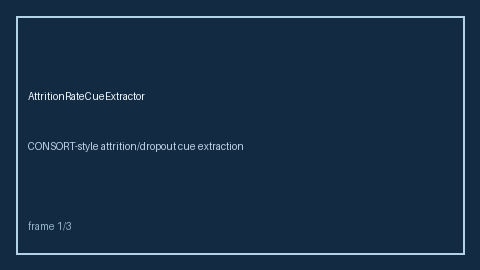

# AttritionRateCueExtractor Guide



CONSORT-style attrition/dropout cue extraction. Never calls the network. Optional polish via **GPT-5.5 / Claude Sonnet 4.6 / Gemini 3.x / Kimi K2**.

## Usage

```python
from retrieval.attrition_rate_cues import AttritionRateCueExtractor

rows = AttritionRateCueExtractor().extract([{"paper_id": "p1", "abstract": "..."}])
print(rows[0].flagged)
```
