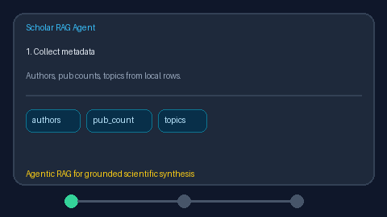

# Author Expertise Ranker Guide



`AuthorExpertiseRanker` ranks papers by a deterministic **author expertise
proxy**: log-normalized max author publication count blended with topic/keyword
Jaccard overlap against a caller-provided topic query.

Fills a Semantic Scholar influential-citation / OpenAlex author-topics gap with
offline heuristics (no LLM or network call). Ranked lists can seed GPT-5.5 /
Claude Sonnet 4.6 / Gemini 3.x / Kimi K2 synthesis. Distinct from citation-count
boosters that ignore author identity.

## Usage

```python
from retrieval.author_expertise import AuthorExpertiseRanker

ranker = AuthorExpertiseRanker(pub_count_weight=0.5, topic_weight=0.5)
ranked = ranker.rank(
    [
        {
            "title": "Graph Neural Networks for Molecules",
            "authors": ["Alice Expert", "Bob Newbie"],
            "topics": ["graph neural networks"],
            "abstract": "We apply graph neural networks to molecules.",
        },
        {
            "title": "Survey of Image Classification",
            "authors": "Carol Other",
            "topics": ["computer vision"],
        },
    ],
    topic_query="graph neural networks",
    author_pub_counts={"alice expert": 40, "carol other": 5},
)
for row in ranked:
    print(row.title, row.expertise_score, row.author_pub_count, row.topic_overlap)
```

Empty paper lists return an empty tuple. Per-row `author_publication_count`
overrides the global author map when present.
