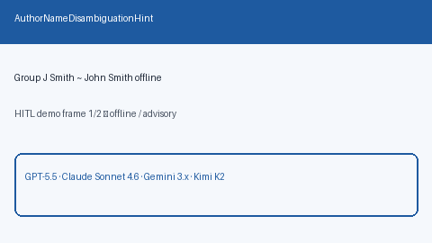

# Author Name Disambiguation Hint Guide



`AuthorNameDisambiguationHint` groups near-duplicate author strings offline
(for example `J Smith` / `J. Smith` with `John Smith`) using shared-surname and
compatible given-name initial heuristics. Singletons are retained. Distinct
surnames never merge.

This module replaces a redundant VenuePrestigeCalibrator: `VenueTierBooster`
already maps venues to prestige tiers with soft score blending. Fills an
OpenAlex / Semantic Scholar author-disambiguation hint gap. Optional later
narrative can use GPT-5.5 / Claude Sonnet 4.6 / Gemini 3.x / Kimi K2.

## Usage

```python
from retrieval.author_disambiguation import AuthorNameDisambiguationHint

groups = AuthorNameDisambiguationHint().group(
    ["J Smith", "John Smith", "Jane Doe", "J. Smith"]
)
for group in groups:
    print(group.canonical, group.members, group.reason)
```

Empty author lists return an empty tuple. Inputs are not mutated.
