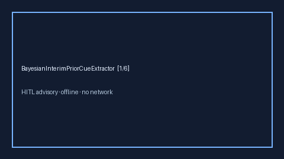

# BayesianInterimPriorCueExtractor Guide



Offline advisory cue extractor. Never calls the network.
Closes Elicit / Consensus / FDA Bayesian interim prior gaps.

Optional polish via **GPT-5.5 / Claude Sonnet 4.6 / Gemini 3.x / Kimi K2**.

Distinct from InterimAnalysisCueExtractor / AdaptiveDesignCueExtractor.

## Usage

```python
from retrieval.bayesian_interim_prior_cues import BayesianInterimPriorCueExtractor

rows = BayesianInterimPriorCueExtractor().extract(
    [
        {
            "paper_id": "p1",
            "methods": "A weakly informative prior guided the Bayesian interim analysis.",
        }
    ]
)
print(rows[0].flagged, rows[0].cues)
```
