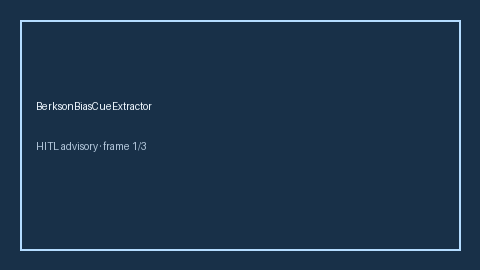

# BerksonBiasCueExtractor Guide



Offline deterministic cue extractor. Never network I/O.
Gap vs Elicit/Consensus/AJE Berkson-bias cue extractors. Distinct from selection-bias and collider-stratification cue extractors.

Optional later narrative via **GPT-5.5 / Claude Sonnet 4.6 / Gemini 3.x / Kimi K2**.

## Usage

```python
from retrieval.berkson_bias_cues import BerksonBiasCueExtractor

cues = BerksonBiasCueExtractor().extract(
    [{"paper_id": "p1", "abstract": "Results may reflect Berkson's bias from hospital sampling."}]
)
assert cues[0].flagged is True
```
