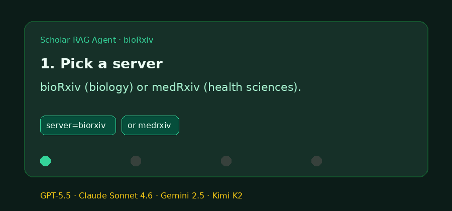

# bioRxiv / medRxiv Source Guide



Use this guide when wiring bioRxiv or medRxiv into **scholar-rag-agent**. The
agent can route enrichment through GPT-5.5 / Claude Sonnet 4.6 / Gemini 2.5 /
Kimi K2 when enabled, but the bioRxiv connector itself is deterministic JSON —
no LLM required to list matching preprints.

## Why bioRxiv / medRxiv

bioRxiv (biology) and medRxiv (health sciences) host early, unrefereed
preprints from Cold Spring Harbor Laboratory. Alongside Europe PMC and PubMed
they surface life-science work weeks to months before journal indexing.

Public recent-posts and DOI endpoints:

```
GET https://api.biorxiv.org/details/biorxiv/100
GET https://api.biorxiv.org/details/medrxiv/100
GET https://api.biorxiv.org/details/biorxiv/10.1101/2020.01.01.000001/na
```

The content API has no free-text `q` parameter. This connector fetches a recent
window (capped at **100** posts per call) and filters client-side by query
tokens against title, abstract, and category. DOI-shaped queries are resolved
directly via the DOI detail endpoint.

## What you get

| Field | Source |
|---|---|
| `title` | `title` |
| `text` | Collapsed `abstract`, or a `By authors (year)` descriptor when absent |
| `source` | `https://www.{server}.org/content/{doi}` |
| `metadata.doi` | `doi` |
| `metadata.year` | Leading four digits of `date` |
| `metadata.authors` | `authors` |
| `metadata.category` | `category` |
| `metadata.source_type` | `"biorxiv"` or `"medrxiv"` |

## Example

```python
import asyncio

from ingestion.biorxiv import BioRxivConnector

documents = asyncio.run(
    BioRxivConnector().search("CRISPR neurons", max_results=5, server="biorxiv")
)
for document in documents:
    print(document.metadata["doi"], document.title)

clinical = asyncio.run(
    BioRxivConnector().search("vaccine effectiveness", max_results=5, server="medrxiv")
)
```

## Safety notes

- Blank queries and non-positive `max_results` short-circuit with no HTTP call.
- Unsupported `server` values raise `ValueError` before any request.
- Preprints without a title are skipped rather than raising.
- Results are unrefereed preprints — treat them as preliminary evidence in any
  grounded answer.
