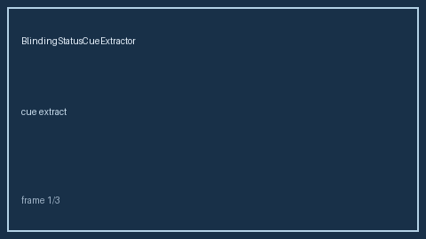

# BlindingStatusCueExtractor Guide



`BlindingStatusCueExtractor` Extract offline single/double/triple-blind and open-label cues; fills an Elicit/Consensus/Cochrane/PaperQA blinding-status gap (distinct from RiskOfBiasCueExtractor)

Never calls the network. Optional later narrative: **GPT-5.5 / Claude Sonnet 4.6 / Gemini 3.x / Kimi K2**.

## Usage

```python
from retrieval.blinding_status_cues import BlindingStatusCueExtractor

rows = BlindingStatusCueExtractor().extract([{"paper_id": "p1", "abstract": "..."}])
print(rows[0].flagged, rows[0].cues)
```
