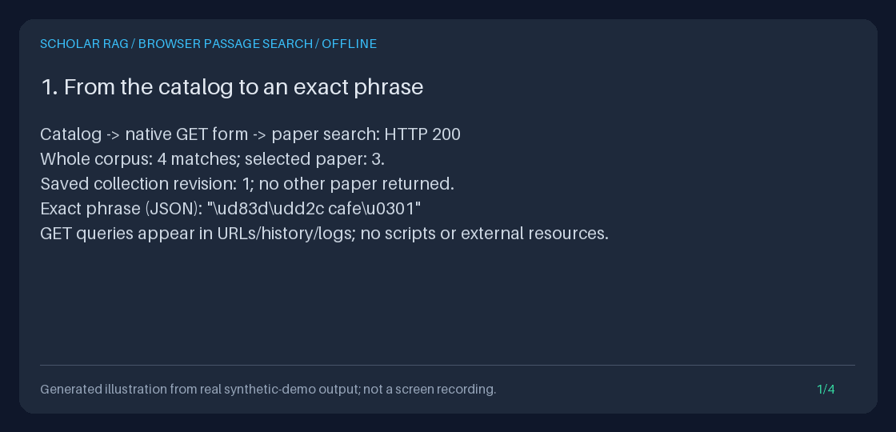

# Find an exact phrase, then read its source

Open `http://127.0.0.1:8000/explore` and choose **Search passages** or
**Search this paper**. Find remembered wording, inspect its first occurrence
and exact Unicode offsets, then read around that exact chunk without
generating an answer. An optional paper or saved collection keeps the search
explicitly scoped. This closes the browser-to-source gap around the existing
literal API; it is not another search engine.



This small GIF is a **generated illustration of asserted actual output**, not
a browser recording, benchmark, or scientific finding. The four panels use
the real native HTML, JSON and Python results from the reproducible demo below.
The [committed transcript](../assets/browser-passage-search.txt) exposes the
measurements; no peer code, paper text, screenshots or assets were copied.

## Native browser workflow

1. Start the [Quickstart](../../QUICKSTART.md) API on loopback and open
   `/explore`. **Search this paper** preselects that exact document ID.
   **Search passages** opens an unscoped form. Catalog source/title filters
   remain return-navigation context, **not passage-search filters**.
2. Enter a nonblank **Literal phrase**, choose **Whole current corpus**,
   **One exact paper**, or **One saved collection**, and set 1-50 matches per
   page. Paper/collection scope requires its exact raw ID. Only whole corpus
   permits a blank scope-ID field, and it rejects a nonblank ID instead of
   discarding it. Get saved collection IDs from the existing
   [collections API/Python workflow](PAPER_COLLECTIONS_GUIDE.md).
3. Choose **Search passages**. Inspect exact document/chunk IDs, bounded
   title/source labels, first-match highlighting, match/excerpt ranges and
   truncation notices. IDs are displayed as JSON strings for lossless copying;
   decode their quotes/escapes before pasting a raw ID into a form.
4. **Next page** preserves the phrase, scope and original catalog page.
   **Start again with the same selection** removes only the cursor. Editing
   and submitting the form also starts at page one. **Clear phrase / keep
   scope** keeps the selection and return context; **New whole-corpus search**
   explicitly clears the phrase and scope without losing the catalog return.
5. Follow a result's **Read surrounding source context** link. The existing
   `/explore/context` reader opens that exact document/chunk pair, never a
   guessed chunk page or a title match. Change the 0-5-neighbor window or
   recenter on a displayed neighbor. **Back to search results** restores the
   original search page, including its cursor; **Back to filtered catalog**
   restores the catalog filters, size and cursor.

The browser uses only native GET forms, links, `<mark>` and static HTML/CSS.
Controls have labels and visible keyboard focus, with a skip link and narrow
screen layout. No scripts, external fonts/resources, analytics, browser storage,
framework or dependency was added. Configured ASGI `root_path` prefixes are
preserved by explorer forms, links and error recovery.

### What a literal match means

Matching is case-sensitive and preserves Unicode normalization, punctuation
and nonblank surrounding whitespace. `%`, `_`, quotes, backslashes and
HTML-looking strings are literal characters, not SQL patterns or executable
markup. A composed accented character differs from a base character plus a
combining mark. Chunks are searched independently: a phrase spanning two chunks
does not match their concatenation.

Only the **first occurrence in each matching chunk** is highlighted. Offsets
are zero-based, half-open Unicode code-point positions in the **full stored
chunk**, not document-wide positions, UTF-8 bytes, browser UTF-16 units, tokens,
or grapheme clusters. The renderer splits the service's excerpt at its returned
offsets and escapes each segment before adding the one `<mark>` element. It
does not run a second matcher or use global string replacement.

Results use ascending SQLite BINARY document/chunk ID order, **not relevance**.
Source labels stay untrusted text, never automatically followed URLs. No
scores, semantic embeddings, ranking, grounding assessment, or generated
answers are involved. No results means no matching stored chunk on that
scope/page, not that the literature lacks evidence.

NUL/CR/LF-bearing phrases, IDs or catalog-return filters cannot round-trip
faithfully through native text inputs. Their editable form is omitted with an
explanation; exact encoded pagination, source links and reset/return paths stay
available. CR in displayed excerpts uses a character reference, preserving it
alongside LF. NUL-bearing source text cannot be rendered faithfully and fails
explicitly. Malformed UTF-8 query bytes are rejected, never replaced with a
different character. Native `maxlength` is intentionally absent because it
counts UTF-16 units; server bounds still apply in Unicode code points.

## HTTP, browser and Python are one search path

`GET /explore/search` validates the native form, constructs
`LiteralSearchRequest`, and calls `AppContainer.literal_search.search` once.
That is the same `SQLiteLiteralSearch` used by **`POST /research/search`**
and standalone Python. There is no duplicated SQL, cursor format, ranking,
schema, ingestion or collection-writing path. The JSON API and its strict
JSON-body/null/extra-field behavior are unchanged.

| Native GET field | Contract |
| --- | --- |
| `query` | 1-200 Unicode code points, nonblank. Omit only to open a form without scanning; a present empty value is invalid |
| `scope` | `all` (default), `document`, or `collection`; exactly one selection |
| `scope_id` | Exact paper ID (1-128 characters, no outer whitespace) or existing `col_` plus 32 lowercase hex digits. Empty/omitted is allowed only with `scope=all` |
| `limit` | ASCII integer form value, 1-50, default 20; decimal/exponent/boolean spellings fail |
| `cursor` | Omit at the beginning; otherwise the exact returned search cursor, 1-4096 characters |
| `catalog_limit`, `source`, `title`, `catalog_cursor` | Bounded original catalog return state, not search constraints. Catalog size is independently 1-100; only blank source/title fields mean omission |
| Unknown/duplicate fields | Rejected instead of ignored or taking a last value |

Browser paper selection deliberately uses the explorer's **exact** ID
validator before wrapping it in a one-item API `document_ids` selection.
It never trims a pasted ID into a different paper. The API continues to accept
its existing 1-100-ID normalized list; the browser intentionally offers one
paper or one saved collection, not an implicit multi-paper editor.
GET has strings, not JSON null: sending an empty query/selected scope/cursor
does not mean omission. The literal string `null` is still ordinary query text.

Generated context links carry `search_query`, `search_scope`, `search_limit`,
and, where applicable, `search_scope_id` and `search_cursor`. When **any**
`search_*` return state is present, the first three must all be supplied and the
selected scope ID must validate. Incomplete, duplicate or unknown state fails
with 422 **before source reading**, rather than creating an unscoped back link.
These fields describe the return page only: the context read still selects
exactly its `document_id` and `chunk_id`. They are not an authorization boundary.

### Fixed bounds, cursor semantics and errors

The shared reader returns at most 50 matches and validates at most `limit + 1`
projected rows, including lookahead. Excerpts contain at most 800 characters,
starting up to 120 characters before the first match. Title/source prefixes
are at most 300/512 characters with explicit truncation flags. Exact document
and chunk IDs (128/256 characters) are never shortened.

The existing 4-MiB stored-passage read cap, 262,144-byte serialized search cap
and cooperative five-second SQLite scan deadline all remain enforced.
The browser additionally caps complete escaped HTML at 1,048,576 UTF-8 bytes.
An oversized or invalid page fails in full, never dropping a bad row or
silently returning only part of a result. See the
[complete shared storage/API contract](LITERAL_SEARCH_GUIDE.md).

The opaque keyset cursor binds the exact phrase and resolved scope, including
collection ID **and revision**. Changing either, even renaming a collection,
requires restarting traversal. Changing page size is allowed. Cursors are not
signed authorization tokens and do not freeze the corpus across requests.
New IDs behind a cursor require restarting; deleted last-seen IDs do not
invalidate otherwise current keyset traversal.

| State | Meaning and recovery |
| --- | --- |
| 200, form only | No phrase was submitted; no search database scan ran |
| 200, no matches | No matching chunks in this scope/page. An explicitly selected unknown paper or a paper with no chunks stays empty, matching the API contract; it never becomes whole corpus |
| 200, exhausted cursor | No later matching IDs; restart with the same selection to see current results |
| 422, invalid form | Invalid/empty bounds or selection, unknown/duplicate fields, malformed Unicode or incomplete return state; no reader ran |
| 422, invalid/stale cursor | Malformed token, changed phrase/scope or changed collection revision; restart with the same selection |
| 404 | Collection absent, or exact document/chunk no longer exists when following source context; no replacement is guessed |
| 409 | Invalid encountered corpus data, invalid/empty/stale collection membership, unrepresentable HTML text, or unavailable source ordering; no partial evidence |
| 413 | Stored passage, serialized search or escaped HTML cap exceeded; reduce page size where appropriate, otherwise inspect the import with trusted local tools |
| 503 / 504 | Storage unavailable / scan deadline exceeded; not empty successes |

Search itself does not require source-order metadata. Source-context reading
does: valid unique indices across at most 2,048 chunks, with at most 8,192 stored
metadata bytes per chunk. A findable passage may therefore have an explicit
source-context error. Context returns bounded 4,000-character passage prefixes;
a very late match may be outside that prefix. It still anchors the exact chunk,
not the previous excerpt location. Read the original permitted source for
omitted text. See [source-context semantics](SOURCE_CONTEXT_GUIDE.md).

## Reproduce the offline showcase

With the existing dev extras installed:

```bash
uv sync --locked --extra dev
DEMO_ROOT="$(mktemp -d "${TMPDIR:-/tmp}/scholar-browser-search.XXXXXX")"
uv run --no-sync python -m scripts.demo_passage_search --output-dir "$DEMO_ROOT/results"
uv run --no-sync python -m scripts.create_passage_search_gif \
  --transcript "$DEMO_ROOT/results/transcript.txt" \
  --output "$DEMO_ROOT/browser-passage-search.gif"
cat "$DEMO_ROOT/results/checks.json"
```

The demo writes original synthetic fixtures to a temporary SQLite database,
then follows real catalog links and native form values into paper/collection
search, pagination, context, recentering and an exact return. It compares actual
HTML highlights and offsets with API/Python results, checks an empty result and
changed-query cursor error, and repeats reads after app restart. Guards count
and reject model, retrieval, reranking, HTTP and writing calls during reads;
database bytes and event counts must stay unchanged.

The temporary database is removed. Only requested HTML/JSON, checks and
transcript artifacts remain. Settings ignore ambient environment, dotenv,
secret files, provider credentials and the user's database. Fixture setup
writes; **search and context reading do not**. Existing output directories,
files and symlinks are refused rather than overwritten.

| Saved artifact | Actual output |
| --- | --- |
| `catalog.html`, `form.html`, `paper.html` | Catalog-to-exact-paper native workflow |
| `collection-first.html`, `collection-next.html` | Scoped first/next result pages |
| `context.html`, `recentered.html`, `context.json` | Exact selected source window and native recentering |
| `empty.html`, `stale-cursor.html` | Empty result and HTTP 422, not invented UI states |
| `whole-corpus.json`, `paper.json`, `collection-first.json` | Shared reader output with actual identities, offsets and collection revision |
| `checks.json`, `transcript.txt` | Measured counts, spans, parity, restart, database/event and forbidden-call assertions |

The existing Pillow renderer checks panel shape and text clipping, producing
four distinct 1120-by-540 frames at 3.5 seconds each. Identical transcripts and
Pillow/font versions yield identical GIF bytes. Collection IDs are genuinely
assigned during setup, so their response values/cursors differ across demo
runs; they are not fabricated fixed IDs and are omitted from the illustration.
Saved HTML is inspectable output, not a standalone offline navigation app.

### Try the actual browser, with no credentials

```bash
uv run --no-sync python - <<'PY'
from pathlib import Path
from tempfile import TemporaryDirectory
import uvicorn
from api.application import create_app
from scripts.demo_evidence_export import offline_settings
from scripts.demo_passage_search import seed_demo

with TemporaryDirectory(prefix="scholar-browser-search-server-") as temporary:
    app = create_app(offline_settings(Path(temporary) / "corpus.sqlite3"))
    collection = seed_demo(app.state.container)
    print("Synthetic collection:", collection.collection_id)
    uvicorn.run(app, host="127.0.0.1", port=8767, access_log=False)
PY
```

Open `http://127.0.0.1:8767/explore`, choose **Search this paper**, and try
`Synthetic context`. Alternatively paste the printed collection ID after
choosing collection scope. The database is removed when this server exits.
Other API operations are separate workflows; manually invoking `/query` would
not be a read-only search operation.

These equivalent GET and JSON requests target the same exact paper:

```bash
curl --fail-with-body --silent --show-error --get \
  http://127.0.0.1:8767/explore/search \
  --data-urlencode 'query=Synthetic context' \
  --data-urlencode 'scope=document' \
  --data-urlencode 'scope_id=paper/../研?draft#v1' --data-urlencode 'limit=1'

curl --fail-with-body --silent --show-error \
  http://127.0.0.1:8767/research/search -H 'Content-Type: application/json' \
  -d '{"query":"Synthetic context","document_ids":["paper/../研?draft#v1"],"limit":1}'
```

### Complete Python/API/browser linkage

This tested example creates only a temporary synthetic corpus. Standalone
readers pointed at an existing database need no app, settings, index rebuild
or schema initialization.

<!-- offline-browser-search-example:start -->
```python
from pathlib import Path
from tempfile import TemporaryDirectory
from fastapi.testclient import TestClient
from api.application import create_app
from scripts.demo_corpus_explorer import browsing_guards
from scripts.demo_evidence_export import offline_settings
from scripts.demo_passage_search import PHRASE, SearchPage, seed_demo
from storage.literal_search import LiteralSearchRequest, SQLiteLiteralSearch
from storage.source_context import SQLiteSourceContext

with TemporaryDirectory(prefix="scholar-browser-search-guide-") as temporary:
    path = Path(temporary) / "corpus.sqlite3"
    app = create_app(offline_settings(path))
    collection = seed_demo(app.state.container)
    before = path.read_bytes()
    request = LiteralSearchRequest(
        query=PHRASE, collection_id=collection.collection_id, limit=1
    )
    with TestClient(app) as client, browsing_guards(app.state.container):
        result = SQLiteLiteralSearch(path).search(request)
        response = client.post("/research/search", json=request.model_dump(exclude_unset=True))
        response.raise_for_status()
        assert response.content == result.to_json().encode()
        html = client.get("/explore/search", params={
            "query": PHRASE, "scope": "collection",
            "scope_id": collection.collection_id, "limit": 1,
        })
        html.raise_for_status()
        browser = SearchPage(html.text)
        match = result.matches[0]
        assert browser.highlights == [PHRASE]
        assert browser.match_offsets == [(match.match_start, match.match_end)]
        assert match.excerpt[
            match.match_start - match.excerpt_start:match.match_end - match.excerpt_start
        ] == PHRASE
        context_html = client.get(browser.links["source-context-1"])
        context_html.raise_for_status()
        context = SQLiteSourceContext(path).read(match.document_id, match.chunk_id)
        assert SearchPage(context_html.text).chunks == [chunk.chunk_id for chunk in context.chunks]
        next_page = client.get(browser.links["next-page"])
        next_page.raise_for_status()
        assert SearchPage(next_page.text).chunks == ["chunk-2"]
        assert SQLiteLiteralSearch(path).search(request) == result
        print(match.chunk_id, match.match_start, match.match_end)
    assert path.read_bytes() == before
    assert app.state.container.event_log.list_events() == []
```
<!-- offline-browser-search-example:end -->

## Privacy, persistence and workflow inspiration

Every handled page/error uses the existing hash-authorized CSS CSP,
no-store/nosniff, no-referrer and framing restrictions. Exception messages,
raw invalid inputs, SQL and private storage paths are not displayed; application
logs record diagnostic codes. Recovery links preserve **validated** phrases
and scope, so accepted search text can appear even on a storage/cursor error
page. GET URLs/history/bookmarks/access logs, saved HTML, copied passages and
screenshots remain sensitive. No-store is not erasure or authentication.
Keep the service on loopback or behind your own access controls.

Current SQLite corpus/collection data survives restart without migration,
backfill or re-ingestion. Each read is one snapshot, not a frozen search session.
App startup still initializes normal stores and loads retrieval indexes;
standalone readers avoid it. The stack remains Python, FastAPI, Pydantic,
HTTPX, SQLite and the custom state machine, not LangGraph. Separate default
retrieval uses lexical/hash-vector components, not semantic embeddings by
default. This workflow calls neither fake nor live models.

Workflow inspiration, reviewed **2026-10-10 America/Los_Angeles**:
[Open WebUI](https://github.com/open-webui/open-webui) documents
[explicit local document selection, source inspection and test queries](https://docs.openwebui.com/features/chat-conversations/rag/).
[AnythingLLM](https://github.com/Mintplex-Labs/anything-llm) documents
[user-facing document/workspace management and limited-context retrieval](https://docs.anythingllm.com/chatting-with-documents/introduction).
Those workflows motivate making **our existing search-to-source path** usable
without API code. They are not claims that either project uses this literal
search implementation, and no code/assets were imported.

The same day's [official provider catalog recheck](PROVIDER_MODELS_GUIDE.md)
leaves selected defaults and older payload-migration check dates unchanged.
Catalog presence is not live inference/account compatibility. Provider selection
is irrelevant to these no-generation browser reads.
