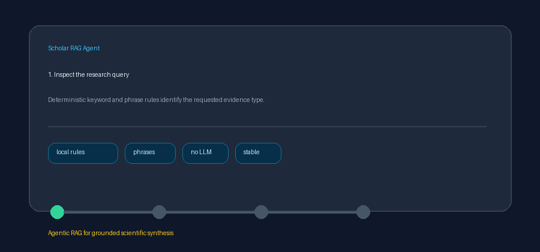

# Citation Intent Classification Guide



Use `CitationIntentClassifier` to make a query's evidence need explicit before
citation-aware ranking. It assigns `background`, `method`, `result`,
`comparison`, or `unknown` with deterministic keyword and phrase rules, then
can copy that intent into each result's chunk metadata. It complements
`CitationGrounder`, which validates claims after retrieval. Optional downstream
stages can use GPT-5.5 / Claude Sonnet 4.6 / Gemini 3.x / Kimi K2.

## Classification rules

Rules cover common scholarly language:

- `background`: overview, review, prior work, history, and definition phrases.
- `method`: methodology, approach, algorithm, protocol, and implementation.
- `result`: findings, outcomes, effects, evidence, accuracy, and conclusions.
- `comparison`: compare, versus, contrast, differences, and outperform.
- `unknown`: no rule matched.

Every distinct matched rule contributes one point. Ties resolve in a fixed
order: comparison, method, result, then background. Multi-token rules such as
`prior work` and `better than` require contiguous terms, avoiding substring
matches inside unrelated words.

## Example

```python
from retrieval.citation_intent import CitationIntentClassifier

classifier = CitationIntentClassifier()
intent = classifier.classify("Compare the methods and accuracy of dense retrieval versus BM25")
# CitationIntent.COMPARISON

rankable_results = classifier.attach(
    "Compare the methods and accuracy of dense retrieval versus BM25",
    retrieved_results,
)
# rankable_results[0].chunk.metadata["citation_intent"] == "comparison"
```

## Metadata behavior

`attach()` returns copied `SearchResult` and `Chunk` objects. Existing metadata,
scores, retriever labels, and path provenance are preserved; inputs are not
mutated. Unknown intent is attached explicitly so downstream ranking can choose
a neutral policy. Pass `metadata_key="ranking_intent"` to use a different,
non-blank metadata field.
