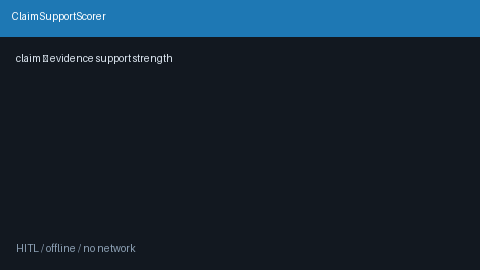

# Claim Support Scorer Guide



`ClaimSupportScorer` scores how strongly each evidence passage supports a
caller-provided claim using offline lexical overlap and claim-term coverage
heuristics. Results are ranked by support strength and labeled
`supported` / `partial` / `unsupported`.

Fills an Elicit / Semantic Scholar claim-table gap with deterministic scoring
(no LLM or network call). Support labels can seed GPT-5.5 / Claude Sonnet 4.6 /
Gemini 3.x / Kimi K2 synthesis. Distinct from `ClaimVerificationGate` (answer
claim groundedness) and `CitationGroundednessScorer` (inline citation-marker
grounding).

## Usage

```python
from retrieval.claim_support import ClaimSupportScorer

scorer = ClaimSupportScorer(
    coverage_weight=0.7,
    supported_threshold=0.6,
    partial_threshold=0.25,
)
ranked = scorer.score(
    "Graph retrieval improves multi-hop reasoning.",
    [
        {
            "evidence_id": "e1",
            "text": "Graph retrieval improves multi-hop reasoning over papers.",
        },
        "Unrelated optics abstract about laser cavities.",
    ],
)
for row in ranked:
    print(row.evidence_id, row.support_score, row.label, row.matched_terms)

one = scorer.score_one(
    "Graph retrieval improves multi-hop reasoning.",
    {"id": "e1", "passage": "Graph retrieval helps multi-hop literature search."},
)
print(one.label, one.support_score)
```

Empty claims raise `ValueError`. Empty evidence lists return a single
`unsupported` result with score `0.0`. Mapping passages may carry `text` /
`passage` / `content` / `abstract` plus `evidence_id` / `id` / `chunk_id`.
