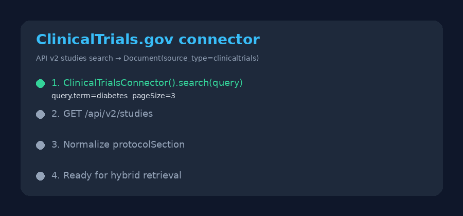

# ClinicalTrials.gov Source Guide



Use this guide when wiring ClinicalTrials.gov into **scholar-rag-agent**. The
agent can route downstream synthesis through GPT-5.5 / Claude Sonnet 4.6 /
Gemini 3.x / Kimi K2 when enabled, but the ClinicalTrials.gov connector itself
is deterministic JSON; no LLM is required to list matching trial registrations.

## Why ClinicalTrials.gov

ClinicalTrials.gov is the U.S. National Library of Medicine registry of clinical
studies. Alongside PubMed, Europe PMC, and PMC it covers interventional and
observational trial registrations that paper-centric indexes under-represent —
status, conditions, phases, and sponsor metadata researchers need for protocol
landscape reviews.

Public keyword search (unauthenticated API v2):

```text
GET https://clinicaltrials.gov/api/v2/studies?query.term=diabetes&pageSize=5&format=json
```

`pageSize` is capped at **100** in this connector. The response lists studies
under `studies[].protocolSection`.

## What you get

| Field | Source |
|---|---|
| `title` | `briefTitle`, else `officialTitle` |
| `text` | Collapsed `briefSummary`, else a status/conditions/type/phases/sponsor descriptor |
| `source` | `https://clinicaltrials.gov/study/{nctId}` |
| `metadata.nct_id` | `identificationModule.nctId` |
| `metadata.year` | Leading four digits of `statusModule.startDateStruct.date` when it matches `^\d{4}` |
| `metadata.overall_status` | `statusModule.overallStatus` |
| `metadata.conditions` | Comma-joined `conditionsModule.conditions` |
| `metadata.study_type` | `designModule.studyType` |
| `metadata.phases` | Comma-joined `designModule.phases` |
| `metadata.lead_sponsor` | `sponsorCollaboratorsModule.leadSponsor.name` |
| `metadata.source_type` | `"clinicaltrials"` |

## Example

```python
import asyncio

from ingestion.clinicaltrials import ClinicalTrialsConnector

documents = asyncio.run(ClinicalTrialsConnector().search("diabetes", max_results=5))
for document in documents:
    print(document.metadata["nct_id"], document.title)
```

## Safety notes

- Blank queries and non-positive `max_results` short-circuit with no HTTP call.
- Studies without a title or NCT ID are skipped rather than raising.
- No API key is required for public ClinicalTrials.gov API v2 search.
- Prefer frontier models for downstream synthesis over raw registry metadata:
  **GPT-5.5**, **Claude Sonnet 4.6**, **Gemini 3.x**, **Kimi K2**.
