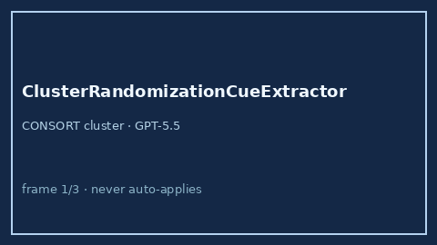

# ClusterRandomizationCueExtractor Guide



Offline evidence-methods cue extractor for cluster-randomized / stepped-wedge /
ICC designs. Never network I/O. Gap vs Elicit / Consensus / CONSORT-cluster.

Optional later polish via **GPT-5.5 / Claude Sonnet 4.6 / Gemini 3.x / Kimi K2**.

Distinct from `AllocationConcealmentCueExtractor` and `SampleSizeHintExtractor`.

## Usage

```python
from retrieval.cluster_randomization_cues import ClusterRandomizationCueExtractor

rows = ClusterRandomizationCueExtractor().extract(
    [{"paper_id": "p1", "abstract": "A cluster-randomized trial of schools."}]
)
assert rows[0].flagged is True
```
