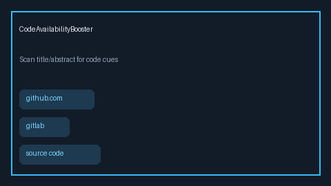

# Code Availability Booster Guide



`CodeAvailabilityBooster` re-scores retrieval hits when title or abstract text
mentions public code hosts (`github.com`, `gitlab`, `bitbucket`) or phrases
such as `code available`, `source code`, and `implementation`. Each row
includes a blended `score`, a `code_signal`, and human-readable `reasons`.

Fills a PapersWithCode / Semantic Scholar code-link gap with offline heuristics
(no LLM or network call). Boosted evidence can seed GPT-5.5 / Claude Sonnet 4.6 /
Gemini 3.x / Kimi K2 synthesis. Distinct from `OpenAccessPreferencer` (OA
metadata preference); this module looks for code-availability language, not
open-access flags.

## Usage

```python
from retrieval.code_availability import CodeAvailabilityBooster
from retrieval.models import Chunk, SearchResult

booster = CodeAvailabilityBooster(alpha=0.3)
boosted = booster.boost(
    [
        SearchResult(
            chunk=Chunk(
                chunk_id="c1",
                document_id="d1",
                title="Graph RAG Toolkit",
                text="We release code at https://github.com/org/graph-rag.",
                source="test",
            ),
            score=0.4,
            retriever="bm25",
        ),
        {
            "title": "Survey without code",
            "abstract": "A narrative review of retrieval systems.",
            "score": 0.9,
        },
    ]
)
for row in boosted:
    print(row.title, row.score, row.code_signal, row.reasons)
    if row.result is not None:
        print(row.result.retriever, row.result.path)
```

Accepts `SearchResult` objects or SearchResult-like mappings with `title`,
`abstract` / `text` / `summary`, and optional `score`. Empty input returns
`[]`. `top_k` truncates after sorting by descending score.
