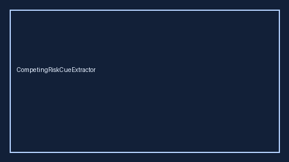

# CompetingRiskCueExtractor Guide



Closes Elicit / Consensus / STROBE competing-risk gaps.

Optional later polish via **GPT-5.5 / Claude Sonnet 4.6 / Gemini 3.x / Kimi K2**.

Distinct from `FollowUpDurationCueExtractor` and `AttritionRateCueExtractor`.

## Usage

```python
from retrieval.competing_risk_cues import CompetingRiskCueExtractor

rows = CompetingRiskCueExtractor().extract(
    [
        {
            "paper_id": "p1",
            "methods": "We used a Fine-Gray competing risk model for the cumulative incidence.",
        }
    ]
)
print(rows[0].flagged, rows[0].cues)
```

## Safety

Offline patterns only. No HTTP. Humans interpret evidence cues.
