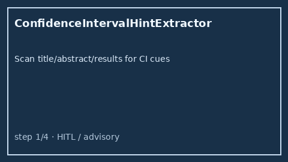

# Confidence Interval Hint Extractor Guide



`ConfidenceIntervalHintExtractor` scans title / abstract / results text for
offline confidence-interval cues (`95% CI 1.2-3.4`, `95% CI: 0.8 to 1.1`,
`confidence interval (0.45, 0.62)`, `CI = [1.5, 2.8]`). It returns advisory
level / low / high numeric hints with the matched cue string. It never calls
the network.

Distinct from `EffectSizeHintExtractor` (Cohen's d / OR / HR / RR / AUC) and
`PValueHintExtractor` (p-value cues). Fills an Elicit / Consensus / SciSpace /
PaperQA confidence-interval surfacing gap with deterministic heuristics.
Optional later narrative can use GPT-5.5 / Claude Sonnet 4.6 / Gemini 3.x /
Kimi K2.

## Usage

```python
from retrieval.confidence_interval_hint import ConfidenceIntervalHintExtractor

hints = ConfidenceIntervalHintExtractor().extract(
    [
        {
            "paper_id": "p1",
            "abstract": "OR was 2.1 (95% CI 1.2-3.4) for the primary endpoint.",
        },
        {
            "paper_id": "clear",
            "abstract": "We study transformers without reported interval estimates.",
        },
    ]
)
for hint in hints:
    print(hint.paper_id, hint.level, hint.low, hint.high, hint.matched_cue)
```

When multiple cues match, labeled `95% CI` is preferred over
`confidence interval`, then bare `CI`. Empty paper lists return an empty
tuple. Inputs are not mutated.
