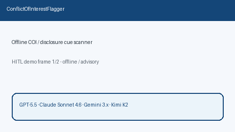

# Conflict Of Interest Flagger Guide



`ConflictOfInterestFlagger` scans abstract / acknowledgements / disclosure text
for offline COI cues (`conflict of interest`, competing interests, financial
disclosures, no-conflicts declarations, advisory/consultant/honoraria/stock
language). It returns advisory flags with reasons and matched cues. It never
calls the network.

Distinct from `FundingDisclosureFlagger` (funder/grant cues). Fills a Scite /
Elicit / Consensus conflict-of-interest surfacing gap with deterministic
heuristics. Optional later narrative can use GPT-5.5 / Claude Sonnet 4.6 /
Gemini 3.x / Kimi K2.

## Usage

```python
from retrieval.conflict_of_interest import ConflictOfInterestFlagger

flags = ConflictOfInterestFlagger().flag(
    [
        {
            "paper_id": "p1",
            "abstract": "The authors declare a conflict of interest with Acme Pharma.",
        },
        {
            "paper_id": "clear",
            "abstract": "We study transformers without disclosure text.",
        },
    ]
)
for flag in flags:
    print(flag.paper_id, flag.flagged, flag.reasons, flag.matched_cues)
```

Empty paper lists return an empty tuple. Inputs are not mutated.
