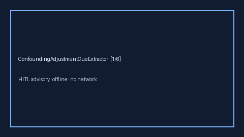

# ConfoundingAdjustmentCueExtractor Guide



Offline advisory cue extractor. Never calls the network.
Closes Elicit / Consensus / STROBE confounding-adjustment gaps.

Optional polish via **GPT-5.5 / Claude Sonnet 4.6 / Gemini 3.x / Kimi K2**.

Distinct from BaselineImbalanceCueExtractor / IntentionToTreatCueExtractor.

## Usage

```python
from retrieval.confounding_adjustment_cues import ConfoundingAdjustmentCueExtractor

rows = ConfoundingAdjustmentCueExtractor().extract(
    [{"paper_id": "p1", "methods": "We used propensity score matching to adjust for confounding."}]
)
print(rows[0].flagged, rows[0].cues)
```
