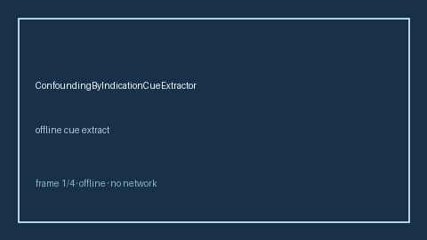

# ConfoundingByIndicationCueExtractor Guide



Offline deterministic cue extractor. Never calls the network.
Closes gaps vs Elicit/Consensus/AJE confounding-by-indication cue extractors.

Optional later narrative via **GPT-5.5 / Claude Sonnet 4.6 / Gemini 3.x / Kimi K2**.

## Usage

```python
from retrieval.confounding_by_indication_cues import ConfoundingByIndicationCueExtractor

cues = ConfoundingByIndicationCueExtractor().extract(
    [
        {
            "paper_id": "p1",
            "abstract": "We discuss confounding by indication when sicker patients receive treatment.",
        }
    ]
)
print(cues[0].flagged, cues[0].cue_kind)
```

## Safety

Advisory cues only. Humans decide relevance. See `SAFETY.md`.
