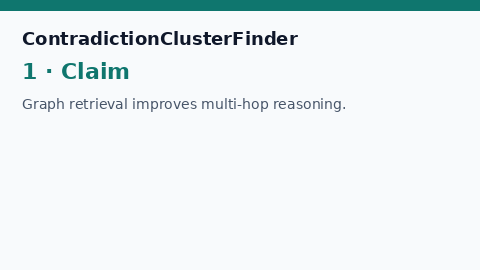

# Contradiction Cluster Finder Guide



`ContradictionClusterFinder` partitions evidence passages into **supporting**
vs **contradicting** clusters for a caller-provided claim. Supporting passages
need high claim-term overlap without negation/antonym cues. Contradicting
passages need topical overlap plus negation words (`not`, `no`, `never`,
`fail*`, `contradict*`) or antonym polarity. Results include id lists, a
`tension_score` in `[0, 1]`, and per-passage labels.

Fills an Elicit conflicting-evidence table gap with deterministic heuristics
(no LLM or network call). Clusters can seed GPT-5.5 / Claude Sonnet 4.6 /
Gemini 3.x / Kimi K2 synthesis. Distinct from `ClaimSupportScorer` (per-passage
support strength) and `ClaimVerificationGate` (answer-level claim
groundedness). Also distinct from `EvidenceConflictDetector` (pairwise snippet
polarity without a claim).

## Usage

```python
from retrieval.contradiction_cluster import ContradictionClusterFinder

finder = ContradictionClusterFinder(
    support_overlap=0.35,
    contradict_overlap=0.15,
)
cluster = finder.find(
    "Graph retrieval improves multi-hop reasoning.",
    [
        {
            "evidence_id": "e1",
            "text": "Graph retrieval improves multi-hop reasoning over papers.",
        },
        {
            "id": "e2",
            "passage": "Graph retrieval does not improve multi-hop reasoning.",
        },
        "Unrelated optics abstract about laser cavities.",
    ],
)
print(cluster.supporting_ids, cluster.contradicting_ids)
print(cluster.tension_score, cluster.labels)
```

Empty claims raise `ValueError`. Empty passage lists return empty id lists and
`tension_score=0.0`. Mapping passages may carry `text` / `passage` /
`content` / `abstract` plus `evidence_id` / `id` / `chunk_id`. String
passages receive synthetic ids (`passage-0`, …). Tension is `0.0` unless both
supporting and contradicting sides are non-empty.
