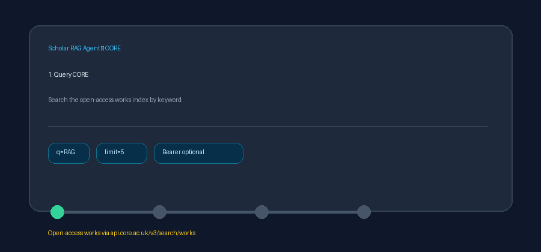

# CORE Source Guide



Use this guide when wiring CORE into **scholar-rag-agent**. The agent can route
enrichment through GPT-5.5 / Claude Sonnet 4.6 / Gemini 2.5 / Kimi K2 when
enabled, but the CORE connector itself is deterministic JSON — no LLM required
to list matching open-access works.

## Why CORE

CORE aggregates open-access research outputs from repositories and journals
worldwide. Alongside OpenAIRE, Zenodo, and Figshare it covers OA copies that may
never appear as the primary record in PubMed or Crossref.

Public keyword search:

```
GET https://api.core.ac.uk/v3/search/works?q=retrieval+augmented+generation&limit=5
```

`limit` is capped at **100**. The response is a JSON object with a `results`
array of work objects. An optional CORE API key may be passed as a Bearer token
for higher rate limits.

## What you get

| Field | Source |
|---|---|
| `title` | `title` |
| `text` | Collapsed `abstract`, or a `By authors (year)` descriptor when absent |
| `source` | `links` entry with `type=display`, else `downloadUrl`, else `https://doi.org/{doi}`, else title |
| `metadata.doi` | `doi` |
| `metadata.year` | `yearPublished` as an integer, or the leading four digits of a date-shaped string |
| `metadata.authors` | Comma-joined `authors[].name` |
| `metadata.source_type` | `"core"` |

## Example

```python
import asyncio

from ingestion.core import CoreConnector

documents = asyncio.run(CoreConnector().search("climate adaptation", max_results=5))
for document in documents:
    print(document.metadata["doi"], document.title)
```

## Safety notes

- Blank queries and non-positive `max_results` short-circuit with no HTTP call.
- Works without a title are skipped rather than raising.
- Search metadata works without a key; configure a CORE API key only when you
  need higher quotas or authenticated full-text fields.
