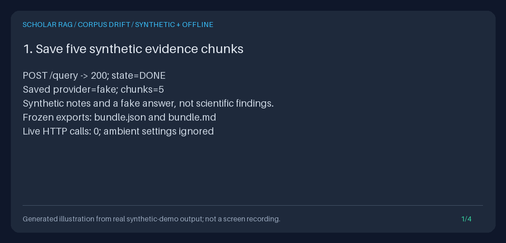

# Compare saved evidence with the current corpus

`GET /runs/{run_id}/corpus-drift` compares a completed run's **frozen retrieved
chunks** with the current persisted SQLite chunks. It returns `unchanged`,
`changed`, or `missing` for each saved source, in its original rank order.
It does not retrieve again, call a live or fake generator, write events, update
the corpus, or change the saved answer or either evidence export.

**Unchanged is not scientifically valid.** This checks exact chunk fields,
not whole-paper equality, source reliability, semantic support, or whether an
answer should be regenerated. A changed title alone counts as drift; an
unretrieved passage changing elsewhere in the same paper does not.



This original illustration is rendered from
[actual offline output](../assets/corpus-drift.txt), not a staged research UI,
screen recording, live-provider answer, or quality benchmark.

## Run the complete offline demonstration

From the repository root, with Python 3.11+ and [uv](https://docs.astral.sh/uv/):

```bash
uv sync --extra dev
DEMO_DIR="$(mktemp -d)"
uv run --no-sync python -m scripts.demo_corpus_drift \
  --output-dir "$DEMO_DIR/artifacts"
uv run --no-sync python -m json.tool "$DEMO_DIR/artifacts/drift.json"
uv run --no-sync python -m json.tool "$DEMO_DIR/artifacts/checks.json"
uv run --no-sync python -m scripts.create_corpus_drift_gif \
  --transcript "$DEMO_DIR/artifacts/transcript.txt" \
  --output "$DEMO_DIR/corpus-drift.gif"
printf 'Review artifacts in %s\n' "$DEMO_DIR"
```

The script persists and indexes five synthetic chunks using the real document
store, then makes **one real `/query` request with the fake adapter**. That setup
step performs retrieval and placeholder generation. Every subsequent drift
request forbids agent execution, retrieval, generation, and event writes.
The script uses the shared `offline_settings` helper, ignoring environment,
dotenv, and secret-file settings and clearing all provider keys. Network guards
reject live HTTP/socket connections; no server listener or downloaded paper is needed.

It first measures five unchanged chunks, then changes only its new temporary
synthetic database: re-ingests one chunk under the same IDs, deletes one chunk,
deletes another's document while leaving an orphan chunk, and reassigns a chunk
ID to another document. The actual response contains:

```json
{"total": 5, "unchanged": 1, "changed": 1, "missing": 3}
```

The demo recreates the application against that database and requires a
byte-identical report, JSON export, and Markdown export, plus unchanged events.
The temporary database is removed on exit. The demonstration is not a backfill,
repair, migration, or corpus-maintenance command.

| Artifact | Actual content |
| --- | --- |
| `bundle.json`, `bundle.md` | Original frozen exports, including the synthetic passages and fake answer |
| `unchanged.json` | Report before the demo's controlled corpus mutations |
| `drift.json`, `restarted.json` | Exact API response before and after application restart |
| `checks.json` | Before/after export SHA-256 values, restart byte parity, event equality, and zero work/network-call counts |
| `transcript.txt` | Measured four-panel output used to render the GIF |

Both scripts refuse to overwrite named outputs, including dangling symlinks.
The renderer reuses the existing Pillow dev dependency and transcript renderer;
it rejects unrelated panels and horizontal/vertical overflow. Rendering the
same transcript with the locked Pillow version is byte-reproducible. New demo
runs have different run IDs/timestamps in their JSON exports; the displayed
counts and transcript are deterministic for this synthetic fixture.

To reproduce the committed illustration without running a query:

```bash
uv run --no-sync python -m scripts.create_corpus_drift_gif \
  --transcript docs/assets/corpus-drift.txt \
  --output "$DEMO_DIR/reproduced.gif"
cmp docs/assets/corpus-drift.gif "$DEMO_DIR/reproduced.gif"
```

## API usage

Start the isolated loopback API in the [Quickstart](../../QUICKSTART.md), ingest
permitted text, and keep the ID from a query whose `result.state` is `DONE`.
`/query` can return HTTP 200 with an `ERROR` state, so check the body first.
To recover old IDs, use `GET /runs?state=DONE&limit=20`; a recorded `DONE` is a
discovery hint, not a guarantee that the exporter will accept the saved record.

```bash
BASE_URL=http://127.0.0.1:8000
RUN_ID='replace-with-your-completed-run-id'
curl --fail-with-body --silent --show-error \
  "$BASE_URL/runs/$RUN_ID/corpus-drift" | uv run --no-sync python -m json.tool
```

The JSON-only endpoint takes no format, scope, pagination, or generation
parameters. There is no bulk endpoint, background job, new table, or migration.
The response is a report directly, not a `result` run wrapper. `/docs` and
`/openapi.json` expose its typed response and bounds.

For the full saved evidence, use `/runs/{run_id}/export?format=json|markdown`.
For present-day passage inspection, use
[`/documents/{document_id}/chunks`](DOCUMENT_CHUNKS_GUIDE.md). Those are separate
reads and may see a later corpus state; the drift response intentionally does
not return source text or inspection URLs that embed private source labels.

## Python usage without an application or model

```python
from pathlib import Path

from storage.corpus_drift import CorpusDriftReport, SQLiteCorpusDrift
from storage.evidence_export import EvidenceExportError

reader = SQLiteCorpusDrift(Path("/absolute/path/to/existing-corpus.sqlite3"))
try:
    report: CorpusDriftReport = reader.report("your-completed-run-id")
except EvidenceExportError as exc:
    # Log the stable code, not the database path or underlying exception.
    print(exc.status_code, exc.code, str(exc))
    raise
else:
    print(report.counts.model_dump())
    for source in report.sources:
        print(source.rank, source.status, source.changed_fields, source.missing_reason)
```

An existing application also exposes `container.corpus_drift.report(run_id)`.
The standalone service requires no settings, provider, retriever, event-log
initializer, or writable document store. Construction does no database I/O.
Each call opens an escaped `file:` URI with `mode=ro`; missing files are not
created, and paths containing spaces, Unicode, `?`, or `#` remain literal paths.
Normal application startup still initializes existing stores and rebuilds its
in-memory retrieval indexes; the drift operation itself does neither.

The original `EvidenceExporter` remains the authority for successful completion,
legacy handling, event sequence, snapshot version, text/context integrity,
scope, and evidence policy. A structural event-reader interface allows it to
consume a bounded read from the **same SQLite connection and transaction** as
the corpus comparison. Export construction/serialization and `/query` behavior
are unchanged.

## Response and comparison contract

| Field | Meaning |
| --- | --- |
| `schema_version` | `"1.0"` for this drift report, not a new frozen-evidence version |
| `run_id`, `context_sha256` | Requested saved run and its authoritative frozen context digest |
| `counts` | `total`, `unchanged`, `changed`, `missing`; each counts retrieved chunks, not distinct papers |
| `has_drift` | True when any source is changed or missing; not an answer-quality verdict |
| `sources` | At most 50 findings, preserving the frozen one-based rank and exact chunk/document IDs |
| `notices` | Fixed scope, privacy, and interpretation limitations |

Each finding contains `rank`, `chunk_id`, `document_id`, `status`,
`changed_fields`, `missing_reason`, and `frozen`/`current` digest objects.
Digest objects contain `text_sha256`, `title_sha256`, `source_sha256`, and
`metadata_sha256`. There are no query/answer/title previews, full passages,
source labels, arbitrary metadata, provider diagnostics, or current owner IDs.

Identity is exactly **both `chunk_id` and `document_id`**. Titles, filenames,
text hashes, and lexical similarity are not identity substitutes:

| Status / reason | Meaning |
| --- | --- |
| `unchanged` | Original document exists, chunk still belongs to it, and all four compared digests match |
| `changed` | Same identity, but one or more compared fields differ |
| `missing` / `document_missing` | Original document row is absent, even if an orphan chunk remains |
| `missing` / `chunk_missing` | Original document exists but the chunk ID is absent |
| `missing` / `chunk_reassigned` | Original document exists but the chunk ID now belongs to a different document |

Document absence takes precedence if both the document and chunk are absent or
the chunk is reassigned. Missing findings retain frozen digests, with
`current: null` and `changed_fields: []`; they do not invent text changes.
Relevant malformed current chunk records reject the whole report even if their
original document is gone. Other corpus rows are not audited.

For matched identities, `changed_fields` follows the fixed order `text`,
`title`, `source`, `metadata`. Text/title/source use SHA-256 over their **exact
UTF-8 strings**: whitespace, newlines, Unicode normalization, and case are not
normalized away. SQLite UTF-8 and UTF-16 databases produce the same UTF-8
digests for the same strings.

Metadata means the chunk's complete `dict[str, str]`, hashed as JSON with sorted
keys, `ensure_ascii=False`, and compact separators. JSON storage spacing, key
order, and equivalent Unicode escapes do not count as changes. Keys/values do;
duplicate keys, non-string values, invalid Unicode, non-object roots, or malformed
JSON are errors, not guessed metadata. No metadata keys or values are returned.

A valid empty snapshot returns zero counts, an empty source list, and
`has_drift: false`. That means **nothing was compared**, not that the corpus is
unchanged or sufficient. Newly added chunks, document bodies/titles/metadata,
retrieval indexes, scores, paths, collection revisions, and remote publications
are outside this report. Document rows are checked for identity presence only.

## Exact bounds and failure behavior

No evidence is truncated, sampled, silently skipped, or partially returned.
Limits are fixed, not caller-controlled:

| Read boundary | Inclusive maximum |
| --- | --- |
| Frozen sources / returned findings | 50, enforced by the existing snapshot validator |
| Frozen context | 262,144 UTF-8 bytes |
| Frozen snapshot | 1,048,576 bytes in the existing event JSON encoding |
| Run, chunk, and document identities in the report | 256 characters each, never trimmed or truncated |
| Saved run events | 100, including diagnostics and events after the first completion |
| One stored event payload | 1,048,576 UTF-8 bytes |
| All selected run-event text fields | 8,388,608 UTF-8 bytes across timestamp, agent ID, run ID, event type, and payload |
| Current chunk text, summed across looked-up chunk IDs | 262,144 UTF-8 bytes |
| Current chunk records, summed across those IDs | 1,048,576 UTF-8 bytes across IDs, title, text, source, and raw metadata JSON |

Current records include orphan/reassigned rows for validation and byte accounting.
Raw JSON whitespace counts toward the read budget even though metadata comparison
ignores it. Event count lookahead fetches at most 101 size-only rows. SQL checks
storage types/byte lengths **before hydrating payloads**; UTF-16 preflight permits
the storage-encoding factor, followed by exact UTF-8 checks. Only selected run
events and up to 50 chunk IDs are read, using existing indexes. No unbounded
`list_events()` or whole-corpus `list_chunks()` call is made.

Saved events, document existence, and current chunks are all read inside one
explicit transaction. Concurrent commits cannot mix old and new rows within a
report. Repeating a request on unchanged persisted data is deterministic,
including across restart; a later request can observe later corpus edits.
This is not an immutable corpus revision, a global database integrity check, a
wall-clock/CPU deadline, or index synchronization across workers. SQLite lock
waiting uses a five-second connection timeout.

| HTTP / `detail.code` | Meaning |
| --- | --- |
| 404 / `run_not_found` | No saved events for the requested run |
| 409 / `run_incomplete`, `run_failed` | No successful completed run to compare |
| 409 / `snapshot_unavailable` | Legacy/missing capture; never reconstructed from today's corpus |
| 409 / `invalid_run_record` | Invalid saved evidence or an unrepresentable frozen identity |
| 409 / `invalid_corpus_record` | A selected current chunk is malformed or unsupported |
| 409 / `drift_limit_exceeded` | A bounded event/current-record read exceeds the limits above |
| 422 / `invalid_drift_request` | Invalid run identity |
| 503 / `drift_storage_unavailable` | Missing/unreadable/locked database, missing required table, or another SQLite failure |

Errors contain only `detail.code` and a fixed safe `detail.message`. Successful
responses and these errors carry `Cache-Control: no-store` and
`X-Content-Type-Options: nosniff`; operational logs use only a stable code, not
raw SQL errors, database paths, or source contents. Storage failure and corrupt
selected data never become “missing,” “unchanged,” or partial success.

## Privacy, limitations, and related work

Keep the API local/trusted: there is still no authentication or tenant isolation.
Identifiers can contain private labels; digests permit equality/dictionary
checks and are **not anonymization, signatures, or scientific validation**.
The original query, answer, passages, and metadata remain in the frozen export,
even after corpus deletion. Protect the database, backups, and downloaded
artifacts separately; see [Safety](../../SAFETY.md).

This feature inspects already saved local evidence; it introduces no connector,
cue extractor, auto-regeneration, model migration, or quality score. The
[dated provider guide](PROVIDER_MODELS_GUIDE.md) explains current catalog
information and this repository's compatible payload/budget choices, not a
live account test. The runtime remains FastAPI/Pydantic/HTTPX/SQLite with a
custom state machine, hash embeddings, and BM25, not automatic LangGraph or
semantic embeddings.

Peer workflow references reviewed **2026-09-28 America/Los_Angeles**:
[PaperQA](https://github.com/Future-House/paper-qa) documents local cached
indexing/update detection, iterative evidence, and saved answers;
[RAGFlow](https://github.com/infiniflow/ragflow) emphasizes human intervention
and traceable references. These motivate inspectable evidence lifecycle
workflows; this small exact-chunk report is independently implemented, not
copied peer code, a feature-parity claim, or either project's quality evaluation.

Use [saved-run comparison](RUN_COMPARISON_GUIDE.md) for two frozen answers,
[saved reviews](ANSWER_REVIEWS_GUIDE.md) for a human opinion, and
[evidence export](EVIDENCE_EXPORT_GUIDE.md) for original passages. None is
silently changed by a corpus-drift request.
