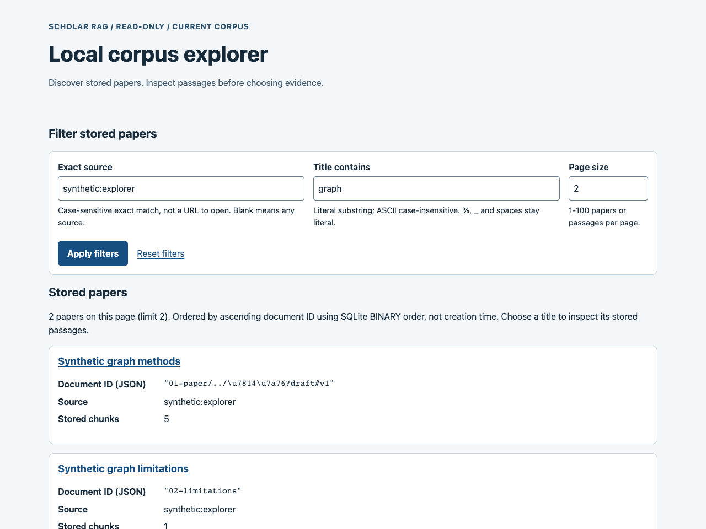

# Browse the current local corpus in a normal browser

Open `http://127.0.0.1:8000/explore` after starting the
[Quickstart](../../QUICKSTART.md) API. Filter stored papers, recover exact
document IDs, open one paper, and follow bounded passage pages. This is a
read-only HTML front end to the existing document catalog and stored-chunk
readers, not a new database, retrieval algorithm, or generation workflow.



The animation contains four **actual browser screenshots** of the implemented
UI with original synthetic fixtures: filtered catalog, catalog continuation,
first passage page, and next passage page. It is a screenshot sequence, not a
continuous screen recording or scientific validation.
[View the first frame without animation](../assets/corpus-explorer.png).

## Browser workflow

1. Start the API on loopback and open `/explore`. An empty database has an
   explicit empty-corpus message; the page does not download or ingest papers.
2. Enter an **exact source** and/or **literal title substring**. Leave either
   field blank to omit it. Set page size to 1-100, then choose **Apply filters**.
3. Follow **Next page**. Both filters and the chosen size survive keyset
   pagination. **Start again with the same selection** removes only the cursor;
   **Reset filters** restores the unfiltered catalog and default size.
4. Choose a paper title. Its document ID is a JSON string suitable for copying
   into a `document_ids` array. Each passage shows its stored title, source,
   exact chunk ID, optional `chunk_index`, and literal text.
5. Follow passage pages or **Back to filtered catalog**. The back link restores
   the catalog page you came from, including its cursor. Choosing a document
   always reads that exact ID; the catalog filters are only back-link context.

Whitespace-only catalog titles appear as **Untitled paper**. This display-only
fallback does not change stored titles or trim nonblank title text.

The browser uses native GET forms and links: no JavaScript, client runtime,
external fonts/resources, analytics, cookies, or browser storage. Keyboard
users can tab to a skip link, labeled controls, paper links, and pagination;
focus is visible, and the layout reflows on narrow screens. Source labels are
text, **never automatically followed as URLs**. Markdown and HTML-looking
passages remain literal text.

Opening a paper does not select a query, create a collection, or record a run.
After reviewing it, use the separate
[document-scope API](DOCUMENT_SCOPE_GUIDE.md) or
[paper collections](PAPER_COLLECTIONS_GUIDE.md) deliberately. For historical
evidence, use the [frozen saved-answer reader](OFFLINE_EVIDENCE_READER_GUIDE.md),
not these current-corpus pages.

## HTTP contract and curl

| Route | Query parameters |
| --- | --- |
| `GET /explore` | `limit=20`, optional `source`, `title`, document-ID `cursor` |
| `GET /explore/document` | Required exact `document_id`; `limit=20`; optional document-bound chunk `cursor`; optional `source`, `title`, `catalog_cursor` for the back link |

Both return `text/html; charset=utf-8`. They are GET-only; unsupported methods
return the framework's 405 response. The existing JSON
[`GET /documents`](DOCUMENT_CATALOG_GUIDE.md) and
[`GET /documents/{document_id}/chunks`](DOCUMENT_CHUNKS_GUIDE.md) are unchanged.
OpenAPI documents the HTML routes and query bounds, but Swagger is not needed
for browsing.

With the synthetic demo server below running:

```bash
export BASE_URL=http://127.0.0.1:8765
curl --fail-with-body --silent --show-error --get "$BASE_URL/explore" \
  --data-urlencode 'source=synthetic:explorer' \
  --data-urlencode 'title=graph' --data-urlencode 'limit=2'

DOC_ID="$(curl --fail-with-body --silent --show-error --get "$BASE_URL/documents" \
  --data-urlencode 'source=synthetic:explorer' --data-urlencode 'title=graph' \
  --data-urlencode 'limit=1' | uv run --no-sync python -c \
  'import json,sys; print(json.load(sys.stdin)["documents"][0]["document_id"])')"
curl --fail-with-body --silent --show-error --get "$BASE_URL/explore/document" \
  --data-urlencode "document_id=$DOC_ID" --data-urlencode 'limit=2'
```

Use the rendered links for continuation, or copy their exact query parameters.
Use a URL/query encoder, not string interpolation, for imported IDs. The HTML
document route intentionally uses a **query parameter**, so slashes, `.`, `..`,
Unicode, quotes, percent signs, `?`, `#`, `&`, and `+` stay inside the identity
rather than becoming normalized path components. URL encoding and HTML escaping
are separate steps. Navigation paths are fixed same-origin routes; user-provided
return URLs and external source links are not accepted as navigation targets.

### Filtering without accidental normalization

`source` matches the full stored label exactly, including case and spaces.
`title` uses the existing SQLite `instr(lower(title), lower(filter))` semantics:
literal substring matching with ASCII case-insensitivity, not full Unicode case
folding. `%`, `_`, quotes, and backslashes are literal, not search patterns.
When both filters are present, both must match, before the page limit.

**Only the empty string in the HTML source/title form fields maps to omission.**
Nonempty values are not stripped, case-normalized, or replaced. Empty IDs,
cursors, and limits remain invalid. JSON readers still reject empty filters.
The server enforces the 300-title/512-source limits in Unicode codepoints.
Text inputs deliberately omit native `maxlength`, which counts UTF-16 code
units and would clip astral characters early. Over-limit requests still return
sanitized 422 errors; the server bounds are unchanged.
Unusual URL-supplied filters containing NUL/CR/LF cannot be round-tripped by
native text inputs; the page displays their JSON representation and exact
continuation links instead of silently changing them. Reset to edit normally.

## Bounds, ordering, and truthful failures

| Item | Limit or meaning |
| --- | --- |
| Page size | Default 20, minimum 1, maximum 100 rows; at most `limit + 1` projected rows read |
| Document ID / catalog cursor | 1-128 characters without surrounding whitespace; never shortened |
| Chunk ID | 1-256 characters; never shortened |
| Passage cursor | Opaque, canonical, document-bound token up to 4096 characters |
| Title / title filter | 300 characters; stored title prefixes carry an explicit truncation notice |
| Source / source filter | 512 characters; stored source prefixes carry an explicit truncation notice |
| Passage | First 4000 characters, with an explicit truncation notice if longer |
| Complete HTML | At most 1,048,576 UTF-8 bytes including markup and escaping; overflow fails, not partial success |

Catalog pages sort by ascending document ID; passage pages sort by **ascending
chunk ID in SQLite BINARY text order, not `chunk_index`**. For example,
`chunk-10` precedes `chunk-2`. The stored index is a zero-based ordinal when
present; missing values say **Not recorded** and are never guessed.
Imported indices need not be unique or contiguous.

Limits count Unicode characters, except the final byte cap. A next-page cursor
moves to later chunk IDs, **not the omitted tail of a truncated passage**.
Consult your original permitted source for that tail. Arbitrary metadata,
full document bodies, embeddings, ranking scores, and run records are not loaded
or shown. A source preview longer than 512 characters cannot serve as a full
exact filter; browse without that filter or by title.

| Status/state | Meaning and next action |
| --- | --- |
| 200, empty corpus | No document rows; use the existing trusted ingestion workflow |
| 200, no matches | Adjust exact source/literal title filters; nothing was silently widened |
| 200, no rows after cursor | Start again; a cursor need not still identify a saved row |
| 200, document with no chunks | The document exists, but has no stored passages |
| 404 | The exact document is absent (including orphan-only chunks); return to the catalog |
| 422 | Invalid bounds/ID or malformed/wrong-document cursor; reset or use a returned link |
| 409 | Corrupt projected data, including lookahead; repair the import with trusted local tools |
| 409, HTML text limitation | A label/passage contains NUL or invalid Unicode; inspect with JSON/Python instead |
| 413 | Escaped HTML exceeds 1 MiB; reduce `limit`; no partial page is returned |
| 503 | SQLite cannot be read; check local availability, permissions and configuration, then retry |

Only projected rows and their bounded prefixes are validated, not unseen
corpus data. A bad later row may therefore appear on a later request. Errors
use fixed explanatory HTML and code-only application logging: no input values,
SQL, filesystem paths, stored secrets, or exception internals are echoed.
Valid control-bearing IDs remain lossless through query encoding and displayed
JSON escapes even when a corresponding label/passage cannot be shown as HTML.

## Persistence, privacy, and runtime boundaries

Reuse the same `SCHOLAR_RAG_DATABASE_PATH` after restart. Existing documents and
chunks need no migration, index addition, backfill, or re-ingestion for the UI.
The factory still initializes ordinary stores and rebuilds its normal in-memory
retrieval indexes at startup; this feature does **not** make startup bounded.
Each synchronous page handler calls exactly one existing read-only reader on
FastAPI's worker thread. Each reader opens its own SQLite connection with
`mode=ro`; page reads do not generate, retrieve, rerank, ingest, edit collections,
or append events. They never fetch the full corpus behind a page limit.

Each catalog SELECT / document read transaction is a current snapshot, not a
snapshot shared across pages. Concurrent re-imports can replace text and labels;
new IDs behind a cursor require starting again. Complete-document Python ingestion
removes that ID's superseded chunks, while low-level row upserts remain incremental.
Existing stale rows are not migrated until the document is reingested through the
[complete replacement boundary](../EXAMPLES.md#replace-a-complete-document-in-python).
Browsing is not a document-version reconstruction or an audit log.
Filtering/counting can scan many rows: bounded response size is not a fixed
latency guarantee, and the UI adds no scan deadline.

Every successful page and handled explorer error has `Cache-Control: no-store`,
`X-Content-Type-Options: nosniff`, `Referrer-Policy: no-referrer`, and
`X-Frame-Options: DENY`. CSP denies default resource loading, scripts, base tags,
objects, frames, and frame embedding; forms can submit only to the same origin.
The single static stylesheet is authorized by its SHA-256 hash, not unsafe-inline.
No untrusted value enters CSS. Text is escaped, isolated for bidi display, and
code/IDs opt out of automatic translation. JSON string escapes preserve copyable
IDs; visual order alone is not an identity check.

These measures are **not authentication, tenant isolation, or permission to
share**. Anyone who can reach this API can inspect its corpus. Use loopback or
your own authenticated boundary. GET filters/IDs/cursors may remain in browser
history, bookmarks, proxy/access logs, screenshots, saved HTML, or copied text.
No-store is not erasure. Do not use secrets as filter values; inspect permitted
material only. The demo disables server access logging, but normal deployments
must configure their own logs.

No provider is called, including the fake adapter. Live providers remain optional
for separate generation workflows; see the existing
[provider model guide](PROVIDER_MODELS_GUIDE.md). This feature changes no model
defaults. The stack remains FastAPI, Pydantic, HTTPX, SQLite, and the custom
state machine with lexical/hash-vector retrieval, not a provider SDK or LangGraph.

## Python: inspect after restart without generation

After installing the dev extras, this complete example uses only temporary
synthetic fixtures and the existing readers. It also checks a real HTML response.
Standalone reader construction avoids app initialization entirely when pointed
at an already existing database.

<!-- python-example:start -->
```python
from pathlib import Path
from tempfile import TemporaryDirectory
from fastapi.testclient import TestClient
from api.application import create_app
from scripts.demo_corpus_explorer import SOURCE, browsing_guards, seed_demo
from scripts.demo_evidence_export import offline_settings
from storage.document_catalog import SQLiteDocumentCatalog
from storage.document_chunks import SQLiteDocumentChunks

with TemporaryDirectory(prefix="scholar-explorer-example-") as directory:
    path = Path(directory) / "corpus.sqlite3"
    settings = offline_settings(path)
    app = create_app(settings)
    seed_demo(app.state.container)
    restarted = create_app(settings)
    before = path.read_bytes()
    with TestClient(restarted) as client, browsing_guards(restarted.state.container):
        catalog = SQLiteDocumentCatalog(path).list_documents(source=SOURCE, title="graph", limit=2)
        paper = catalog.documents[0]
        reader = SQLiteDocumentChunks(path)
        first = reader.list_chunks(paper.document_id, limit=2)
        second = reader.list_chunks(paper.document_id, limit=2, cursor=first.next_cursor)
        print("Stored chunk IDs:", [chunk.chunk_id for chunk in first.chunks + second.chunks])
        page = client.get(
            "/explore/document", params={"document_id": paper.document_id, "limit": 2}
        )
        page.raise_for_status()
        print("Browser page:", page.status_code, page.headers["content-type"])
    assert path.read_bytes() == before
    assert restarted.state.container.event_log.list_events() == []
```
<!-- python-example:end -->

The direct readers require an actual integer limit, not a boolean, float or
numeric string; HTTP query numbers follow FastAPI's existing parsing rules.
Missing standalone-reader databases fail rather than being created.

## Reproduce the offline demo and actual browser GIF

From the repository root after the normal development install:

```bash
EXPLORER_DIR="$(mktemp -d)/explorer"
uv run --no-sync python -m scripts.demo_corpus_explorer --output-dir "$EXPLORER_DIR"
printf 'Keep this path for the other terminal: %s\n' "$EXPLORER_DIR"
uv run --no-sync python -m scripts.demo_corpus_explorer --serve "$EXPLORER_DIR" --port 8765
```

The demo refuses an existing output directory before doing work. It ignores
ambient environment, `.env`, secret files and provider keys. It persists a new
synthetic database, five actual HTML responses, exact browser paths in
`pages.json`, measured `checks.json`, and `transcript.txt`. It exercises filtered
catalog pages (2, 1), passage pages (2, 2, 1), blank form filters, unusual exact
IDs, explicit 4000-character truncation, and identical HTML after restart.
Guards fail on generation, retrieval, reranking, writes, or external HTTP, and
the demo compares database bytes/events before and after. The served fixture
also blocks those operations; Ctrl-C stops it and checks its database is unchanged.

In another terminal, set `EXPLORER_DIR` to the printed path. Open
`http://127.0.0.1:8765/explore` to perform the browser workflow. Reproduce the
four frames with an already available browser or browser-automation tool, using
a **1280x960 CSS-pixel viewport at device scale 1**, with the page scrolled to
the top. The included GIF was captured through Playwright browser tooling.
No browser or automation dependency is installed by the demo.

| Screenshot filename | Browser state to capture |
| --- | --- |
| `catalog-first.png` | Submit source `synthetic:explorer`, title `graph`, page size `2` |
| `catalog-next.png` | Follow the catalog's Next page link |
| `passages-first.png` | Start again with the same selection, then choose Synthetic graph methods |
| `passages-next.png` | Follow that document's Next page link |

The exact same-origin paths are also saved under the corresponding names in
`pages.json`; prefix them with your local server origin. Save viewport PNGs
(not whole-page screenshots or browser-window chrome) into a new
`browser-frames` directory. Chromium DevTools' responsive device toolbar can
set these dimensions/DPR and capture a screenshot; Playwright's
`page.setViewportSize({width:1280,height:960})` and
`page.screenshot({path:...,scale:"css"})` provide the equivalent. Use real page
responses, not recreated panels. Then assemble the frames offline with Pillow:

```bash
uv run --no-sync python -m scripts.create_corpus_explorer_gif \
  --frames-dir "$EXPLORER_DIR/browser-frames" \
  --output "$EXPLORER_DIR/corpus-explorer.gif"
```

The assembler does not start or reconfigure a browser. It refuses an existing
GIF, duplicate frames or incorrectly sized/non-PNG inputs, and does not resize
screenshots. Pixels/fonts can vary by browser version and OS; saved frames give
repeatable GIF assembly. It cannot independently establish a PNG's provenance:
inspect the actual frames alongside the saved paths and measured demo checks.
If browser capture is unavailable, the measured HTML/checks remain useful; no
placeholder is labelled as a browser recording.

## Troubleshooting and portfolio walkthrough

If the page is empty, confirm the API is using the database you actually seeded:
the older local demo removes its own temporary database and does not preload
your server. If a filter finds nothing, check exact case/spacing of the full
source, literal title semantics, and whether a displayed source was shortened.
If a cursor is invalid, start again rather than substituting another document's
cursor. Reduce page size after 413; 409/503 are not instructions to erase storage.
If a port is occupied, choose another loopback port and matching browser URL;
never stop an unrelated application. If Chrome capture fails, inspect the
running local page first; do not disable browser sandboxing or security controls.

For a portfolio, show the filter form submitting normally, a filtered
continuation/back link, the Unicode/dot-segment ID surviving passage pagination,
chunk-ID order differing from ordinals, a visible truncation notice, and the
zero-call/event checks. Restart and revisit the same URLs. Explain why no models,
new SQL, schema changes, or front-end runtime were needed, and why current-corpus
inspection is not frozen evidence, privacy isolation, relevance ranking or
scientific verification.

## Peer workflow attribution

Public READMEs reviewed on 2026-10-07:

- [RAGFlow](https://github.com/infiniflow/ragflow#-key-features) describes chunk
  visualization for human inspection and quick reference views. That workflow
  motivates making stored passages accessible without curl.
- [LightRAG](https://github.com/HKUDS/LightRAG#readme) describes a WebUI spanning
  documents, queries and graph inspection, plus selectable chunk strategies.
  That workflow motivates connecting document discovery to chunk inspection.

This independently implemented, deliberately smaller explorer reuses this
repository's catalog/readers; no implementation, screenshots, or papers were
copied from either peer. It does not claim their ingestion dashboards, graph
visualizations, chunk editors, authentication, or full RAG capabilities.
