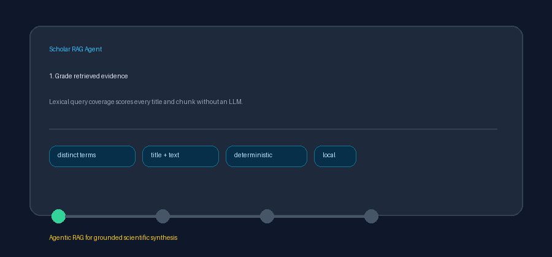

# Corrective RAG Gate Guide



Use `CorrectiveRagGate` after retrieval to prevent weak evidence from flowing
directly into synthesis. The gate is local and deterministic: it grades lexical
query coverage without a network or LLM call. Optional downstream stages can
use GPT-5.5 / Claude Sonnet 4.6 / Gemini 3.x / Kimi K2 after the gate accepts
context.

## How grading works

Each result receives a coverage score:

```text
coverage = distinct query terms found in title or text
           / distinct non-stopword query terms
```

The gate then returns one of three signals:

1. `keep`: at least one result reaches `keep_threshold`; only strong results
   are returned.
2. `filter`: no result is strong, but one or more reach `filter_threshold`;
   only those borderline results are returned.
3. `retry_rewrite`: nothing qualifies; results are empty and `rewrite_hint`
   suggests broadening terminology.

Strong results take precedence over borderline results. Result order, scores,
and retrieval provenance are preserved.

## Example

```python
from retrieval.corrective_rag import CorrectiveRagGate

gate = CorrectiveRagGate(
    keep_threshold=0.6,
    filter_threshold=0.2,
)
decision = gate.evaluate(
    "graph neural networks for molecular property prediction",
    retrieved_results,
)

if decision.signal == "retry_rewrite":
    retry_query(decision.rewrite_hint)
else:
    synthesize(decision.results)
```

## Configuration notes

- Thresholds are inclusive, finite values in `[0.0, 1.0]`.
- `filter_threshold` cannot exceed `keep_threshold`.
- Matching uses distinct lowercase terms and excludes shared retrieval
  stopwords.
- Titles participate in grading so concise scholarly records can qualify.
- Blank or stopword-only queries always request a retry with more specific
  content terms.
- Inputs are not mutated and no relevance scores are fabricated.
