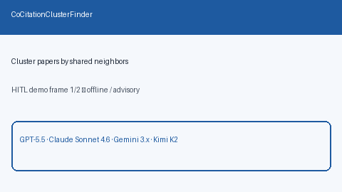

# Co-Citation Cluster Finder Guide



`CoCitationClusterFinder` clusters papers that share citation neighbor IDs
above a configurable `min_shared` count and optional Jaccard threshold.
Neighbor sets are read from `neighbors` or `citation_neighbors`. Clustering is
union-find over pairwise links; multi-paper clusters report
`shared_neighbor_count`.

Offline only — distinct from `CitationGraphIndex` (directed citing/cited
expansion) and `ContradictionClusterFinder` (claim polarity clusters). Fills a
ResearchRabbit / Semantic Scholar co-citation browsing gap. Optional later
narrative can use GPT-5.5 / Claude Sonnet 4.6 / Gemini 3.x / Kimi K2.

## Usage

```python
from retrieval.co_citation_cluster import CoCitationClusterFinder

clusters = CoCitationClusterFinder(min_shared=2, min_jaccard=0.0).find(
    [
        {"paper_id": "A", "neighbors": {"n1", "n2", "n3"}},
        {"id": "B", "citation_neighbors": ["n1", "n2", "n8"]},
        {"paper_id": "D", "neighbors": {"x1", "x2"}},
    ]
)
for cluster in clusters:
    print(cluster.cluster_id, cluster.paper_ids, cluster.shared_neighbor_count)
```

Invalid `min_shared` (`< 1`) or `min_jaccard` (outside `[0, 1]`) raises
`ValueError`. Empty input returns an empty tuple. Inputs are not mutated.
