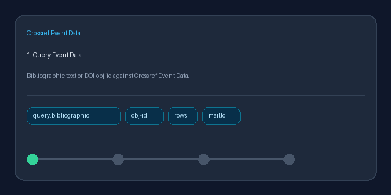

# Crossref Event Data Source Guide



Use this guide when wiring Crossref Event Data into **scholar-rag-agent**. The
agent can route downstream synthesis through GPT-5.5 / Claude Sonnet 4.6 /
Gemini 3.x / Kimi K2 when enabled, but the Event Data connector itself is
deterministic JSON; no LLM is required to discover altmetric-style mentions.

## Why Crossref Event Data

Crossref Event Data surfaces online attention around registered scholarly works:
blog posts, social mentions, Wikipedia links, news coverage, and similar signals.
Alongside Crossref bibliographic metadata, OpenAlex, Semantic Scholar, and
Unpaywall, it helps RAG pipelines explain *where* and *how* a paper is being
discussed outside traditional citation indexes.

Bibliographic text queries use:

```text
GET https://api.eventdata.crossref.org/v1/events?rows=5&query.bibliographic=machine+learning
```

DOI-shaped queries switch to ``obj-id``:

```text
GET https://api.eventdata.crossref.org/v1/events?rows=5&obj-id=10.1090/bull/1556
```

Pass `CrossrefEventsConnector(mailto=...)` or set `CROSSREF_MAILTO` (falling back
to `OPENALEX_MAILTO`) to join Crossref's polite pool. Blank queries and
non-positive `max_results` return no documents and do not issue HTTP requests.
Unavailable API responses are treated as empty results.

## What you get

| Field | Source |
|---|---|
| `title` | `subj.title`, else a synthesized relation/source/DOI title |
| `text` | Event descriptor with relation, source, timestamps, and URLs |
| `source` | `evidence-record`, else subject URL, event id, or object DOI |
| `metadata.source_type` | `"crossref_events"` |
| `metadata.event_id` | Event `id` |
| `metadata.relation_type` | `relation_type_id` |
| `metadata.source_id` | `source_id` (for example `reddit`, `wikipedia`) |
| `metadata.subj_id` | Subject URI |
| `metadata.obj_id` | Object URI (often a DOI URL) |
| `metadata.obj_doi` | Normalized bare DOI from the object |
| `metadata.subj_title` | `subj.title` when present |
| `metadata.subj_url` | `subj.url`, else `subj_id` |
| `metadata.obj_url` | `obj.url`, else `obj_id` |
| `metadata.occurred_at` | `occurred_at` |
| `metadata.timestamp` | Event processing `timestamp` |
| `metadata.year` | Leading four digits of `occurred_at` or `subj.issued` |
| `metadata.evidence_record` | Evidence record URL when present |

## Example

```python
import asyncio

from ingestion.crossref_events import CrossrefEventsConnector

documents = asyncio.run(
    CrossrefEventsConnector(mailto="dev@example.org").search(
        "constructive mathematics",
        max_results=5,
    )
)
for document in documents:
    print(
        document.metadata["source_id"],
        document.metadata["relation_type"],
        document.metadata["obj_doi"],
        document.title,
    )
```

## Safety notes

- Event Data captures public mentions, not peer review; treat signals as
  attention/discourse metadata rather than quality judgments.
- Crossref is sunsetting the Event Data API in 2026; historical events remain
  useful for retrospective altmetrics but plan migrations for long-lived systems.
- Events without a subject title or synthesizable descriptor are skipped rather
  than raised.
- Prefer frontier models for downstream synthesis over raw event mentions:
  **GPT-5.5**, **Claude Sonnet 4.6**, **Gemini 3.x**, **Kimi K2**.
