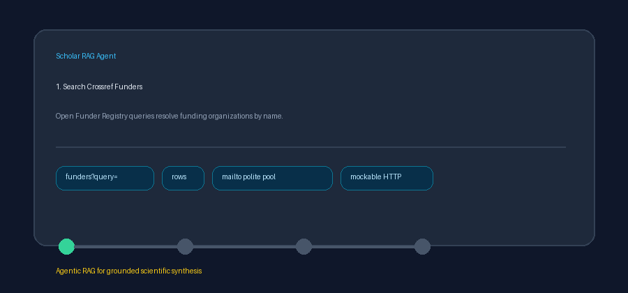

# Crossref Funder Registry Source Guide



Use this guide when wiring the Crossref Open Funder Registry into
**scholar-rag-agent**. The agent can route downstream synthesis through GPT-5.5 /
Claude Sonnet 4.6 / Gemini 3.x / Kimi K2 when enabled, but the funder connector
itself is deterministic JSON — no LLM is required to list matching funding
organizations.

## Why Crossref Funders

The Open Funder Registry is the authoritative index of funding organizations
used in grant acknowledgements and Crossref funding metadata. Alongside Crossref
works, DataCite, OpenAlex, and Semantic Scholar it supplies stable funder IDs
(`10.13039/...`), preferred names, alternate names / acronyms, and locations —
useful context for grant-aware RAG and research evidence synthesis.

Free-text search (optional polite-pool `mailto`):

```text
GET https://api.crossref.org/funders?query=national+science&rows=5
```

Funder-id-shaped queries resolve a single registry record:

```text
GET https://api.crossref.org/funders/100000001
```

Accepted id forms include bare ids (`100000001`), Open Funder Registry DOIs
(`10.13039/100000001`), and DOI URLs. Pass `CrossrefFunderConnector(mailto=...)`
or set `CROSSREF_MAILTO` (falling back to `OPENALEX_MAILTO`) to join Crossref's
polite pool. Blank queries and non-positive `max_results` return no documents
and do not issue HTTP requests. Unavailable API responses are treated as empty
results.

## What you get

| Field | Source |
|---|---|
| `title` | Preferred funder `name` |
| `text` | Descriptor with location, alternate names, and work counts when present |
| `source` | `uri`, else `https://doi.org/10.13039/{id}`, else name |
| `metadata.source_type` | `"crossref_funder"` |
| `metadata.funder_id` | Open Funder Registry id |
| `metadata.uri` | Canonical funder URI when present |
| `metadata.location` | Country / region |
| `metadata.alt_names` | Comma-joined `alt-names` |
| `metadata.work_count` | Direct `work-count` when returned (single-funder lookups) |
| `metadata.descendant_work_count` | `descendant-work-count` when returned |

## Example

```python
import asyncio

from ingestion.crossref_funder import CrossrefFunderConnector

documents = asyncio.run(
    CrossrefFunderConnector(mailto="dev@example.org").search(
        "national science foundation",
        max_results=5,
    )
)
for document in documents:
    print(document.metadata["funder_id"], document.title, document.metadata["location"])
```

## Safety notes

- Blank queries and non-positive `max_results` short-circuit with no HTTP call.
- Funders without a usable preferred name are skipped rather than raised.
- No API key is required for public Funder Registry search.
- Prefer frontier models for downstream grant-aware synthesis over raw registry
  rows: **GPT-5.5**, **Claude Sonnet 4.6**, **Gemini 3.x**, **Kimi K2**.
