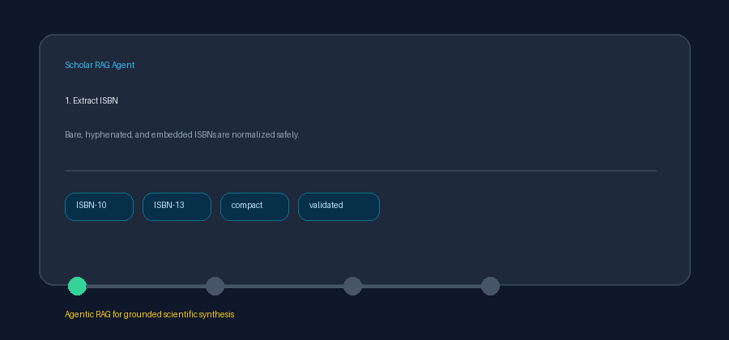

# Crossref Works ISBN Source Guide



Use this guide to retrieve books, chapters, and other Crossref works by ISBN.
Discovery uses deterministic HTTP against the public Crossref REST API;
optional downstream synthesis can use GPT-5.5 / Claude Sonnet 4.6 /
Gemini 3.x / Kimi K2.

## Why ISBN-scoped works

ISBN filtering links book-oriented identifiers to Crossref's DOI metadata and
abstracts. This connector is distinct from general Crossref search,
ISSN-and-type filtering, and journal metadata lookup.

## Usage

```python
from ingestion.crossref_works_isbn import CrossrefWorksIsbnConnector

# Bare, hyphenated, or text-embedded ISBNs use the exact ISBN filter
docs = await CrossrefWorksIsbnConnector(mailto="dev@example.org").search(
    "ISBN 978-1-4028-9462-6",
    max_results=5,
)

# Free text is constrained to ISBN-bearing works
docs = await CrossrefWorksIsbnConnector().search(
    "grounded retrieval handbook",
    max_results=5,
)
```

## Request behavior

| Query | Crossref parameters |
|---|---|
| ISBN-10 or ISBN-13 | `filter=isbn:{normalized_isbn}` |
| Free text | `query={text}&filter=has-isbn:true` |

## What you get

| Field | Source |
|---|---|
| `title` | Crossref work title |
| `text` | JATS-stripped abstract, else a bibliographic descriptor |
| `source` | `https://doi.org/{DOI}` when present |
| `metadata.source_type` | `crossref_works_isbn` |
| `metadata.isbn` | First normalized ISBN, falling back to the query ISBN |
| `metadata.doi` / `year` / `authors` | Normalized bibliographic metadata |

## Safety notes

- Public Crossref API only; optional `mailto` routes polite-pool traffic.
- ISBN separators are removed and candidate lengths are validated before filtering.
- Blank input and non-positive limits do not issue HTTP requests.
- Unavailable or malformed responses return an empty list.
