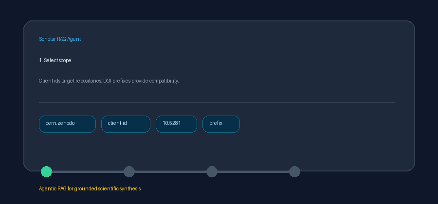

# DataCite Client and Prefix Source Guide



Use this guide to list DOI records registered through a specific DataCite
repository client. Discovery uses deterministic HTTP against the public
DataCite JSON:API; optional downstream synthesis can use GPT-5.5 /
Claude Sonnet 4.6 / Gemini 3.x / Kimi K2.

## Why client-id filtering

A DataCite client id such as `cern.zenodo` identifies the repository that
registered a DOI. This is more specific than a DOI prefix, which may be shared
across registration workflows. The connector prioritizes `client-id` and keeps
prefix support as a compatibility path distinct from
`datacite_dois_prefix.py`.

## Usage

```python
from ingestion.datacite_client_prefix import DataCiteClientPrefixConnector

# Raw client ids and client-id: labels apply an exact client filter
docs = await DataCiteClientPrefixConnector().search(
    "client-id:cern.zenodo",
    max_results=5,
)

# Free text can remain scoped to one configured client
docs = await DataCiteClientPrefixConnector(
    default_client_id="cern.zenodo",
).search("retrieval dataset", max_results=5)

# DOI prefixes use DataCite's prefix parameter
docs = await DataCiteClientPrefixConnector().search("10.5281", max_results=5)
```

## Request behavior

| Query | DataCite parameters |
|---|---|
| Client id (`cern.zenodo`) | `client-id=cern.zenodo` |
| Free text with a default client | `query={text}&client-id={default_client_id}` |
| DOI prefix (`10.5281`) | `prefix=10.5281` |

All requests include a bounded `page[size]` and call
`GET https://api.datacite.org/dois`.

## What you get

| Field | Source |
|---|---|
| `title` | Primary DataCite title |
| `text` | Abstract/description, else a bibliographic descriptor |
| `source` | Landing URL or `https://doi.org/{doi}` |
| `metadata.source_type` | `datacite_client_prefix` |
| `metadata.client_id` | Response or selected DataCite client id |
| `metadata.doi_prefix` | Prefix extracted from the DOI or selected filter |
| `metadata.doi` / `year` / `authors` | Normalized bibliographic metadata |

## Safety notes

- Public DataCite API only; no credentials are required.
- Client ids and DOI prefixes are syntax-validated before filtering.
- Blank input and non-positive limits do not issue HTTP requests.
- Unavailable or malformed responses return an empty list.
