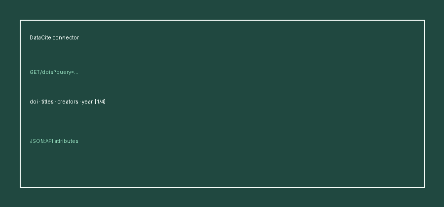

# DataCite Source Guide



Use this guide when wiring DataCite into **scholar-rag-agent**. The agent can
route enrichment through GPT-5.5 / Claude Sonnet 4.6 / Gemini 2.5 / Kimi K2 when
enabled, but the DataCite connector itself is deterministic JSON — no LLM
required to list matching DOI records.

## Why DataCite

DataCite is the leading DOI registration agency for research data, software, and
other non-traditional scholarly outputs. Alongside Zenodo, Figshare, and
Crossref it covers datasets and research objects that journal-centric indexes
under-represent.

Public keyword search (unauthenticated):

```
GET https://api.datacite.org/dois?query=climate+dataset&page[size]=5
```

`page[size]` is capped at **100** in this connector. The response is a JSON:API
object with a `data` array of DOI resources; metadata lives under each item's
`attributes`.

## What you get

| Field | Source |
|---|---|
| `title` | First `attributes.titles[].title` |
| `text` | Preferred `Abstract` description, else first description, else a `By authors via publisher (year)` descriptor |
| `source` | `attributes.url`, else `https://doi.org/{doi}`, else title |
| `metadata.doi` | `attributes.doi` (or resource `id`) |
| `metadata.year` | `attributes.publicationYear` |
| `metadata.authors` | Comma-joined `attributes.creators[].name` |
| `metadata.publisher` | `attributes.publisher` (string or `.name`) |
| `metadata.resource_type` | `attributes.types.resourceTypeGeneral` |
| `metadata.source_type` | `"datacite"` |

## Example

```python
import asyncio

from ingestion.datacite import DataCiteConnector

documents = asyncio.run(DataCiteConnector().search("climate dataset", max_results=5))
for document in documents:
    print(document.metadata["doi"], document.title)
```

## Safety notes

- Blank queries and non-positive `max_results` short-circuit with no HTTP call.
- Records without a title are skipped rather than raising.
- No API key is required for public DOI metadata search.
