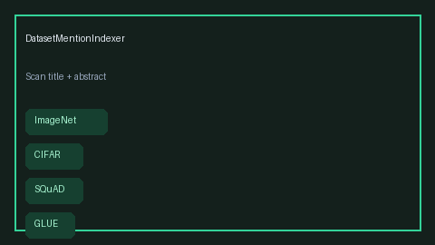

# Dataset Mention Indexer Guide



`DatasetMentionIndexer` extracts dataset mentions from paper title and abstract
text using a curated lexicon (ImageNet, CIFAR, MIMIC, SQuAD, GLUE, PubMedQA,
and related benchmarks) plus optional nearby `dataset` / `benchmark` /
`corpus` heuristics. Results are returned as a `DatasetMentionReport` with
canonical `datasets` and human-readable `reasons`.

Fills a PapersWithCode-style dataset-surfacing gap with offline heuristics
(no LLM or network call). Mentions can seed GPT-5.5 / Claude Sonnet 4.6 /
Gemini 3.x / Kimi K2 synthesis. Distinct from live PapersWithCode connectors.

## Usage

```python
from retrieval.dataset_mention import DatasetMentionIndexer

indexer = DatasetMentionIndexer(nearby_heuristic=True)
report = indexer.index(
    "Multi-task evaluation on GLUE and SQuAD",
    "We also report ImageNet top-1 and introduce the FooBar dataset.",
)
print(report.datasets)
print(report.reasons)
```

Empty title and abstract return an empty report with a single explanatory
reason. Lexicon hits are listed before nearby-heuristic names. Disable
`nearby_heuristic` to keep only curated lexicon matches.
