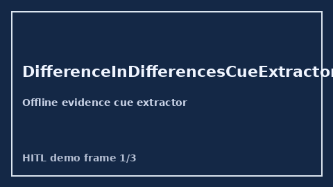

# DifferenceInDifferencesCueExtractor Guide



Closes Elicit / Consensus / AJE difference-in-differences gaps.

Optional later polish via **GPT-5.5 / Claude Sonnet 4.6 / Gemini 3.x / Kimi K2**.

Distinct from `TimeVaryingConfoundingCueExtractor` and `ClusterRandomizationCueExtractor`.

## Usage

```python
from retrieval.difference_in_differences_cues import DifferenceInDifferencesCueExtractor

rows = DifferenceInDifferencesCueExtractor().extract(
    [
        {
            "paper_id": "p1",
            "methods": "We estimated difference-in-differences under parallel trends with TWFE.",
        }
    ]
)
print(rows[0].flagged, rows[0].cues)
```

## Safety

Offline patterns only. No HTTP. Humans interpret evidence cues.
