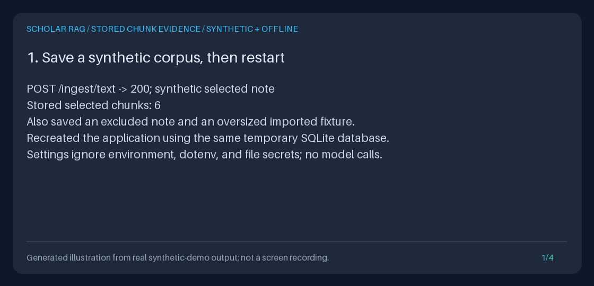

# Inspect persisted chunk evidence before choosing a query scope

`GET /documents/{document_id}/chunks` lets you read bounded passages from one
stored paper, including after restart. First recover a paper ID with the
[document catalog](DOCUMENT_CATALOG_GUIDE.md), then inspect its chunks and
choose `document_ids` for an existing `/query` request. No query, retrieval,
generation, external download, or run event is needed to browse evidence.



**Synthetic and offline:** this GIF is generated from the executable demo's
actual API results. It is not a UI recording, real literature, a retrieval
benchmark, or evidence of scientific accuracy. The demo saves a query request
but does not execute it.

## What gap this closes

[Cinnamon/kotaemon](https://github.com/Cinnamon/kotaemon#features) describes file
organization and citation/document previews, including a browser PDF viewer.
Those are useful examples of making source inspection accessible. This
independently implemented, local-first feature supplies only a bounded JSON
reader for this project's existing SQLite chunks. It does **not** copy their
code or content, or add their UI, PDF highlighting, multi-user login, collections,
or sharing capabilities.

The existing catalog lists paper summaries; this endpoint reads stored evidence.
It does not rank matches, perform a retrieval preview, validate scientific claims,
or export the historical evidence of a run. Use
[document scope](DOCUMENT_SCOPE_GUIDE.md) to constrain a query, and
[evidence exports](EVIDENCE_EXPORT_GUIDE.md) to inspect exactly what a recorded
run used. The runtime remains FastAPI, Pydantic, HTTPX, SQLite, and a custom
agent state machine with deterministic lexical/hash-vector retrieval.

## Run a safe curl walkthrough

Install the development extras with `uv sync --locked --extra dev --python 3.12`.
In one terminal, start a loopback-only, synthetic service. These explicit
settings ignore ambient credentials, database paths, `.env`, and secret files.
This walkthrough's database is temporary and removed when the process exits:

```bash
uv run python - <<'PY'
from pathlib import Path
from tempfile import TemporaryDirectory
import uvicorn
from api.application import create_app
from scripts.demo_evidence_export import offline_settings

with TemporaryDirectory(prefix="scholar-chunks-guide-") as directory:
    app = create_app(offline_settings(Path(directory) / "corpus.sqlite3"))
    uvicorn.run(app, host="127.0.0.1", port=8000)
PY
```

In another terminal, ingest an original synthetic passage and read its chunks.
The ID is taken from the actual response, not a hardcoded placeholder:

```bash
export BASE_URL=http://127.0.0.1:8000
INGEST="$(uv run python -c 'import json; print(json.dumps({
    "title": "Synthetic methods", "source": "synthetic:chunk-guide",
    "text": "Synthetic GraphRAG methods and limitations; not research findings. " * 30
}))' | curl --fail-with-body --silent --show-error "$BASE_URL/ingest/text" \
  -H 'Content-Type: application/json' --data-binary @-)"
DOC_ID="$(printf '%s' "$INGEST" | uv run python -c \
  'import json, sys; print(json.load(sys.stdin)["document_id"])')"

curl --fail-with-body --silent --show-error --get "$BASE_URL/documents" \
  --data-urlencode 'source=synthetic:chunk-guide'
PAGE="$(curl --fail-with-body --silent --show-error --get \
  "$BASE_URL/documents/$DOC_ID/chunks" --data-urlencode 'limit=2')"
printf '%s\n' "$PAGE" | uv run python -m json.tool
CURSOR="$(printf '%s' "$PAGE" | uv run python -c \
  'import json, sys; print(json.load(sys.stdin)["next_cursor"] or "")')"
if [ -n "$CURSOR" ]; then
  curl --fail-with-body --silent --show-error --get \
    "$BASE_URL/documents/$DOC_ID/chunks" --data-urlencode 'limit=2' \
    --data-urlencode "cursor=$CURSOR"
fi
```

Continue with each returned `next_cursor` until it is null. Omit `cursor` for a
new traversal; an empty cursor string is invalid. IDs returned by text ingestion
are URL-safe. For imported IDs, percent-encode the complete ID (`quote(id,
safe="")` in Python); Unicode, quotes, percent signs, and embedded slashes are
treated as exact stored keys, not hashes or a search language. Do not trim,
split, or reconstruct them. Some reverse proxies normalize paths; the Python
reader below avoids URL transport limitations.

After reviewing the passages, a query request can use the selected ID:

```bash
uv run python -c 'import json, sys; print(json.dumps({
    "query": "What do the synthetic methods and limitations say?",
    "document_ids": [sys.argv[1]]
}))' "$DOC_ID" | curl --fail-with-body --silent --show-error "$BASE_URL/query" \
  -H 'Content-Type: application/json' --data-binary @-
```

That **separate POST** runs retrieval and generation (the fake adapter in this
walkthrough) and records events. Inspect `result.state`, warnings, and citations.
For optional real providers, use the current source-linked
[provider model guide](PROVIDER_MODELS_GUIDE.md); this feature introduces no
model defaults or live-provider compatibility claims.

## HTTP contract

| Item | Contract |
| --- | --- |
| Path | `GET /documents/{document_id}/chunks`; exact, case-sensitive document ID |
| `document_id` | 1-128 characters, no surrounding whitespace; catalog identity rules |
| `limit` | Integer, default 20, minimum 1, maximum 100 |
| `cursor` | Optional opaque, versioned, document-bound token, maximum 4096 characters |
| Page | Exactly `document_id`, `chunks`, `next_cursor`; last page has a null cursor |
| Chunk identity | Exact `chunk_id` (1-256 characters) and `document_id`, never truncated |
| Ordinal | `chunk_index`: stored nonnegative integer, or null if missing |
| Labels | `title` (up to 300 characters), `source` (up to 512), plus their `*_truncated` flags |
| Evidence | `text` (up to 4000 characters) and `text_truncated` |
| Omitted | Full document bodies, arbitrary metadata, vectors, scores, citations, and run data |

Limits count Unicode characters, not bytes. Embedded NULs are preserved as JSON
escapes. Prefixes are also byte-bounded inside SQL, before reaching Python.
Normal ingestion creates chunks of at most 800 characters, so these are normally
complete. Oversized imported chunks expose only their first 4000 characters:
there is no text-offset or full-text download endpoint. A subsequent cursor
moves to the **next chunk**, not the remainder of a truncated passage.

`chunk_index` preserves the current chunker's zero-based ordinal without deriving
it from an opaque chunk ID. Imported metadata may omit it (null); a present
value must be an integer or canonical decimal string between 0 and
9223372036854775807. Missing ordinals are not guessed. Duplicate ordinals are
allowed, and arbitrary metadata is never returned. Empty chunk text is valid.

### Ordering, consistency, and storage

Pages sort by **ascending `chunk_id` using SQLite BINARY text order**, not by
ordinal, paragraph position, creation time, retrieval score, or scientific
importance. The next cursor exclusively excludes the last returned ID and
earlier IDs **within that document**. Duplicate ordinals do not cause skipped
rows. Clients may use preserved ordinals to organize fully collected pages,
but imported ordinals need not be present, unique, or contiguous.

Each request checks document existence and reads its chunk page in one read
transaction. It fetches at most `limit + 1` projected rows and validates the
lookahead, too. The composite `chunks(document_id, chunk_id)` index supports
document scoping and keyset seeks; normal store initialization creates it
idempotently for existing databases, without changing stored IDs or text.
The reader opens SQLite with `mode=ro` and never initializes or backfills it.

Different requests are **not one frozen snapshot**. Re-ingestion may replace
text under an existing ID; new IDs behind your cursor are missed until you start
again. A removed boundary row does not invalidate its cursor. Existing ingestion
does not guarantee removal of older chunks on re-import, so this API describes
what is stored, not a reconstructed document version. Cursors are canonical
continuations, not signatures, secrets, authorization, or snapshot handles.

### Errors and privacy

| Status | Meaning |
| --- | --- |
| 200, empty `chunks` | The document exists but has no stored chunks, or the cursor is beyond the last chunk |
| 404, `detail.code=document_not_found` | No document row exists; orphan chunks do not make a document exist |
| 422 | Invalid path/limit/cursor bounds (FastAPI validation detail) |
| 422, `detail.code=invalid_chunk_cursor` | Malformed/noncanonical/version-mismatched cursor, or cursor from another document |
| 409, `detail.code=invalid_chunk_record` | Invalid projected ID/text/labels/ordinal or malformed metadata JSON; no private payload is echoed |
| 5xx | Underlying storage/operational failure; never disguised as a successful empty page |

Python callers receive `ValidationError`, `DocumentNotFoundError`,
`ChunkCursorError`, `DocumentChunksError`, or the underlying SQLite exception.
Only the fetched rows and bounded prefixes are validated, not the entire corpus.
Invalid data elsewhere may surface on a later page. Fix malformed imports
through the existing trusted ingestion/storage workflow, not by ignoring errors.

Successful pages and explicit reader errors carry `Cache-Control: no-store` and
`X-Content-Type-Options: nosniff`, consistent with the catalog. FastAPI's own
request-validation responses retain the framework's normal format. This is
**not authentication or tenant isolation**. Any caller who can reach the API can
discover IDs and inspect the same corpus. Keep it on loopback or behind your own
authenticated boundary. Titles, sources, and especially passages can be sensitive;
no-store does not prevent terminal logs, saved files, screenshots, or copying.
Treat source strings and text as untrusted data, not executable markup or URLs.
There is no deletion, write, sharing, or permission-management endpoint here.

## Python: inspect an existing database without starting retrieval

The following complete example uses temporary synthetic data, closes the API,
then reads the catalog and chunk pages directly. Reader construction does not
build the application's in-memory indexes. Normal FastAPI startup still does.

<!-- offline-reader-example:start -->
```python
import json
from pathlib import Path
from tempfile import TemporaryDirectory
from fastapi.testclient import TestClient
from api.application import create_app
from scripts.demo_evidence_export import offline_settings
from storage.document_catalog import SQLiteDocumentCatalog
from storage.document_chunks import SQLiteDocumentChunks

with TemporaryDirectory(prefix="scholar-chunks-python-") as directory:
    path = Path(directory) / "corpus.sqlite3"
    with TestClient(create_app(offline_settings(path))) as client:
        client.post("/ingest/text", json={
            "title": "Synthetic evidence",
            "source": "synthetic:python",
            "text": "GraphRAG connects synthetic methods and limitations. " * 30,
        }).raise_for_status()
    document = SQLiteDocumentCatalog(path).list_documents(
        source="synthetic:python"
    ).documents[0]
    reader = SQLiteDocumentChunks(path)
    cursor = None
    while True:
        page = reader.list_chunks(document.document_id, limit=2, cursor=cursor)
        for chunk in page.chunks:
            print(chunk.chunk_id, chunk.chunk_index, chunk.text[:80])
            if chunk.text_truncated:
                print("Only a prefix: consult the original trusted source.")
        cursor = page.next_cursor
        if cursor is None:
            break
    print(json.dumps({
        "query": "Compare the synthetic methods and limitations",
        "document_ids": [document.document_id],
    }))
```
<!-- offline-reader-example:end -->

The final object is a **proposed request**, not an executed query. The direct
reader requires a real integer limit (not `True`, `1.0`, or `"2"`), and a path
to an existing database. A missing database is not silently created.

## Reproduce the GIF and demonstrate the workflow

```bash
CHUNK_DEMO="$(mktemp -d)/chunk-reader"
uv run python -m scripts.demo_document_chunks --output-dir "$CHUNK_DEMO"
uv run python -m scripts.create_document_chunks_gif \
  --transcript "$CHUNK_DEMO/transcript.txt" \
  --output "$CHUNK_DEMO/document-chunks.gif"
```

The demo ingests synthetic selected/excluded notes, adds a clearly labeled
oversized imported fixture, restarts, discovers the selected ID, reads three
pages, and checks text truncation. It blocks generation, retrieval, and writes
during browsing; verifies the database bytes and event count are unchanged;
and removes its temporary database. Explicit offline settings ignore environment,
dotenv, and file-secret sources. No external corpus is downloaded.

Inspect `catalog.json`, `page-1.json` through `page-3.json`, `long-chunk.json`,
`query-request.json`, and `transcript.txt`. Re-running into the same named outputs
is refused rather than overwriting them; choose another empty output directory.
The Pillow generator reuses the existing transcript-rendering pattern, validates
four expected panels, and refuses to overwrite its GIF.

For a portfolio, show the discovered ID surviving restart, three exclusive
pages containing only that paper, stored ordinals differing from ID order,
explicit truncation of imported evidence, and zero browsing-generated events.
Explain that this is a read-only evidence-inspection API, not a chat UI,
scientific validator, or access-control system. The illustration's figures are
measured from its synthetic fixture, not product benchmarks.
