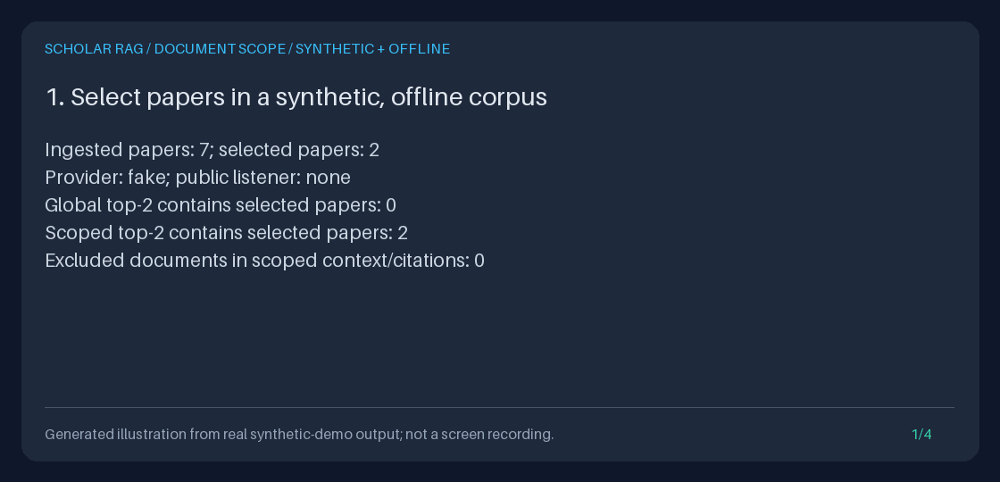

# Document-scoped scientific queries

Select the **ingested papers** a query may retrieve from, rather than searching
the whole corpus. `POST /query` accepts optional `document_ids`; Python callers
use `AgentRunner.run(query, document_ids=[...])`. Omission preserves the existing
unscoped behavior. This is integrated retrieval, not an unused post-ranking helper.

A researcher can keep pilot studies separate from a selected methods comparison,
or ask the same hypothesis question against two explicitly chosen reading lists.
Save the scope with each [evidence bundle](EVIDENCE_EXPORT_GUIDE.md) so a reviewer
can see which corpus subset was eligible. Selection does not establish that a
reading list is comprehensive, that a source supports a claim, or that excluded
evidence is irrelevant.



**Animation provenance:** a generated illustration of actual synthetic/offline
demo output, not a screen recording, research UI, real publication, or live
model's findings. Counts, graph reachability, validation statuses, context digest,
and restart comparisons come from the runnable demo below. Run IDs and UTC event
timestamps in its saved files are real values from that execution.

## Reproduce the complete offline demonstration

From the repository root, with Python 3.11+ and `uv`:

```bash
uv sync --extra dev
uv run python -m scripts.demo_document_scope --output-dir document-scope-demo
uv run python -m scripts.create_document_scope_gif \
  --transcript document-scope-demo/transcript.txt \
  --output document-scope-demo/document-scope.gif
```

The demo drives the real API in process with `TestClient`; it never opens a
listener. It clears **all four provider keys**, ignores `.env`, and uses a
temporary SQLite database. Environment credentials cannot enable a paid call.
The database is removed on exit; the output files remain. Use a **fresh output
directory**: existing demo files are never overwritten. The default
`document-scope-demo/` is Git-ignored; other artifact directories are not.

The seven synthetic papers include two selected notes, four higher-ranked
distractors, and an excluded graph bridge. With a two-chunk retrieval limit:

| Measured check | Expected output |
| --- | --- |
| Whole-corpus top-2 | Neither selected paper appears |
| Selected top-2 | Both selected papers appear, with no excluded citations/context |
| Graph seeded at `Alpha` | 3 chunks unscoped; 1 chunk scoped |
| Allowed `Beta`/`Gamma` tail reachable only through an excluded paper | Not reached by scoped graph traversal |
| Unknown ID | `DONE`, 0 sources/citations, an ungrounded fake answer and warning |
| Explicit empty list or `null` | HTTP `422`, never a whole-corpus query |
| Reopen SQLite, rebuild indexes, query again | Only the selected papers |
| Export the original run after restart | Byte-identical JSON and Markdown |

The graph check calls the same `MultiHopRetriever` used by the API against that
ingested corpus; it is reported separately from the API's hybrid top-2 check.
The default pipeline uses hash vectors, BM25, template HyDE and lexical reranking,
not learned embeddings or a learned reranker.

| File | Contents |
| --- | --- |
| `unscoped.json` | Whole-corpus run and frozen evidence |
| `scoped.json`, `scoped.md` | Selected-paper run with scope, exact context, citations and events |
| `unknown.json` | Honest zero-evidence run; unknown scope remains recorded |
| `transcript.txt` | Measured results consumed by the GIF generator |

The generator uses the existing Pillow development dependency and shared
evidence-demo renderer. This command writes `document-scope-demo/document-scope.gif`,
leaving the committed illustration untouched. There are four 1120 x 540 frames,
3500 ms each, looping. To deliberately refresh the checked-in illustration,
pass `--output docs/assets/document-scope.gif`; no other assets are regenerated.
The renderer rejects unrelated, incomplete or oversized transcripts instead of
inventing or clipping results.

## Offline HTTP example

Start an isolated, loopback-only API in one terminal:

```bash
export SCOPE_DEMO_DIR="$(mktemp -d)"
printf 'Keep this path for restart: %s\n' "$SCOPE_DEMO_DIR"
OPENAI_API_KEY= ANTHROPIC_API_KEY= GEMINI_API_KEY= MOONSHOT_API_KEY= \
  SCHOLAR_RAG_DATABASE_PATH="$SCOPE_DEMO_DIR/corpus.sqlite3" \
  uv run uvicorn api.main:app --host 127.0.0.1 --port 8765
```

In a second terminal at the repository root, ingest two synthetic notes and keep
their returned IDs:

```bash
api=http://127.0.0.1:8765
first=$(curl --fail-with-body --silent --show-error "$api/ingest/text" \
  --json '{"title":"Selected methods note","text":"GraphRAG connects selected synthetic methods evidence.","source":"synthetic:scope-guide"}' \
  | uv run python -c 'import json,sys; print(json.load(sys.stdin)["document_id"])')
second=$(curl --fail-with-body --silent --show-error "$api/ingest/text" \
  --json '{"title":"Excluded pilot note","text":"GraphRAG connects excluded synthetic pilot evidence.","source":"synthetic:scope-guide"}' \
  | uv run python -c 'import json,sys; print(json.load(sys.stdin)["document_id"])')
printf 'Selected: %s\nExcluded: %s\n' "$first" "$second"

export SCOPE_CLIENT_DIR="$(mktemp -d)"
curl --fail-with-body --silent --show-error "$api/query" \
  --json '{"query":"What does GraphRAG connect?"}' \
  --output "$SCOPE_CLIENT_DIR/unscoped-query.json"
payload=$(uv run python -c 'import json,sys; print(json.dumps({"query":"What does GraphRAG connect?", "document_ids":sys.argv[1:]}))' "$first")
curl --fail-with-body --silent --show-error "$api/query" \
  --json "$payload" --output "$SCOPE_CLIENT_DIR/scoped-query.json"
run_id=$(uv run python -c 'import json,sys; r=json.load(open(sys.argv[1]))["result"]; assert r["state"]=="DONE", r; print(r["run_id"])' "$SCOPE_CLIENT_DIR/scoped-query.json")
curl --fail-with-body --silent --show-error \
  "$api/runs/$run_id/export?format=json" --output "$SCOPE_CLIENT_DIR/scoped.json"
curl --fail-with-body --silent --show-error \
  "$api/runs/$run_id/export?format=markdown" --output "$SCOPE_CLIENT_DIR/scoped.md"
uv run python -m json.tool "$SCOPE_CLIENT_DIR/scoped.json"
printf 'Saved synthetic artifacts: %s\n' "$SCOPE_CLIENT_DIR"
```

The unscoped answer can cite both notes. The scoped context and citations can
contain only `first`, and `plan.observation.document_ids` records `[first]`.
Use IDs from ingestion, not titles, source URLs or chunk IDs. For this API, a
changed title/source/text can mint a different document ID. A DOI is a document
ID only if Python ingestion explicitly used it as `Document.document_id`.

Inspect the empty-selection validation response without treating it as a
successful query:

```bash
curl --silent --show-error "$api/query" \
  --json '{"query":"GraphRAG evidence","document_ids":[]}' \
  --output "$SCOPE_CLIENT_DIR/invalid.json" --write-out '%{http_code}\n'
uv run python -m json.tool "$SCOPE_CLIENT_DIR/invalid.json"
```

Expect `422` and FastAPI's `detail` array pointing to `body.document_ids`. No run
is created. Stop the API with Ctrl-C. Reusing the printed server database path
preserves ingested papers and runs; a new temporary directory is a new corpus.

## Offline Python example

This standalone example deliberately includes a Unicode document ID and a
quoted DOI-like ID, both legal for Python-ingested corpora. No character whitelist
is imposed on IDs.

```bash
uv run python - <<'PY'
import asyncio
from pathlib import Path
from tempfile import TemporaryDirectory
from api.dependencies import AppContainer
from retrieval.models import Document
from scripts.demo_evidence_export import offline_settings

async def main():
    with TemporaryDirectory(prefix="scope-python-") as temporary:
        container = AppContainer(offline_settings(Path(temporary) / "corpus.sqlite3"))
        container.ingestion_pipeline.ingest_documents([
            Document(document_id="paper-\u03b2", title="Selected synthetic note",
                     text="GraphRAG connects selected synthetic evidence.", source="synthetic"),
            Document(document_id="https://doi.org/10.1/'excluded'", title="Excluded note",
                     text="GraphRAG connects excluded synthetic evidence.", source="synthetic"),
        ])
        supplied = [" paper-\u03b2 ", "paper-\u03b2"]
        result = await container.runner.run("GraphRAG evidence", document_ids=supplied)
        assert result.state == "DONE", result.error
        assert supplied == [" paper-\u03b2 ", "paper-\u03b2"]
        bundle = container.evidence_exporter.export(result.run_id)
        assert bundle.plan.observation.document_ids == ("paper-\u03b2",)
        assert {s.chunk.document_id for s in bundle.snapshot.sources} == {"paper-\u03b2"}
        assert {c.document_id for c in bundle.answer.citations} == {"paper-\u03b2"}
        print("State:", result.state)
        print("Saved scope:", bundle.plan.observation.document_ids)
        print("Provider:", bundle.generation.provider)
        print("Context:", bundle.snapshot.request.context)

asyncio.run(main())
PY
```

The shared `offline_settings` helper disables provider keys and excludes ambient
environment, dotenv and secrets-file configuration, including invalid runtime
settings. It does not modify those sources or initialize a default application.

The runner signature remains `run(query, token=None, *, document_ids=None)`.
Python `None` or omission means unscoped; HTTP **explicit `null` is rejected**.
Python accepts a list or tuple, not a set, generator, mapping or scalar. Invalid
Python scope raises `ValueError` (Pydantic `ValidationError`) before creating a
run. The tuple snapshot is taken when the coroutine starts, before its first
await; subsequent caller-list changes cannot change that run.

For direct library integration, `DenseRetriever`, `BM25Retriever`,
`HybridRetriever`, `MultiHopRetriever`, `GraphRetriever`, and the graph store's
`chunks_for_entities` / `neighbours` accept the same `document_ids` keyword.
`Executor.retrieve` uses the plan's scope; an explicit keyword must match it.

## Exact selection and error contract

| Input or outcome | Behavior |
| --- | --- |
| HTTP field omitted / Python `None` | Existing whole-corpus behavior |
| HTTP `null`, `[]`, scalar, mapping, non-string entry, blank ID | HTTP `422`; no run and no retrieval |
| More than 100 supplied IDs | Rejected **before deduplication**, even if all IDs repeat |
| ID length | 1-128 characters **after** trimming surrounding whitespace; not a byte limit |
| Normalization | Trim surrounding whitespace; deduplicate in first-seen order; never mutate input |
| Matching | Case-sensitive exact IDs; preserve Unicode, punctuation and internal whitespace; no Unicode folding |
| Unknown IDs / known IDs with no indexed chunks | No matching candidates; retain those IDs in scope; never retry unscoped |
| Mixed known and unknown IDs | Search only matching selected papers, retaining the complete requested scope |
| Zero candidates with the fake adapter | `DONE` with zero context/citations and an ungrounded placeholder plus warning; exportable |
| Unsupported scoped custom component | Explicit run `ERROR`; never retry it without the requested scope |
| Out-of-scope custom retrieval/reranking output | Explicit run `ERROR` before generation, not post-top-k silent filtering |

The HTTP success envelope is unchanged: runtime failures can still return HTTP
`200` with `result.state="ERROR"`. Always inspect `state` and `error`. A zero-source
run may still call the configured generation adapter with empty context; unknown
IDs are not a promise of no model call. Live model claims and warnings retain the
existing grounding behavior. No semantic-match threshold has been added: a
selected paper with no lexical overlap can still be ranked with a zero score.

For an imported ID with surrounding whitespace, selection uses its trimmed form:
ingest canonical IDs if you need to select that corpus. This deliberately
normalizes selection input, not the stored documents. Unknown IDs do not reveal
any cross-corpus mapping; matching uses only this application's ingested chunks.

## Where the filter applies

1. The API and runner share typed bounded validation. The runner snapshots a
   tuple before awaits and records it in the frozen `QueryObservation.document_ids`
   field, nested inside the plan, and in the initial `PLANNING` event.
2. Every comparison, hypothesis, synthesis or factual retrieval task receives
   that same scope. HyDE expands the query, not the selected corpus. Dense and
   BM25 discard ineligible candidates **before scoring/top-k and RRF**, so an
   allowed paper below the global top-k is not lost by post-filtering.
3. Graph SQL filters chunk ownership and **both directions of edge ownership**
   through `graph_chunks.document_id` before `LIMIT`. An excluded paper cannot
   bridge to another selected paper. Entity names remain shared; edges must be
   supported by selected chunks. Values, including IDs and entity names, are
   bound SQL parameters.
4. Scoped results are checked before generation and after reranking; final
   citations derive from the same detached allowed evidence. Shared indexes
   are not mutated or given request-local filter state.

Custom retrieval components must accept **and honor** the keyword for scoped
runs. Unscoped calls omit the keyword entirely, keeping old signatures and test
doubles working. There is no `TypeError` retry that silently broadens selection.
Optional cataloged helpers do not become scope-aware merely by being installed.

## Saved scope, compatibility and limits

JSON exports include `plan.observation.document_ids` and the initial event's
`payload.payload.document_ids`; Markdown also has a **Document scope** section.
The exporter compares saved scope records and checks captured source/citation
document IDs against that scope using only stored events. It does not consult
today's index or re-run retrieval. Inconsistent records are
`409 invalid_run_record`. See the [evidence export error contract](EVIDENCE_EXPORT_GUIDE.md#explicit-error-policy).

After a restart, use the [run catalog](RUN_HISTORY_GUIDE.md) to recover a run ID
and follow its export link. The catalog remains database-wide, not filtered by
the last query's document selection; each export retains that run's own scope.

Old version-1 bundles/events without the field remain readable as unscoped.
`RunConfiguration` keeps its existing four fields and the bundle version stays
`1.0`; no database migration or backfill is required. Scope records the eligible
papers, **not a snapshot of every paper in that selection**. Only exact final
context is frozen; re-running a query after corpus/model changes can differ.

BM25 IDF and average document length remain **global corpus statistics**, even
for scoped ranking. Changing excluded papers may change scores. The configured
source limit still caps **chunks**, not distinct papers; scope does not guarantee
every selected paper appears. Graph depth, source, context-byte and snapshot-byte
bounds still apply, and graph co-mentions are not proofs.

**Corpus selection is not authentication or tenant isolation.** The API, event
and export endpoints remain local/trusted and unauthenticated. This does not
protect one user's papers from another, authorize source access, or redact
queries/answers/artifacts. Retrieved context goes to a configured live provider.
Keep the service on loopback, protect SQLite and exported files, and review
content before sharing. See [Safety](../../SAFETY.md).

## Research/portfolio acceptance checklist

Demonstrate both whole-corpus and selected-paper runs on explicitly synthetic
notes. Show the global-top-k exclusion, excluded-bridge result, zero-match and
validation cases, then inspect the saved scope, full evidence and citations after
restart. Explain why global BM25 statistics, shallow entity heuristics and
token-overlap grounding do not measure scientific quality. The checked-in GIF is
a reproducible engineering walkthrough, not a benchmark or generated research.

## Comparative inspiration

[Haystack's query-time metadata filtering](https://docs.haystack.deepset.ai/docs/metadata-filtering)
motivates selecting relevant subsets before retrieval. Its
[public repository](https://github.com/deepset-ai/haystack) was checked with
26,542 stars on 2026-09-18. This feature is original code in the existing
FastAPI/Pydantic/SQLite/custom-state-machine stack, with no new framework
dependency. It is **not** a Haystack integration, its general filter language,
or a feature-parity claim.
