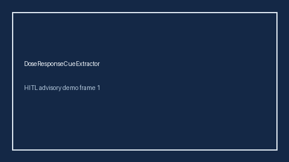

# DoseResponseCueExtractor Guide



Offline cue extractor. Never network I/O. Gap vs Elicit/Consensus/AJE dose-response / exposure-response cue extractors.

Optional later polish via **GPT-5.5 / Claude Sonnet 4.6 / Gemini 3.x / Kimi K2**.

Distinct from `HeterogeneousTreatmentEffectCueExtractor / MediationAnalysisCueExtractor`.

## Usage

```python
from retrieval.dose_response_cues import DoseResponseCueExtractor

cues = DoseResponseCueExtractor().extract(
    [
        {
            "paper_id": "p1",
            "abstract": "A clear dose-response and exposure-response relationship was observed with ED50 estimates.",
        }
    ]
)
assert cues[0].flagged is True
```
