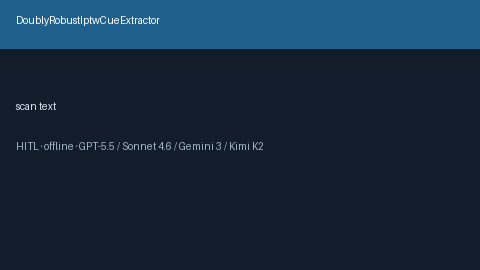

# DoublyRobustIptwCueExtractor Guide



Offline cue extractor. Never network I/O. Gap vs Elicit/Consensus/AJE doubly-robust / IPTW cue extractors.

Optional polish via **GPT-5.5 / Claude Sonnet 4.6 / Gemini 3.x / Kimi K2**.

Distinct from `PropensityScoreMatchingCueExtractor / ConfoundingAdjustmentCueExtractor`.

## Usage

```python
from retrieval.doubly_robust_iptw_cues import DoublyRobustIptwCueExtractor

cues = DoublyRobustIptwCueExtractor().extract([{"paper_id": "p1", "abstract": 'We used a doubly robust estimator with IPTW.'}])
print(cues[0].flagged, cues[0].cue_kind)
```

## Safety

Advisory only. Humans decide. See `SAFETY.md`.
