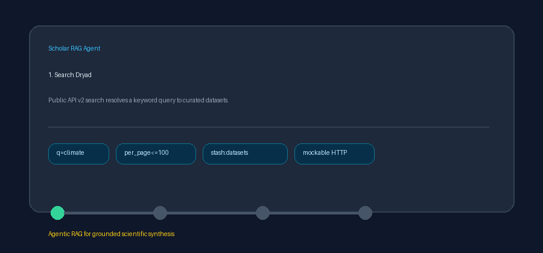

# Dryad Source Guide



Use this guide when wiring Dryad into **scholar-rag-agent**. The agent can
route downstream synthesis through GPT-5.5 / Claude Sonnet 4.6 / Gemini 3.x /
Kimi K2 when enabled, but the Dryad connector itself is deterministic JSON; no
LLM is required to list matching research datasets.

## Why Dryad

Dryad is a curated open-access repository for research data linked to scholarly
publications. Alongside Zenodo, Figshare, DataCite, and OSF it covers
publisher-associated datasets that journal-centric indexes under-represent,
especially in ecology, evolution, and life sciences.

Public keyword search (unauthenticated):

```text
GET https://datadryad.org/api/v2/search?q=climate+dataset&per_page=5
```

`per_page` is capped at **100** in this connector. The response embeds datasets
under `_embedded['stash:datasets']`.

## What you get

| Field | Source |
|---|---|
| `title` | `title` |
| `text` | HTML-stripped `abstract`, else a `By authors (field) (year)` descriptor |
| `source` | `sharingLink`, else `https://doi.org/{doi}`, else title |
| `metadata.doi` | Bare DOI from `identifier` (`doi:...`) |
| `metadata.year` | Leading four digits of `publicationDate` when it matches `^\d{4}` |
| `metadata.authors` | Comma-joined `authors[].firstName` + `lastName` |
| `metadata.field_of_science` | `fieldOfScience` |
| `metadata.dryad_id` | Numeric Dryad dataset `id` |
| `metadata.source_type` | `"dryad"` |

## Example

```python
import asyncio

from ingestion.dryad import DryadConnector

documents = asyncio.run(DryadConnector().search("climate dataset", max_results=5))
for document in documents:
    print(document.metadata["doi"], document.title)
```

## Safety notes

- Blank queries and non-positive `max_results` short-circuit with no HTTP call.
- Datasets without a title are skipped rather than raising.
- No API key is required for public Dryad search.
- Prefer frontier models for downstream synthesis over raw dataset metadata:
  **GPT-5.5**, **Claude Sonnet 4.6**, **Gemini 3.x**, **Kimi K2**.
