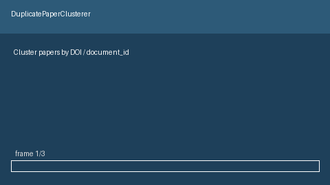

# Duplicate Paper Cluster Guide



`DuplicatePaperClusterer` groups papers that are the same work using exact DOI
or `document_id` matches, plus fuzzy title similarity via `difflib.SequenceMatcher`.
It fills a PaperQA / LocalGPT gap: those stacks often collapse retrieval hits or
chat context, but do not expose inspectable **paper-level** duplicate clusters.

Distinct from `NearDuplicateCollapser` and `ParaphraseCollapser`, which collapse
chunk-level retrieval hits. Local clustering for GPT-5.5 / Claude Sonnet 4.6 /
Gemini 3.x / Kimi K2 pipelines (not a DOI connector).

## Usage

```python
from retrieval.duplicate_paper_cluster import DuplicatePaperClusterer, PaperRef

clusterer = DuplicatePaperClusterer(title_threshold=0.92)
papers = [
    PaperRef(document_id="a", title="Graph RAG Survey", doi="10.1000/xyz"),
    PaperRef(document_id="b", title="Graph RAG Survey", doi="https://doi.org/10.1000/XYZ"),
]
clusters = clusterer.duplicate_clusters(papers)
for cluster in clusters:
    print(cluster.cluster_id, cluster.size, cluster.match_reasons)
```

`Document`, `Chunk`, and `SearchResult` inputs are also accepted. Use
`cluster(...)` when you need the full partition including singletons.
